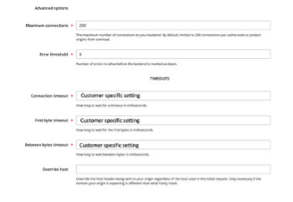

# 基础架构调整（超时和连接限制）

有些设置与AEM和Adobe Commerce以及周围的基础架构（如负载平衡器）需要保持一致，这些设置与连接限制和超时设置相关。

这些限制之间的不一致性意味着连接最终可能会在AEM端被限制，而Adobe Commerce能够处理更多连接。 同样，对于超时设置，未对齐可能意味着AEM端发生超时错误，而Adobe Commerce仍在处理请求。

对于超时设置，应查看设置并对齐，以防止在加载下出现503超时错误。 有几个基础架构和应用程序超时设置可供审查：

## AEM负载平衡器

假设基础架构中有一个AWS应用程序负载平衡器和多个Dispatcher/发布者 — 应考虑对负载平衡器进行以下设置：

1. 应审查发布者运行状况检查，以防止Dispatcher过早因负载激增而停止服务。 负载平衡器运行状况检查的超时设置应与发布者超时设置一致。

   

1. 可以禁用Dispatcher目标组粘性，并且可以使用轮循负载平衡算法。 这是假设没有使用需要设置会话粘性的AEM特定功能或AEM用户会话。 它假定用户登录和会话管理仅通过GraphQL在Adobe Commerce上进行。

   

1. 请注意，如果您启用了会话粘性，这可能会导致不缓存Fastly请求，因为默认情况下，Fastly不使用Set-Cookies标头缓存页面。 Adobe Commerce甚至在可缓存页面上设置Cookie(TTL > 0)，但默认的Fastly VCL会删除可缓存页面上的这些Cookie，以便Fastly缓存正常工作。 如果页面未缓存，请检查您可能使用的任何自定义Cookie，还可上传Fastly VCL并重新检查站点。

## Dispatcher超时设置

Dispatcher“renders”选项中的/timeout指定访问AEM发布实例的连接超时，以毫秒为单位。 应查看此设置，并在存在单独的负载平衡器时使用默认设置“0”（无限超时）。

如果基础结构中没有负载平衡器，则应在Dispatcher /timeout设置中指定超时设置，其值应与发布者中的GraphQL超时设置匹配。

## 发布者

发布者GraphQL连接限制和超时：最初，Adobe Commerce CIF GraphQL客户端配置工厂OSGI设置中的最大HTTP连接数应设置为默认的Fastly最大连接数限制，当前设置为200。 即使AEM场中有多个发布者，也应为每个发布者设置相同的限制，以匹配Fastly设置。 原因在于，在某些情况下，如果从场中取出关联的调度程序，则一个发布程序可能处理比其他发布程序更多的流量。 这意味着所有流量都将通过仅剩下的一个调度程序和发布程序路由，在这种情况下，单个发布程序可能需要所有HTTP连接。

“默认HTTP方法”应从POST设置为GET。 Adobe Commerce GraphQL缓存中仅缓存GET请求，因此默认方法应始终设置为GET。

http连接超时和http套接字超时应设置为与Fastly超时匹配的值。

下图显示了MagentoCIF GraphQL Client Configuration Factory。 此处显示的设置只是示例，需要根据具体情况进行调整：

下图显示了Fastly后端配置。 此处显示的设置只是示例，需要根据具体情况进行调整：

