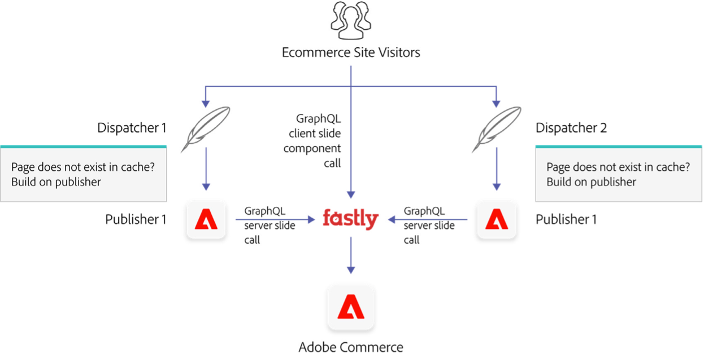

# 使用Adobe Commerce、Commerce Integration Framework和Adobe Experience Manager大规模交付体验

使用CIF作为连接器的AEM和Adobe Commerce之间推荐的集成模式是，AEM拥有表示层（“玻璃”）和Adobe Commerce，以支持将商业后端作为“无头”后端。 此集成方法利用了每个应用程序的优势：Adobe Commerce的AEM和电子商务运营的创作、个性化和全渠道功能。

在AEM/CIF/Adobe Commerce环境中，电子商务网站访客将首先到达AEM。 AEM将检查其Dispatcher缓存中是否具有请求的页面。 如果该页面存在，则会向访客提供此缓存的页面，无需进一步处理。 如果Dispatcher不包含所请求的页面，或者该页面已过期，则Dispatcher请求AEM发布者构建页面，发布者调用Adobe Commerce获取电子商务数据以构建页面（如有必要）。 然后，构建页面将传递给Dispatcher以提供给访客，并且随后会被缓存，以防止在来自其他访客的同一页面的后续请求中，将进一步的负载放置到服务器上。

服务器端渲染和客户端渲染的组合可用于AEM/CIF/Adobe Commerce模型：服务器端渲染用于提供静态内容，而客户端渲染则通过直接从用户浏览器内为特定组件调用Adobe Commerce来提供经常更改或个人动态内容。

在下面的示例中可以看到AEM电子商务店面的“产品详细信息”页面中不同组件的示例：

## 服务器端渲染

电子商务页面(如产品详细信息页面(PDP)和产品列表页面(PLP))不太可能经常更改，并且适合在使用AEM CIF核心组件在服务器端呈现后完全缓存。 页面应使用在AEM中创建的通用模板在AEM Publisher中呈现。 这些组件通过GraphQL API从Adobe Commerce获取数据。 这些页面是动态创建的，在服务器上呈现，在AEM Dispatcher上缓存，然后交付给浏览器。 上面的示例中的紫色框显示了这方面的示例。

## 客户端渲染

当显示更多动态属性（如库存水平/可用性或价格）时(例如在产品详细信息页面(PDP)上)，可以使用客户端组件。 虽然可以使用上述服务器端渲染方法在Dispatcher上构建和缓存模板页面，但在静态页面本身中，可以存在动态客户端Web组件。 这些动态组件可以通过GraphQL API在客户端的浏览器中直接从Adobe Commerce获取数据，以实时检查PDP上的当前价格或库存水平等。 这可确保在页面加载时始终获取通常对于实时显示很关键的内容。 以上示例中的红色框中显示了相关示例。

在结帐过程中还可以使用AEM模板和客户端渲染的组合：客户端购物车组件渲染购物车、结帐表单以及与支付服务提供商集成。 此混合方法还可用于Adobe Commerce的帐户管理功能，例如创建帐户、登录帐户和忘记密码。
