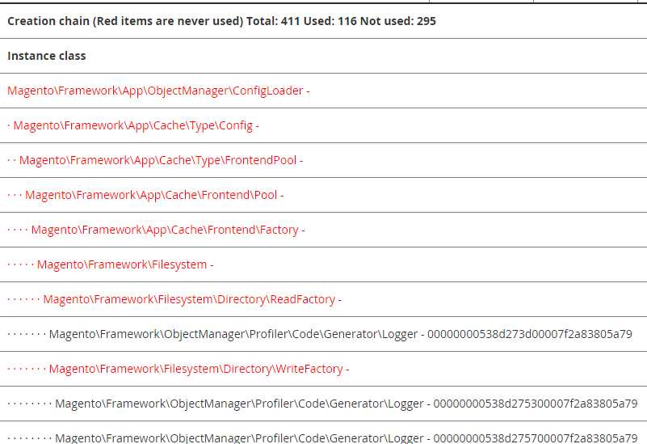

# 启用分析

通过Commerce分析，您可以：

- 启用内置探查器。

   您可以使用带有Commerce的内置探查器来执行分析性能等任务。 分析的性质取决于您使用的分析工具。 我们支持多种格式，包括HTML。 启用Profiler时， `var/profiler.flag` 文件生成，指示已启用探查器并配置。 禁用后，此文件将被删除。

- 在Commerce页面上显示依赖关系图。

   A _依赖关系图_ 是一个列表，其中列出了对象依赖项及其所有依赖项，以及这些依赖项的所有依赖项，等等。

   您应该对以下列表特别感兴趣： _未使用的依赖关系_，这些对象之所以创建，是因为某些构造函数中请求了这些对象，但从未使用过（即，未调用任何它们的方法）。 因此，用于创建这些依赖项的处理器时间和内存被浪费了。

Commerce提供以下基本功能： [`Magento\Framework\Profiler`][profiler].

可以使用MAGE_PROFILER变量或命令行来启用和配置Profiler。

## 设置MAGE_PROFILER

您可以设置 `MAGE_PROFILER` 以中讨论的任何方式 [设置引导参数值](../bootstrap/set-parameters.md).

`MAGE_PROFILER` 支持以下值：

- `1` 以启用特定分析工具的输出。

   您可以使用以下值之一来启用特定的Profiler：

   - `csvfile` 使用 [`Magento\Framework\Profiler\Driver\Standard\Output\Csvfile`][csvfile]
   - 任何其他值(不包括 `2`)，包括一个空值，它使用 [`Magento\Framework\Profiler\Driver\Standard\Output\Html`][html]

- `2` 启用依赖关系图。

   依赖关系图通常显示在页面底部。 下图显示了输出的部分：

   

## CLI命令

您可以使用CLI命令启用或禁用Profiler：

- `dev:profiler:enable <type>` 使探查器能够 `type` 之 `html` （默认）或 `csvfile`. 启用后，将显示一个标志文件 `var/profiler.flag` 创建。
- `dev:profiler:disable` 禁用Profiler。 禁用后，flagfile `var/profiler.flag` 将被删除。

要启用依赖关系图，请使用变量选项。

**启用或禁用探查器**：

1. 登录到您的Commerce服务器。
1. 转到Commerce安装目录。
1. 作为文件系统所有者，启用探查器：

   使用类型启用探查器 `html` 并创建一个flagfile ：

   ```bash
   bin/magento dev:profiler:enable html
   ```

   使用类型启用探查器 `csvfile` 并创建一个flagfile ：

   ```bash
   bin/magento dev:profiler:enable csvfile
   ```

   输出保存到 `<project-root>/var/log/profiler.csv`. 此 `profiler.csv` 将在每次页面刷新时覆盖。

   要禁用Profiler并删除Flagfile，请执行以下操作：

   ```bash
   bin/magento dev:profiler:disable
   ```

<!-- link definitions -->

[csvfile]: https://github.com/magento/magento2/blob/2.4/lib/internal/Magento/Framework/Profiler/Driver/Standard/Output/Csvfile.php
[html]: https://github.com/magento/magento2/blob/2.4/lib/internal/Magento/Framework/Profiler/Driver/Standard/Output/Html.php
[profiler]: https://github.com/magento/magento2/blob/2.4/lib/internal/Magento/Framework/Profiler.php
