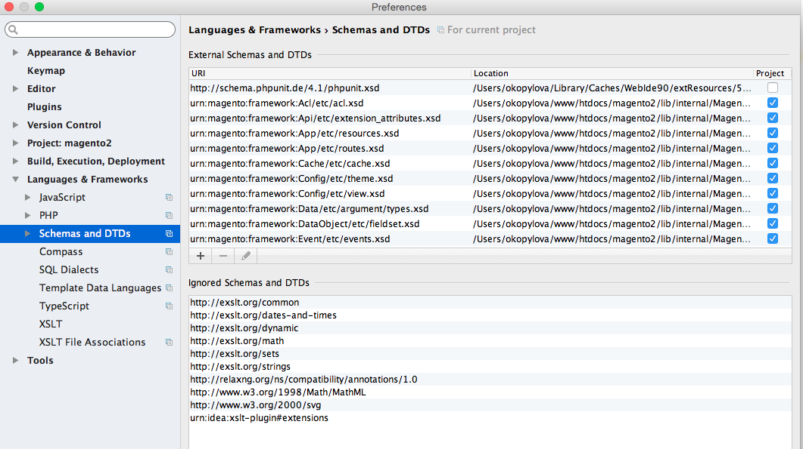

# URN高亮显示器概述

{{file-system-owner}}

商务代码将所有XSD架构作为 [统一资源名称(URN)](https://www.ietf.org/rfc/rfc2141.txt). 如果您正在开发代码并且需要引用XSD，则此命令会配置集成开发人员环境(IDE)以识别和高亮显示URN。 这使开发更轻松。

默认情况下，像PhpStorm这样的IDE未配置为识别URN，因此它们以红色文本显示，如下所示：


的 `bin/magento dev:urn-catalog:generate` 命令允许IDE（当前仅PhpStorm和Visual Studio代码）识别并高亮显示URN，如下所示：


具体而言，此命令将创建以下PhpStorm配置：



## 配置IDE

目前，仅支持PhpStorm和Visual Studio代码。

命令语法：

```bash
bin/magento dev:urn-catalog:generate <path>
```

其中 `<path>` 是通往PhpStorm的路 `misc.xml` 文件，它相对于您的项目根目录位置。 通常， `<path>` is `.idea/misc.xml`.

>[!INFO]
>
>要保持“架构和DTD”为最新，请运行 `dev:urn-catalog:generate` 命令 `*.xsd` 文件。
