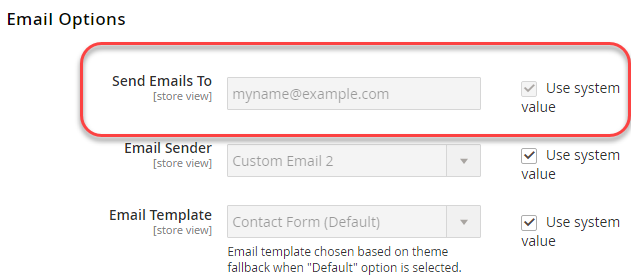

# 使用环境变量的示例

此示例说明如何在开发系统中设置共享、系统特定的敏感值，然后使用共享配置、`config.php`和PHP环境变量的组合设置生产系统中的所有值。

这些配置设置可以在开发系统和生产系统之间共享：

来自&#x200B;**商店** >设置> **配置** >常规> **常规**&#x200B;的VAT号码和商店名称

这些配置设置是系统特定的或敏感的，如下所示：

- 从&#x200B;**商店** >设置> **配置** >常规> **联系人**&#x200B;向（敏感）发送电子邮件
- 来自&#x200B;**商店** >设置> **配置** >客户> **客户配置** > **创建新帐户选项**&#x200B;的默认电子邮件域（特定于系统）

您可以使用相同的过程来配置以下引用中的任何设置：

- [敏感且特定于系统的配置路径参考](../reference/config-reference-sens.md)
- [支付配置路径参考](../reference/config-reference-payment.md)
- [常规配置路径引用](../reference/config-reference-general.md)
- [Commerce Enterprise B2B扩展配置路径参考](../reference/config-reference-b2b.md)

## 开始之前

在开始之前，请按照[开发、构建和生产系统的先决条件](../deployment/prerequisites.md)中所述设置文件系统权限和所有权。

## 假设

本主题提供了修改生产系统配置的示例。 您可以根据需要选择不同的配置选项。

在本例中，我们假定：

- 您使用Git源代码控制
- 开发系统在名为`mconfig`的Git远程存储库中可用
- 您的Git工作分支名为`m2.2_deploy`

## 步骤1：在开发系统中设置配置

要在开发系统中设置默认区域设置和权重单位，请执行以下操作：

1. 登录到管理员。
1. 单击“**存储**”>“设置”>“**配置**”>“常规”>“**常规”**。
1. 如果您有多个可用网站，请使用左上角的&#x200B;**商店视图**&#x200B;列表切换到其他网站，如下图所示。

   

1. 在右窗格中，展开&#x200B;**存储信息**。
1. 如有必要，请清除&#x200B;**增值税编号**&#x200B;字段旁边的&#x200B;**使用默认值**&#x200B;复选框。
1. 在字段中输入数字（例如，`12345`）。
1. 在&#x200B;**存储名称**&#x200B;字段中，输入一个值（如`My Store`）。
1. 单击&#x200B;**保存配置**。
1. 使用&#x200B;**存储视图**&#x200B;列表选择&#x200B;**默认配置**，如下图所示。

   

1. 在左侧导航栏的“常规”下，单击&#x200B;**联系人**。
1. 清除&#x200B;**将电子邮件发送到**&#x200B;字段旁边的&#x200B;**使用默认值**&#x200B;复选框。
1. 在字段中输入电子邮件地址。
1. 单击&#x200B;**保存配置**。
1. 在左窗格中，单击“客户”>“**客户配置”**。
1. 在右窗格中，展开&#x200B;**新建帐户选项**。
1. 清除&#x200B;**默认电子邮件域**&#x200B;字段旁边的&#x200B;**使用系统值**&#x200B;复选框。
1. 在字段中输入域名。
1. 单击&#x200B;**保存配置**。
1. 如果出现提示，请刷新缓存。

## 步骤2：更新配置

现在您已在管理员中更改了配置，请将共享配置写入文件，如本节所述。

{{$include /help/_includes/config-save-config.md}}

请注意，即使`app/etc/env.php`（系统特定的配置）已更新，也不要将其签入到源代码管理。 稍后将在此过程中在生产系统上创建相同的配置设置。

## 步骤3：更新构建系统并生成文件

现在，您已将共享配置的更改提交到源代码管理，您可以在构建系统中提取这些更改，编译代码并生成静态文件。 最后一步是将这些更改拉入您的生产系统。

{{$include /help/_includes/config-update-build-system.md}}

## 步骤4：更新生产系统

该流程的最后一步是更新生产系统。 您必须分两部分完成此操作：

- 更新敏感和特定于系统的设置
- 更新共享设置

### 更新敏感和特定于系统的设置

要使用环境变量设置敏感和特定于系统的设置，您必须了解以下信息：

- 每个设置的范围

  如果您按照步骤1中的说明进行操作，则向发送电子邮件的范围是全局的（即默认配置范围），而默认电子邮件域的范围是网站。

  您必须知道网站的代码才能设置默认电子邮件域配置值。 有关查找配置设置的详细信息，请参阅[使用环境变量覆盖配置设置](../reference/override-config-settings.md#environment-variables)。

- 每个设置的配置路径

  此示例中使用的配置路径如下所示：

  | 设置名称 | 配置路径 |
  |--------------|--------------|
  | 发送电子邮件至 | `contact/email/recipient_email` |
  | 默认电子邮件域 | `customer/create_account/email_domain` |

  您可以在[敏感配置路径和特定系统配置路径引用](../reference/config-reference-sens.md)中找到所有敏感配置路径和特定系统配置路径。

#### 将配置路径转换为变量名称

如[使用环境变量覆盖配置设置](../reference/override-config-settings.md#environment-variables)中所述，变量的格式为：

```text
<SCOPE>__<SYSTEM__VARIABLE__NAME>
```

全局作用域的`<SCOPE>`值为`CONFIG__DEFAULT__`，网站作用域为`CONFIG__WEBSITES__<WEBSITE CODE>`。

要查找`<SYSTEM__VARIABLE__NAME>`的值，请将配置路径中的每个`/`字符替换为两个下划线。

变量名称如下所示：

| 名称 | 配置路径 | 变量名称 |
|--------------|--------------|--------------|
| 发送电子邮件至 | `contact/email/recipient_email` | `CONFIG__DEFAULT__CONTACT__EMAIL__RECIPIENT_EMAIL` |
| 默认电子邮件域 | `customer/create_account/email_domain` | `CONFIG__WEBSITES__BASE__CUSTOMER__CREATE_ACCOUNT__EMAIL_DOMAIN` |

>[!INFO]
>
>前面的表格具有默认电子邮件域配置设置的示例网站代码`BASE`。 将`BASE`替换为商店的相应网站代码。

#### 使用环境变量设置变量

您可以使用以下格式在`index.php`中设置变量值：

```php
$_ENV['VARIABLE'] = 'value';
```

**要设置变量值**：

1. 以文件系统所有者的身份登录您的生产系统，或切换到文件系统所有者。
1. 在文本编辑器中打开`<Commerce root dir>/pub/index.php`。
1. 在`index.php`中的任何位置，为变量设置类似于以下内容的值：

   ```php
   $_ENV['CONFIG__DEFAULT__CONTACT__EMAIL__RECIPIENT_EMAIL'] = 'myname@example.com';
   $_ENV['CONFIG__WEBSITES__BASE__CUSTOMER__CREATE_ACCOUNT__EMAIL_DOMAIN'] = 'magento.com';
   ```

1. 将更改保存到`pub/index.php`并退出文本编辑器。
1. 继续下一部分。

### 更新共享设置

本节将讨论如何提取您在开发和构建系统中进行的所有更改，这些更改会更新共享配置设置（商店名称和VAT编号）。

{{$include /help/_includes/config-update-prod-system.md}}

### 在“管理员”中验证配置设置

此部分讨论如何在生产系统管理员中验证配置设置。

**验证配置设置**：

1. 登录到生产系统的管理员。
1. 单击“**存储**”>“设置”>“**配置**”>“常规”>“**常规”**。
1. 使用左上角的&#x200B;**商店视图**&#x200B;列表切换到其他网站。

   在开发系统中设置的共享配置选项显示如下。

   

   >[!INFO]
   >
   >**存储名称**&#x200B;字段在网站范围中可编辑，但如果您切换到默认配置范围，则无法编辑该字段。 这是您在开发系统中设置选项的结果。 **增值税号**&#x200B;的值在网站范围中不可编辑。

1. 如果您尚未这样做，请切换到默认配置范围。
1. 在左侧导航栏的“常规”下，单击&#x200B;**联系人**。

   **将电子邮件发送到**&#x200B;字段不可编辑，如下图所示。 这是一个敏感设置。

   

1. 在左窗格中，单击“客户”>“**客户配置”**。
1. 在右窗格中，展开&#x200B;**新建帐户选项**。

   **默认电子邮件域**&#x200B;字段的值显示如下。 这是系统特定的设置。

   

<!-- Last updated from includes: 2024-07-18 15:50:54 -->
