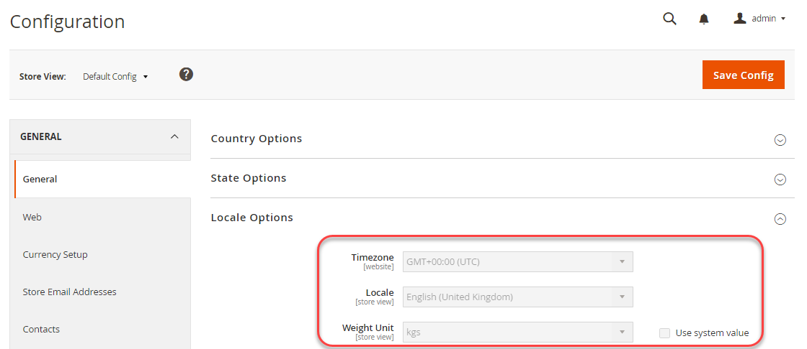

# 使用共享配置的示例

此示例说明如何在开发系统中更改以下设置，更新共享配置文件， `config.php`，并在生产系统中实施相同的设置：

- 时区
- 重量单位

这些设置在的“管理员”中可用 **商店** >设置> **配置** >常规> **常规**.

在以下引用中，您可以使用相同的过程配置任何非敏感、非系统特定的设置：

- [其他配置路径引用](../reference/config-reference-general.md)
- [付款配置路径参考](../reference/config-reference-payment.md)
- [商务企业B2B扩展配置路径参考](../reference/config-reference-b2b.md)

## 开始之前

在开始之前，按 [开发、构建和生产系统的先决条件](../deployment/prerequisites.md).

## 假设

本主题提供了修改生产系统配置的示例。 您可以根据需要选择不同的配置选项。

在本例中，我们假定：

- 您使用Git源控件
- 开发系统位于名为的Git远程存储库中 `mconfig`
- 您的Git工作分支已命名 `m2.2_deploy`

## 步骤1:在开发系统中设置配置

要在开发系统中设置时区和重量单位，请执行以下操作：

1. 登录到管理员。
1. 单击 **商店** >设置> **配置** >常规> **常规**.
1. 在右侧窗格中，展开 **区域设置选项**.

   下图显示了一个示例。

   

1. 从 **时区** 列表，单击 **GMT+00:00(UTC)**.
1. 清除 **使用系统值** 复选框 **权重单位** 字段。
1. 从 **权重单位** 列表，单击 **kgs**.
1. 单击 **保存配置**.
1. 如果出现提示，请刷新缓存。

## 步骤2:更新共享配置

生成共享配置文件， `app/etc/config.php`，并使用源代码管理将其传输到构建系统，如本节所述。

{{$include /help/_includes/config-save-config.md}}

## 步骤3:更新内部版本系统并生成文件

现在，您已将对共享配置所做的更改提交到源代码管理，接下来可以在生成系统中提取这些更改、编译代码并生成静态文件。 最后一步是将这些更改提取到您的生产系统。 因此，您的生产系统的配置将与开发系统相匹配。

{{$include /help/_includes/config-update-build-system.md}}

## 步骤4:更新生产系统

该过程的最后一步是从源代码管理更新生产系统。 这会提取您在开发和构建系统上所做的所有更改，这意味着您的生产系统是完全最新的。

{{$include /help/_includes/config-update-prod-system.md}}

### 在管理员中验证更改

**要验证这些设置是否在管理员中不可编辑，请执行以下操作**:

1. 登录到管理员。
1. 单击 **商店** >设置> **配置** >常规> **常规**.
1. 在右侧窗格中，展开 **区域设置选项**.

   您刚才设置的选项如下所示：

   

>[!INFO]
>
>要更改管理员中锁定的设置，请使用 [`magento config:set --lock` 命令](../cli/set-configuration-values.md).
