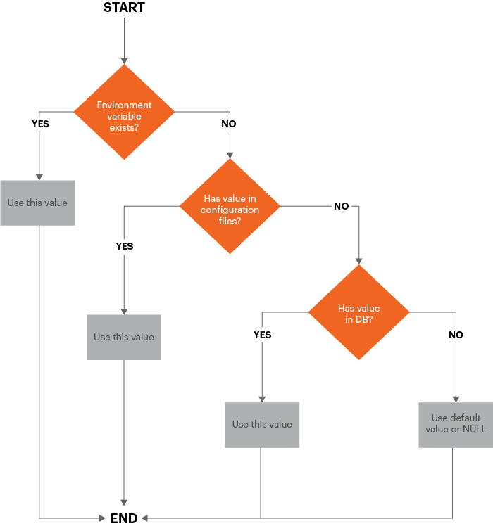

# 技术详细信息

本主题讨论有关Commerce 2.2及更高版本中管道部署的技术实施详细信息。 改进可以分为以下几个方面：

- [配置管理](#configuration-management)
- [管理员中的更改](#changes-in-the-admin)
- [安装和删除cron](#install-and-remove-cron)

本主题还讨论了用于管道部署的[推荐的工作流](#recommended-workflow)，并提供了一些示例来帮助您了解它的工作方式。

在开始之前，请查看开发、生成和生产系统的[先决条件](../deployment/prerequisites.md)。

## 配置管理

要让您同步和维护开发和生产系统的配置，请使用以下覆盖方案。



如图所示，配置值的使用顺序如下：

1. 环境变量（如果存在）将覆盖所有其他值。
1. 从共享配置文件`env.php`和`config.php`。 `env.php`中的值覆盖`config.php`中的值。
1. 从存储在数据库中的值。
1. 如果这些源中的任何一个都不存在值，则使用默认值或NULL。

### 管理共享配置

共享配置存储在`app/etc/config.php`中，它应位于源代码管理中。

在开发(或云基础架构&#x200B;_集成_&#x200B;上的Adobe Commerce)系统的管理员中设置共享配置，并使用`config.php`命令[`magento app:config:dump`将该配置写入](../cli/export-configuration.md)。

### 管理特定于系统的配置

系统特定的配置存储在`app/etc/env.php`中，它应该&#x200B;_不是_&#x200B;位于源代码管理中。

在开发(或Adobe Commerce on cloud infrastructure集成)系统的管理员中设置系统特定的配置，并使用`env.php`命令[`magento app:config:dump`将该配置写入](../cli/export-configuration.md)。

此命令还会将敏感设置写入`env.php`。

### 管理敏感配置

敏感配置也存储在`app/etc/env.php`中。

您可以通过以下任意方式管理敏感配置：

- 环境变量
- 使用`env.php`命令[`magento config:set:sensitive`将敏感配置保存在生产系统上的](../cli/set-configuration-values.md)中

### 已在Admin中锁定配置设置

`config.php`或`env.php`中的任何配置设置均在Admin中锁定；也就是说，无法在Admin中更改这些设置。
使用[`magento config:set`或`magento config:set --lock`](../cli/export-configuration.md#config-cli-config-set)命令更改`config.php`或`env.php`文件中的设置。

## Commerce管理员

在生产模式下，管理员会显示以下行为：

- 您不能在“管理员”中启用或禁用缓存类型
- 开发人员设置不可用（**商店** >设置> **配置** >高级> **开发人员**），包括：

   - 简化CSS、JavaScript和HTML
   - 合并CSS和JavaScript
   - 服务器端或客户端LESS编译
   - 内联翻译
   - 如前所述，`config.php`或`env.php`中的任何配置设置均被锁定，无法在管理员中编辑。
   - 您只能将管理员区域设置更改为已部署主题使用的语言

     下图显示了Admin中的&#x200B;**帐户设置** > **界面区域设置**&#x200B;列表的一个示例，该列表只显示两个已部署的区域设置：

     

- 无法使用“管理员”更改任何范围的区域设置配置。

  我们建议在切换到生产模式之前进行这些更改。

  您仍然可以使用环境变量或路径为`config:set`的`general/locale/code` CLI命令配置区域设置。

## 安装和删除cron

在版本2.2中，我们首次提供[`magento cron:install`命令](../cli/configure-cron-jobs.md)来帮助您设置cron作业。 此命令将crontab设置为运行该命令的用户。

此外，您可以使用`magento cron:remove`命令删除crontab。

## 建议的管道部署工作流

下图显示了我们建议您使用管道部署管理配置的方式。


### 开发系统

在开发系统上，您在“管理员”中进行配置更改，并生成共享配置`app/etc/config.php`和特定于系统的配置`app/etc/env.php`。 将Commerce代码和共享配置检查到源代码控制中，并将其推送到构建服务器。

您还应在开发系统上安装扩展并自定义Commerce代码。

在您的开发系统上：

1. 在“管理员”中设置配置。

1. 使用`magento app:config:dump`命令将配置写入文件系统。

   - `app/etc/config.php`是共享配置，它包含除&#x200B;_敏感和系统特定的设置之外的所有设置_。 此文件应在源代码管理中。
   - `app/etc/env.php`是特定于系统的配置，其中包含特定系统特有的设置（例如，主机名和端口号）。 此文件&#x200B;_不_&#x200B;在源代码管理中。

1. 将修改后的代码和共享配置添加到源代码管理。

1. 要在开发过程中删除生成的php代码和静态资源文件，请运行以下命令：

   ```bash
   rm -r var/view_preprocessed/*
   rm -r pub/static/*/*
   rm -r generated/*/*
   ```

运行命令清除资源后，Commerce会生成工作文件。

>[!WARNING]
>
>要小心上述方法。 删除`.htacces`或`generated`文件夹中的`pub`文件可能会导致问题。

### 构建系统

构建系统编译代码并为Commerce中注册的主题生成静态视图文件。 它不需要连接到Commerce数据库；它只需要Commerce代码库。

在您的构建系统上：

1. 从源代码管理中提取共享配置文件。
1. 使用`magento setup:di:compile`命令编译代码。
1. 使用`magento setup:static-content:deploy -f`命令更新静态文件视图文件。
1. 将更新签入源代码管理。

>[!INFO]
>
>请参阅静态视图文件的[部署策略](../cli/static-view-file-strategy.md)。

### 生产系统

在生产系统（即实时商店）中，您可以从源代码管理中提取生成的资源和代码更新，并使用命令行或环境变量设置特定于系统的敏感配置设置。

在生产系统上：

1. 启动维护模式。
1. 从源代码管理中获取代码和配置更新。
1. 如果您使用Adobe Commerce，请停止队列工作程序。
1. 使用`magento app:config:import`命令在生产系统中导入配置更改。
1. 如果安装了更改数据库架构的组件，请运行`magento setup:upgrade --keep-generated`以更新数据库架构和数据，并保留生成的静态文件。
1. 要设置系统特定的设置，请使用`magento config:set`命令或环境变量。
1. 要设置敏感设置，请使用`magento config:sensitive:set`命令或环境变量。
1. 清理（也称为&#x200B;_刷新_）缓存。
1. 结束维护模式。

## 配置管理命令

我们提供以下命令帮助您管理配置：

- [`magento app:config:dump`](../cli/export-configuration.md)将管理员配置设置写入`config.php`和`env.php`（敏感设置除外）
- [`magento config:set`](../cli/set-configuration-values.md)以在生产系统上设置系统特定设置的值。

  使用可选的`--lock`选项在Admin中锁定该选项（即使该设置不可编辑）。 如果设置已被锁定，请使用`--lock`选项更改设置。

- [`magento config:sensitive:set`](../cli/set-configuration-values.md)以在生产系统上设置敏感设置的值。
- [`magento app:config:import`](../cli/import-configuration.md)将配置更改从`config.php`和`env.php`导入到生产系统。

## 配置管理示例

此部分显示管理配置的示例，以便您查看如何对`config.php`和`env.php`进行更改。

### 更改默认区域设置

此部分显示当您使用管理员（`config.php`商店&#x200B;**>设置>**&#x200B;配置&#x200B;**>常规>**&#x200B;常规&#x200B;**>**&#x200B;区域设置选项&#x200B;**）更改默认权重单位时对**&#x200B;所做的更改。

在管理员中进行更改后，运行`bin/magento app:config:dump`以将该值写入`config.php`。 此值将写入`general`下的`locale`数组，因为`config.php`中的以下代码片段显示：

```php
'general' =>
    array (
        'locale' =>
        array (
            'code' => 'en_US',
            'timezone' => 'America/Chicago',
            'weight_unit' => 'kgs'
        )
    )
```

### 更改多个配置设置

本节讨论如何进行以下配置更改：

- 添加网站、商店和商店视图（**商店** >设置> **所有商店**）
- 更改默认电子邮件域（**商店** >设置> **配置** >客户> **客户配置**）
- 设置PayPal API用户名和API密码（**商店** >设置> **配置** >销售> **付款方式** > **PayPal** > **必需的PayPal设置**）

在管理员中进行更改后，在开发系统上运行`bin/magento app:config:dump`。 这一次，并非所有更改都写入`config.php`；实际上，只有网站、商店和商店视图会写入该文件，如以下代码段所示。

### config.php

`config.php`包含：

- 对网站、商店和商店视图的更改。
- 非系统特定的搜索引擎设置
- 不敏感的PayPal设置
- 通知您从`config.php`中省略的敏感设置的注释

`websites`数组：

```php
      'new' =>
      array (
        'website_id' => '2',
        'code' => 'new',
        'name' => 'New website',
        'sort_order' => '0',
        'default_group_id' => '2',
        'is_default' => '0',
      ),
```

`groups`数组：

```php
      2 =>
      array (
        'group_id' => '2',
        'website_id' => '2',
        'code' => 'newstore',
        'name' => 'New store',
        'root_category_id' => '2',
        'default_store_id' => '2',
      ),
```

`stores`数组：

```php
     'newview' =>
      array (
        'store_id' => '2',
        'code' => 'newview',
        'website_id' => '2',
        'group_id' => '2',
        'name' => 'New store view',
        'sort_order' => '0',
        'is_active' => '1',
      ),
```

`payment`数组：

```php
      'payment' =>
      array (
        'paypal_express' =>
        array (
          'active' => '0',
          'in_context' => '0',
          'title' => 'PayPal Express Checkout',
          'sort_order' => NULL,
          'payment_action' => 'Authorization',
          'visible_on_product' => '1',
          'visible_on_cart' => '1',
          'allowspecific' => '0',
          'verify_peer' => '1',
          'line_items_enabled' => '1',
          'transfer_shipping_options' => '0',
          'solution_type' => 'Mark',
          'require_billing_address' => '0',
          'allow_ba_signup' => 'never',
          'skip_order_review_step' => '1',
        ),
```

### env.php

默认电子邮件域系统特定的配置设置已写入`app/etc/env.php`。

PayPal设置既不会写入文件，也不会写入文件，因为`bin/magento app:config:dump`命令不会写入敏感设置。 您必须使用以下命令在生产系统上设置PayPal设置：

```bash
bin/magento config:sensitive:set paypal/wpp/api_username <username>
```

```bash
bin/magento config:sensitive:set paypal/wpp/api_password <password>
```
