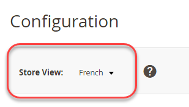

# 在管理员中设置多个视图

此任务要求您为每个存储创建一个根类别（如果需要，还要创建其他类别）。 本主题中讨论的任务提供了一种设置多个商店的方法。 有关更多信息，请参阅《Commerce用户指南》中的以下资源：

- [类别](https://experienceleague.adobe.com/zh-hans/docs/commerce-admin/catalog/categories/categories)
- [添加网站](https://experienceleague.adobe.com/zh-hans/docs/commerce-admin/stores-sales/site-store/stores#add-websites)
- [存储URL](https://experienceleague.adobe.com/zh-hans/docs/commerce-admin/stores-sales/site-store/store-urls)
- [内容](https://experienceleague.adobe.com/zh-hans/docs/commerce-admin/content-design/content-menu)

>[!INFO]
>
>仅出于示例目的，在本主题中使用网站代码为`french`的法语网站。 有关分步教程，请参阅[教程：使用Apache设置多个网站](ms-apache.md)和[教程：使用nginx设置多个网站](ms-nginx.md)

## 步骤1：创建根类别

创建根类别是可选的，但我们会在本教程中介绍如何在您希望每个网站都有一个唯一根类别的情况下创建根类别。 您可以选择创建其他类别。

要创建根类别，请执行以下操作：

1. 以有权创建类别的用户身份登录到管理员。
1. 单击&#x200B;**目录** > **类别**。
1. 单击&#x200B;**添加根类别**。
1. 在&#x200B;**类别名称**&#x200B;字段中，输入唯一名称以标识该类别。
1. 确保将“启用类别”设置为&#x200B;**是**。

   有关此页面上其他选项的信息，请参阅[根类别](https://experienceleague.adobe.com/zh-hans/docs/commerce-admin/catalog/categories/category-root)。

   下图显示了一个示例。

   

1. 单击&#x200B;**保存**。
1. 根据需要重复这些任务多次，以便为存储区创建根类别。

## 第2步：创建网站

要创建网站，请执行以下操作：

1. 以有权创建网站、商店和商店视图的用户身份登录到管理员。
1. 单击&#x200B;**商店** > **设置** > **所有商店**。
1. 在&#x200B;_商店_&#x200B;页面上，单击&#x200B;**创建网站**。

   - **名称** — 输入名称以标识网站。
   - **代码** — 输入唯一代码；例如，如果您拥有法式商店，则可以输入`french`
   - **排序顺序** — 输入可选的数字排序顺序。

   下图显示了一个示例。

   

1. 单击&#x200B;**保存网站**。
1. 根据需要多次重复这些任务以创建您的网站。

## 步骤3：创建存储

要创建存储，请执行以下操作：

1. 在&#x200B;_管理员_&#x200B;面板中，单击&#x200B;**商店** > **设置** > **所有商店**。
1. 在&#x200B;_商店_&#x200B;页面上，单击&#x200B;**创建商店**。

   - **网站** — 单击要与此商店关联的网站的名称。
   - **名称** — 输入名称以标识存储。
   - **代码** — 输入唯一代码以标识存储。
   - **根类别** — 单击此存储的根类别的名称。

   下图显示了一个示例。

   

1. 单击&#x200B;**保存存储**。
1. 根据需要多次重复这些任务以创建您的商店。

## 步骤4：创建商店视图

要创建商店视图，请执行以下操作：

1. 在&#x200B;_管理员_&#x200B;面板中，单击&#x200B;**商店** > **设置** > **所有商店**。
1. 在商店页面上，单击&#x200B;**创建商店视图**。

   - **存储** — 单击要与此存储视图关联的存储的名称。
   - **名称** — 输入名称以标识此存储视图。
   - **代码** — 输入唯一名称以标识此商店视图。
   - **状态** — 选择&#x200B;**已启用**。

   下图显示了一个示例。

   

1. 单击&#x200B;**保存商店视图**。
1. 根据需要，重复执行上述任务多次，以创建商店视图。

## 步骤5：更改网站基本URL

要使用诸如`http://french.magento.mg`之类的唯一URL访问网站，您必须在Admin中更改每个站点的基本URL。

要更改网站基本URL，请执行以下操作：

1. 在&#x200B;_管理员_&#x200B;面板中，单击&#x200B;**存储** > **设置** > **配置** > **常规** > **Web**。
1. 从页面顶部的&#x200B;**商店视图**&#x200B;列表中，单击您其中一个网站的名称，如下图所示。

   

1. 在右窗格中，展开&#x200B;**基本URL**。
1. 在&#x200B;_基本URL_&#x200B;部分中，清除&#x200B;**使用系统值**。
1. 在&#x200B;**基本URL**&#x200B;和&#x200B;**基本链接URL**&#x200B;字段中输入`http://french.magento.mg` URL。

1. 在&#x200B;_基本URL（安全）_&#x200B;部分中重复上一步骤。

   >[!INFO]
   >
   >如果要为云基础架构上的Adobe Commerce部署设置基本URL，则必须将第一个句点替换为三个短划线。 例如，如果您的基本URL是`french.branch-sbg7pPa-f3dueAiM03tpy.us.magentosite.cloud`，请输入`http://french---branch-sbg7pPa-f3dueAiM03tpy.us.magentosite.cloud`。 如果要设置基本URL以进行本地测试，请使用句点。

1. 单击&#x200B;**保存配置**。

1. 对其他网站重复这些任务。

## 步骤6：将存储代码添加到基本URL

Commerce为您提供了将商店代码添加到站点基本URL的选项，这简化了设置多个商店的过程。 使用此选项，您不必在Commerce文件系统上创建目录来存储`index.php`和`.htaccess`。

这样可防止`index.php`和`.htaccess`在将来升级时与Commerce代码库不同步。

请参阅[Commerce用户指南](https://experienceleague.adobe.com/zh-hans/docs/commerce-admin/stores-sales/site-store/store-urls)。

要将存储代码添加到基本URL，请执行以下操作：

1. 在&#x200B;_管理员_&#x200B;面板中，单击&#x200B;**存储** > **设置** > **配置** > **常规** > **Web**。
1. 在页面顶部的&#x200B;**存储视图**&#x200B;列表中，单击&#x200B;**默认配置**，如下图所示。

   

1. 在右窗格中，展开&#x200B;**Url选项**。
1. 清除&#x200B;_将存储代码添加到Url_&#x200B;旁边的&#x200B;**使用系统值**&#x200B;复选框。
1. 从&#x200B;_将存储代码添加到Url_&#x200B;列表中，单击&#x200B;**是**。

   

1. 单击&#x200B;**保存配置**。
1. 如果出现提示，请刷新缓存。 （**系统** > **缓存管理**）。

## 步骤7：更改默认商店视图基本URL

最后必须执行此步骤，因为您将失去对管理员的访问权限；在您设置虚拟主机后，您的访问权限将返回，如特定于Web服务器的主题中所述。

要更改默认商店视图基本URL，请执行以下操作：

1. 在&#x200B;_管理员_&#x200B;面板中，单击&#x200B;**存储** > **设置** > **配置** > **常规** > **Web**。

1. 从页面顶部的&#x200B;_存储视图_&#x200B;列表中，单击&#x200B;**默认配置**。

   

1. 在右窗格中，展开&#x200B;**基本URL**。
1. 在&#x200B;_基本URL_&#x200B;部分中，清除&#x200B;**使用系统值**。
1. 在&#x200B;**基本URL**&#x200B;和&#x200B;**基本链接URL**&#x200B;字段中输入`http://magento.mg` URL。

1. 在&#x200B;**基本URL（安全）**&#x200B;部分中重复上一步骤。

   >[!INFO]
   >
   >如果您在云基础架构上为Adobe Commerce设置基本URL，则必须将第一个句点替换为三个短划线。 例如，如果您的基本URL是`french.branch-sbg7pPa-f3dueAiM03tpy.us.magentosite.cloud`，请输入`http://french---branch-sbg7pPa-f3dueAiM03tpy.us.magentosite.cloud`

1. 单击&#x200B;**保存配置**。

>[!INFO]
>
>网站、商店和商店视图代码只能包含字母（a-z或A-Z）、数字(0-9)和下划线(_)。 此外，第一个字符必须是字母。 如果使用大写或驼峰式大小写，则内部匹配项不区分大小写，以通过环境变量覆盖配置设置。 请参阅[使用环境变量覆盖配置设置](../reference/override-config-settings.md#environment-variables)。