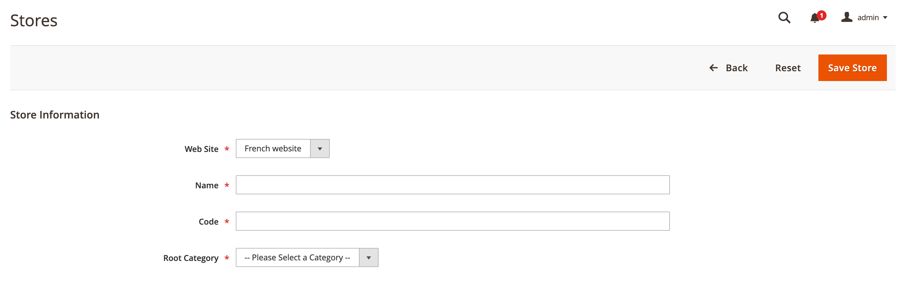

# 在管理员中设置多个视图

此任务要求您为每个存储创建根类别(和其他类别（如果需要）)。 本主题中讨论的任务提供了一种设置多个存储的方法。 有关其他信息，请参阅《商务用户指南》中的以下资源：

- [类别](https://docs.magento.com/user-guide/catalog/categories.html)
- [添加网站](https://docs.magento.com/user-guide/stores/stores-all-create-website.html)
- [存储URL](https://docs.magento.com/user-guide/stores/store-urls.html)
- [内容](https://docs.magento.com/user-guide/cms/content-menu.html)

>[!INFO]
>
>例如，仅出于目的，我们使用的是带有网站代码的法语网站 `french` 在本主题中。 有关分步教程，请参阅 [教程：使用Apache设置多个网站](ms-apache.md) 和 [教程：使用nginx设置多个网站](ms-nginx.md)

## 步骤1:创建根类别

创建根类别是可选的，但在本教程中，我们将在 [事件](https://glossary.magento.com/event) 您希望每个网站具有唯一的根类别。 您可以选择创建其他类别。

要创建根类别，请执行以下操作：

1. 以有权创建类别的用户身份登录到管理员。
1. 单击 **目录** > **类别**.
1. 单击 **添加根类别**.
1. 在 **类别名称** 字段中，输入唯一名称以标识此类别。
1. 确保将“启用类别”设置为 **是**.

   有关此页面上其他选项的信息，请参阅 [根类别](https://docs.magento.com/user-guide/catalog/category-root.html).

   下图显示了一个示例。

   

1. 单击 **保存**.
1. 根据需要多次重复这些任务，以为存储创建根类别。

## 步骤2:创建网站

要创建网站，请执行以下操作：

1. 以有权创建网站、存储和存储视图的用户身份登录到管理员。
1. 单击 **商店** > **设置** > **所有商店**.
1. 在 _商店_ 页面，单击 **创建网站**.

   - **名称** — 输入用于标识网站的名称。
   - **代码** — 输入唯一代码；例如，如果您有一家法国商店，则可以在 `french`
   - **排序顺序** — 输入可选的数字排序顺序。

   下图显示了一个示例。

   

1. 单击 **保存网站**.
1. 根据需要多次重复这些任务以创建网站。

## 步骤3:创建商店

要创建商店，请执行以下操作：

1. 在 _管理员_ 面板，单击 **商店** > **设置** > **所有商店**.
1. 在 _商店_ 页面，单击 **创建商店**.

   - **网站** — 单击要与此商店关联的网站名称。
   - **名称** — 输入用于标识存储的名称。
   - **代码** — 输入唯一代码以标识存储。
   - **根类别** — 单击此存储的根类别的名称。

   下图显示了一个示例。

   

1. 单击 **保存存储**.
1. 根据需要多次重复这些任务以创建存储。

## 步骤4:创建商店视图

要创建存储视图，请执行以下操作：

1. 在 _管理员_ 面板，单击 **商店** > **设置** > **所有商店**.
1. 在“商店”页面上，单击 **创建存储视图**.

   - **存储** — 单击要与此存储视图关联的存储的名称。
   - **名称** — 输入用于标识此存储视图的名称。
   - **代码** — 输入唯一名称以标识此存储视图。
   - **状态** — 选择 **已启用**.

   下图显示了一个示例。

   

1. 单击 **保存存储视图**.
1. 根据需要多次重复这些任务以创建存储视图。

## 步骤5:更改网站基本URL

使用唯一URL(如 `http://french.magento.mg`，则必须在“管理员”中更改每个网站的基本URL。

要更改网站基本URL，请执行以下操作：

1. 在 _管理员_ 面板，单击 **商店** > **设置** > **配置** > **常规** > **Web**.
1. 从 **存储视图** 列表时，单击其中一个网站的名称，如下图所示。

   

1. 在右侧窗格中，展开 **基本URL**.
1. 在 _基本URL_ 部分，清除 **使用系统值**.
1. 输入 `http://french.magento.mg` 中的URL **基本URL** 和 **基本链接URL** 字段。

1. 在 _基本URL（安全）_ 中。

   >[!INFO]
   >
   >如果要为云基础架构上的部署Adobe Commerce设置基本URL，则必须将第一个时段替换为三个短划线。 例如，如果您的基本URL是 `french.branch-sbg7pPa-f3dueAiM03tpy.us.magentosite.cloud`，输入 `http://french---branch-sbg7pPa-f3dueAiM03tpy.us.magentosite.cloud`. 如果要为本地测试设置基本URL，请使用句点。

1. 单击 **保存配置**.

1. 对其他网站重复执行这些任务。

## 步骤6:将存储代码添加到基本URL

商务允许您选择将存储代码添加到网站基本URL，从而简化设置多个存储的过程。 使用此选项，您不必在商务文件系统上创建目录即可存储 `index.php` 和 `.htaccess`.

这可防止 `index.php` 和 `.htaccess` 从未来升级中与Commerce代码库不同步。

请参阅 [Commerce用户指南](https://docs.magento.com/user-guide/stores/store-urls.html).

要将存储代码添加到基本URL，请执行以下操作：

1. 在 _管理员_ 面板，单击 **商店** > **设置** > **配置** > **常规** > **Web**.
1. 从 **存储视图** 列表，单击 **默认配置** 如下图所示。

   

1. 在右侧窗格中，展开 **Url选项**.
1. 清除 **使用系统值** 复选框位于 _将存储代码添加到Url_.
1. 从 _将存储代码添加到Url_ 列表，单击 **是**.

   

1. 单击 **保存配置**.
1. 如果出现提示，请刷新缓存。 (**系统** > **缓存管理**)。

## 步骤7:更改默认的商店视图基本URL

您必须在最后执行此步骤，因为您将失去对管理员的访问权限；在设置虚拟主机后，如特定于web服务器的主题中所述，将返回您的访问权限。

要更改默认的商店视图基本URL，请执行以下操作：

1. 在 _管理员_ 面板，单击 **商店** > **设置** > **配置** > **常规** > **Web**.

1. 从 _存储视图_ 列表，单击 **默认配置**.

   

1. 在右侧窗格中，展开 **基本URL**.
1. 在 _基本URL_ 部分，清除 **使用系统值**.
1. 输入 `http://magento.mg` 中的URL **基本URL** 和 **基本链接URL** 字段。

1. 在 **基本URL（安全）** 中。

   >[!INFO]
   >
   >如果要在云基础架构上为Adobe Commerce设置基本URL，则必须将第一个句点替换为三个破折号。 例如，如果您的基本URL是 `french.branch-sbg7pPa-f3dueAiM03tpy.us.magentosite.cloud`，输入 `http://french---branch-sbg7pPa-f3dueAiM03tpy.us.magentosite.cloud`

1. 单击 **保存配置**.
