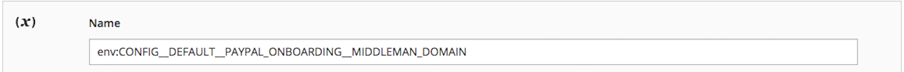

# 覆盖配置设置

本主题讨论如何获取知道配置路径的环境变量名称。 您可以使用环境变量覆盖Adobe Commerce配置设置。 例如，您可以在生产系统上覆盖支付处理者的实时URL的值。

您可以覆盖的值 _任意_ 使用环境变量进行配置设置；但是，Adobe建议使用共享配置文件 `config.php`以及系统特定的配置文件， `env.php`，如中所述 [部署一般概述](../deployment/overview.md).

>[!TIP]
>
>查看 [配置环境](https://experienceleague.adobe.com/docs/commerce-cloud-service/user-guide/configure/env/stage/variables-intro.html) 中的主题 _云基础架构上的Commerce指南_.

## 环境变量

环境变量名称包括其作用域，后跟特定格式的配置路径。 以下部分将更详细地讨论如何确定变量名称。

您可以将变量用于以下任何一项：

- [敏感值](config-reference-sens.md) 必须使用环境变量或 [`magento config:sensitive:set`](../cli/set-configuration-values.md) 命令。
- 系统特定的值必须使用以下方式设置：

   - 环境变量
   - 此 [`magento config:set`](../cli/set-configuration-values.md) 命令
   - 管理员后接 [`magento app:config:dump` 命令](../cli/export-configuration.md)

可在以下位置找到配置路径：

- [敏感和系统特定的配置路径引用](config-reference-sens.md)
- [支付配置路径参考](config-reference-payment.md)
- [Commerce B2B扩展配置路径参考](config-reference-b2b.md)
- [其他配置路径参考](config-reference-general.md)

### 变量名称

系统设置变量名称的一般格式如下：

`<SCOPE>__<SYSTEM__VARIABLE__NAME>`

`<SCOPE>` 可以是：

- 全局范围(即 _所有_ 范围)

   全局范围变量的格式如下：

   `CONFIG__DEFAULT__<SYSTEM__VARIABLE__NAME>`

- 特定范围（即，设置仅影响指定的商店视图或网站）

   例如，存储视图范围变量的格式如下：

   `CONFIG__STORES__ <STORE_VIEW_CODE>__<SYSTEM__VARIABLE__NAME>`

   有关范围的详细信息，请参见：

   - [步骤1：查找网站或商店视图范围值](#step-1-find-the-website-or-store-view-scope-value)
   - [有关范围的Commerce用户指南主题](https://docs.magento.com/user-guide/configuration/scope.html)
   - [范围快速参考](https://docs.magento.com/user-guide/stores/store-scope-reference.html)

`<SYSTEM__VARIABLE__NAME>` 是用双下划线字符替换的配置路径 `/`. 有关更多信息，请参阅 [步骤2：设置系统变量](#step-2-set-global-website-or-store-view-variables).

### 变量格式

`<SCOPE>` 分隔自 `<SYSTEM__VARIABLE__NAME>` 两个下划线字符。

`<SYSTEM__VARIABLE__NAME>` 派生自配置设置的 _配置路径_，即 `/` 唯一标识特定设置的分隔字符串。 替换每个 `/` 字符（带有两个下划线字符）来创建系统变量。

如果配置路径包含下划线字符，则下划线字符将保留在变量中。

可在以下位置找到配置路径的完整列表：

- [敏感和系统特定的配置路径引用](config-reference-sens.md)
- [支付配置路径参考](config-reference-payment.md)
- [Commerce Enterprise B2B扩展配置路径参考](config-reference-b2b.md)
- [其他配置路径参考](config-reference-general.md)

## 步骤1：查找网站或商店视图范围值

本节讨论如何查找和设置系统配置值，根据 _范围_ （商店视图或网站）。 要设置全局范围变量，请参阅 [步骤2：设置全局、网站或商店视图变量](#step-2-set-global-website-or-store-view-variables).

范围值来自 `store`， `store_group`、和 `store_website` 表格。

- 此 `store` table指定存储视图名称和代码
- 此 `store_website` 表指定网站名称和代码

您还可以使用“管理员”查找代码值。

如何读取表：

- `Path in Admin` 列

   逗号之前的值是管理员导航中的路径。 逗号后的值是右窗格中的选项。

- `Variable name` 列是相应环境变量的名称。

   如果需要，可以选择将这些配置参数的系统值指定为环境变量。

   - 整个变量名称始终为全大写
   - 变量名称的开头为 `CONFIG__` （注意两个下划线字符）
   - 您可以找到 `<STORE_VIEW_CODE>` 或 `<WEBSITE_CODE>` Admin或Commerce数据库中变量名称的一部分，如以下部分所示。
   - 您可以找到 `<SYSTEM__VARIABLE__NAME>` 如中所述 [步骤2：设置全局、网站或商店视图变量](#step-2-set-global-website-or-store-view-variables).

### 在管理员中查找网站或商店视图范围

下表汇总了如何在“管理员”中查找网站或存储视图值。

| 描述 | 管理员中的路径 | 变量名称 |
|--------------|--------------|----------------------|
| 创建、编辑、删除商店视图 | **[!UICONTROL Stores]** > **[!UICONTROL All Stores]** | `CONFIG__STORES__<STORE_VIEW_CODE>__<SYSTEM__VARIABLE__NAME>` |
| 创建、编辑和删除网站 | **[!UICONTROL Stores]** > **[!UICONTROL All Store]s** | `CONFIG__WEBSITES__<WEBSITE_CODE>__<SYSTEM__VARIABLE__NAME>` |

例如，要在“管理员”中查找网站或存储视图范围值，请执行以下操作：

1. 以有权查看网站的用户身份登录到管理员。
1. 单击 **[!UICONTROL Stores]** > **[!UICONTROL All Store]s**.
1. 单击网站或商店视图的名称。

   右侧窗格显示如下。

   

1. 作用域名称显示在 **[!UICONTROL Code]** 字段。
1. 继续使用 [步骤2：设置全局、网站或商店视图变量](#step-2-set-global-website-or-store-view-variables).

### 在数据库中查找网站或商店视图范围

要从数据库中获取这些值，请执行以下操作：

1. 以文件系统所有者的身份登录开发系统（如果尚未登录）。
1. 输入以下命令：

   ```bash
   mysql -u <database-username> -p
   ```

1. 在 `mysql>` 提示符下，按所示顺序输入以下命令：

   ```shell
   use <database-name>;
   ```

1. 使用以下SQL查询查找相关值：

   ```shell
   SELECT * FROM STORE;
   SELECT * FROM STORE_WEBSITE;
   ```

   下面是一个示例：

   ```shell
   mysql> SELECT * FROM STORE_WEBSITE;
   +------------+-------+--------------+------------+------------------+------------+
   | website_id | code  | name         | sort_order | default_group_id | is_default |
   +------------+-------+--------------+------------+------------------+------------+
   |          0 | admin | Admin        |          0 |                0 |          0 |
   |          1 | base  | Main Website |          0 |                1 |          1 |
   |          2 | test1 | Test Website |          0 |                3 |          0 |
   +------------+-------+--------------+------------+------------------+------------+
   ```

1. 使用来自以下各项的值： `code` 列作为作用域名称，而不是 `name` 值。

   例如，要为测试网站设置配置变量，请使用以下格式：

   ```shell
   CONFIG__WEBSITES__TEST1__<SYSTEM__VARIABLE__NAME>
   ```

   位置 `<SYSTEM__VARIABLE__NAME>` 来自下一节。

## 步骤2：设置全局、网站或商店视图变量

本节讨论如何设置系统变量。

- 要设置全局范围（即所有网站、商店和存储视图）的值，请在变量名称开头使用 `CONFIG__DEFAULT__`.

- 要为特定的商店视图或网站设置值，请按照中所述启动变量名称 [步骤1：查找范围值](#step-1-find-the-website-or-store-view-scope-value)：

   - `CONFIG__WEBSITES`
   - `CONFIG__STORES`

- 变量名称的最后一部分是配置路径，每个配置设置具有唯一性。

[查看一些示例](#examples).

下表显示了几个示例变量。

| 描述 | 管理中的路径（省略） **商店** > **设置** > **配置**) | 变量名称 |
|--------------|--------------|----------------------|
| Elasticsearch服务器主机名 | 目录> **目录**， **Elasticsearch服务器主机名** | `<SCOPE>__CATALOG__SEARCH__ELASTICSEARCH_SERVER_HOSTNAME` |
| Elasticsearch服务器端口 | 目录> **目录**， **Elasticsearch服务器端口** | `<SCOPE>__CATALOG__SEARCH__ELASTICSEARCH_SERVER_PORT` |
| 装运国家/地区来源 | 销售> **配送设置** | `<SCOPE>__SHIPPING__ORIGIN__COUNTRY_ID` |
| 自定义管理员URL | 高级> **管理员** | `<SCOPE>__ADMIN__URL__CUSTOM` |
| 自定义管理路径 | 高级> **管理员** | `<SCOPE>__ADMIN__URL__CUSTOM_PATH` |

## 示例

本节介绍如何查找某些示例变量的值。

### Elasticsearch服务器主机名

要查找用于全局HTML缩小的变量名称，请执行以下操作：

1. 确定范围。

   它是全局范围，因此变量名称的开头为 `CONFIG__DEFAULT__`

1. 变量名称的其余部分为 `CATALOG__SEARCH__ELASTICSEARCH_SERVER_HOSTNAME`.

   **结果**：变量名称为 `CONFIG__DEFAULT__CATALOG__SEARCH__ELASTICSEARCH_SERVER_HOSTNAME`

### 装运国家/地区来源

要查找发运国家（地区）来源的变量名称，请执行以下操作：

1. 确定范围。

   在中查找范围 [数据库](#find-a-website-or-store-view-scope-in-the-database) 如步骤1：查找网站或商店视图范围值中所述。 (您还可以在“管理员”中找到值，如中所示 [步骤2中的表：设置全局、网站或商店视图变量](#step-2-set-global-website-or-store-view-variables。

   例如，范围可以是 `CONFIG__WEBSITES__DEFAULT`.

1. 变量名称的其余部分为 `SHIPPING__ORIGIN__COUNTRY_ID`.

   **结果**：变量名称为 `CONFIG__WEBSITES__DEFAULT__SHIPPING__ORIGIN__COUNTRY_ID`

## 如何使用环境变量

使用PHP的配置值设置为变量 [`$_ENV`](https://php.net/manual/en/reserved.variables.environment.php) 关联数组。 您可以在Commerce运行时运行的任何PHP脚本中设置值。

>[!TIP]
>
>在中设置变量值 `index.php` 或 `pub/index.php` 无法始终按预期工作，因为根据Web服务器配置，可以使用不同的应用程序入口点。 通过配售 `$_ENV` 中的指令 `app/bootstrap.php` 文件，无论不同的应用程序入口点是什么， `$_ENV` 指令始终执行，因为 `app/bootstrap.php` 文件作为Commerce架构的一部分加载。

设置两个的示例 `$_ENV` 值如下：

```php
$_ENV['CONFIG__DEFAULT__CATALOG__SEARCH__ELASTICSEARCH_SERVER_HOSTNAME'] = 'http://search.example.com';
$_ENV['CONFIG__DEFAULT__GENERAL__STORE_INFORMATION__MERCHANT_VAT_NUMBER'] = '1234';
```

有关分步示例，请参见 [使用环境变量设置配置值](../deployment/example-environment-variables.md).

>[!WARNING]
>
>- 要使用您在 `$_ENV` 数组，您必须设置 `variables_order = "EGPCS"`（Environment、Get、Post、Cookie和服务器） `php.ini` 文件。 有关详细信息，请参阅 [PHP文档](https://www.php.net/manual/en/ini.core.php).
>
>- 对于云基础架构上的Adobe Commerce，如果您尝试使用 [Project Web界面](https://experienceleague.adobe.com/docs/commerce-cloud-service/user-guide/project/overview.html#configure-the-project)，您必须在变量名称前加上 `env:`. 例如：
>
>
