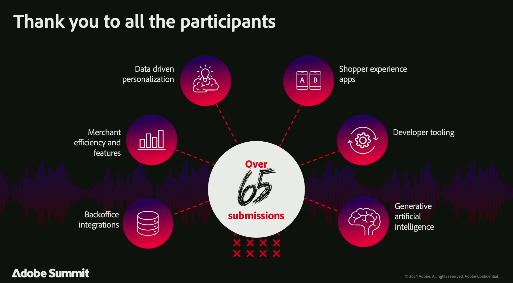

# 《2024年Adobe CommerceAdobe Summit摘要》

Adobe Summit2024是一项卓越的活动，将Adobe Commerce社区(包括行业领先的客户、有远见的合作伙伴以及我们的Adobe Commerce团队)聚集在一起，共同连接、探索和学习。 所有包含与Hanesbrands、可口可乐、雀巢、联合利华、佳能等公司的专题讨论的内容都是 [**现已按需提供**](https://business.adobe.com/summit/2024/sessions.html?Track=Commerce)！

以下是2024年Adobe Summit的一些要点。

## Adobe Commerce路线图会议

我们以充满创新的方式开始了会议 [**Adobe Commerce路线图会议**](https://business.adobe.com/summit/2024/sessions/adobe-commerce-2024-product-roadmap-review-s432.html) 通过体验导向型平台，我们展示了Adobe Commerce如何增强企业能力，使其能够更快地创新并加快销售。

观看本课程，了解Adobe Commerce如何提供以下功能：

- **[更快的店面体验](https://experienceleague.adobe.com/developer/commerce/storefront/)：** 我们新的高性能店面体系结构、Edge Delivery Services、网站速度、SEO排名和自然流量都得到了提升。 此外，与Adobe Experience Manager Assets的新集成可简化您的内容供应链，让您能够访问GenAI内容开发和工作流管理。

- **[超个性化购买历程](https://experienceleague.adobe.com/en/docs/commerce-admin/customers/customers-menu/personalize-scale)：** 自动收集并共享实时店面点击次数、后端订单历史记录，以及现在与其他Adobe Experience Cloud解决方案的客户档案数据。 使用用例行动手册自动设置全渠道营销活动，并使用Adobe Real-Time CDP受众个性化商务移动应用程序和追加销售/交叉销售选件。

- **[简化的可组合开发](https://developer.adobe.com/commerce/extensibility/app-development/learning-path/)：** 使用Adobe Developer App Builder更快捷、更低成本地进行创新。 使用新的后台集成入门套件简化与ERP和其他后端系统的集成。 通过统一的开发人员体验（包括API编排、事件管理和无服务器可扩展性），配置Webhook并自定义Admin UI。

- **[高级B2B Commerce和订单管理](https://experienceleague.adobe.com/en/docs/commerce-admin/b2b/introduction)：** 使用高级报价工具和父子帐户配置提高B2B销售，以支持大型全球帐户和B2B2X用例。 通过我们新的预建集成，以前所未有的速度连接到IBM Sterling Order Management，借助实时库存管理、自动订单履行、退货管理以及全套功能板和工作流程最大程度提高运营效率。

## 强大的客户和合作伙伴会议

我们由Adobe Commerce客户和合作伙伴组成的创新社区也分享了他们的策略、最佳实践和学习。

深入了解Commerce的所有讲座 [此处](https://business.adobe.com/summit/2024/sessions.html?Track=Commerce) 并查看以下一些最热门的会议：

- [联合利华如何将其全球分销贸易路线数字化](https://business.adobe.com/summit/2024/sessions/how-unilever-digitized-its-distributive-trade-rout-s430.html) 与联合利华副总兼首席技术官Prashaant Huria合作； *已选择Prashant作为 [年度体验创造器](https://www.adobeexperienceawards.com/stories2024) 在APAC*

- [E-Comm Masterclass：Hanesbrands打造全球最快的店面](https://business.adobe.com/summit/2024/sessions/ecomm-masterclass-hanesbrands-creates-the-worlds-f-s435.html) 与Hanesbrands全球业务洞察和数据分析高级经理Emmylou Jordan合作

- [可口可乐：释放数据以创建以消费者为中心的Commerce体验](https://business.adobe.com/summit/2024/sessions/cocacola-unlocking-data-to-create-consumercentric-s434.html) 可口可乐公司Global Adtech/Martech Platforms的Director维奈·戈皮纳斯

- [佳能如何使用Adobe Commerce提高转化率和流量](https://business.adobe.com/summit/2024/sessions/how-canon-increased-conversion-rates-and-traffic-u-s438.html) 与美国佳能公司Martech Engagement Ops经理Matthew Mandato一起

- [Nestle Purina：使用Adobe Commerce构建可组合平台，以实现业务灵活性](https://business.adobe.com/summit/2024/sessions/purina-takes-composable-commerce-approach-to-boost-s437.html) 与雀巢Purina D2C高级技术经理Ben Robie合作

## Adobe Commerce Rockstars的创新展示

每年，我们都会向世人展示最富创新精神的客户和合作伙伴开发人员与Adobe Commerce合作的成果。 查看 **[Adobe Commerce Rockstar展示](https://business.adobe.com/summit/2024/sessions/adobe-commerce-rockstar-showcase-s431.html)** 我们从65个以上筛选出的前3个提交内容中了解到：

- **利用Edge Delivery Services和Luma Bridge实现店面创新**

  Martin Altmann，首席顾问和Adobe实践主管，Comwrap回复

- **App Builder集成，用于精益订单管理**

  Shikha Raina，Bounteous建筑师

- **主GPT GenAI推荐的产品内容创建**

  Yaroslav Rogoza，Atwix首席技术官

看看谁被授予2024年Adobe Commerce摇滚明星勋章！

重温所有精彩会议，请点击 **[深入了解按需内容](https://business.adobe.com/summit/2024/sessions.html?Track=Commerce)** 并始终了解上最新Adobe Commerce创新 [**Experience League**](https://experienceleague.adobe.com/en/docs/commerce-admin/start/about).
