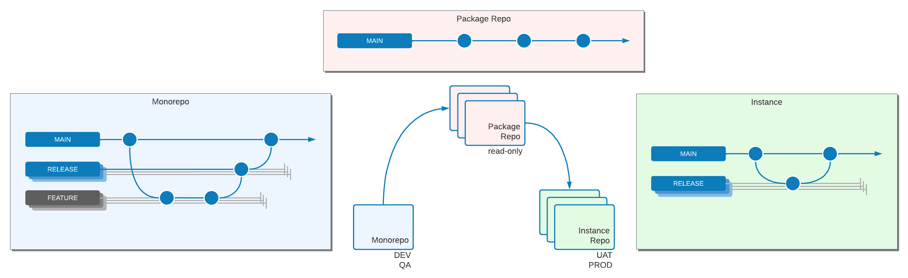
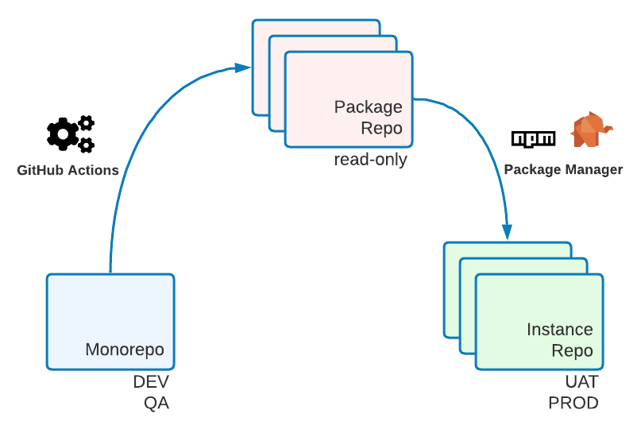

# 全局参考架构示例

本主题介绍组织报表的常用方法 [全球参考体系结构(GRA)](overview.md) 代码库。 尽管 [单独的包](#option-1-separate-packages) 选项是首选，某些情况下需要下面描述的其他选项之一。

## 定义

{{$include /help/_includes/gra-definitions.md}}

## 选项1：单独的包

请参阅 [Composer项目结构](composer/project-structure.md) 设置此方法的最佳实践。


管理GRA Composer包的最灵活方式是通过中继。 中继包包含 `composer.json` 仅文件，用于定义其他包依赖关系。 使用创建元包 [专用包程序](https://packagist.com/) 存储库。

### 主项目 `composer.json`

```json
{
    "name": "example-client/region-1",
    "description": "Example Client Region 1",
    "type": "project",
    "require": {
        "magento/product-enterprise-edition": "2.3.5",
        "example-client/meta-region-1": "~1.0"
    },
    "minimum-stability": "dev",
    "prefer-stable": true,
    "repositories": [
        {"type": "composer", "url": "https://repo.packagist.com/example-client/"},
        {"packagist.org": false}
    ]
}
```

### `example-client/meta-region-1 composer.json`

```json
{
    "name": "example-client/meta-region-1",
    "description": "Region 1 meta package",
    "type": "metapackage",
    "require": {
        "example-client/meta-gra": "~1.0",
        "example-client/theme-frontend-region1",
        "example-client/language-es-es",
        "ingenico/ogone-client"
    }
}
```

### `example-client/meta-gra composer.json`

```json
{
    "name": "example-client/meta-gra",
    "description": "GRA meta package",
    "type": "metapackage",
    "require": {
        "geoip2/geoip2": "~2.0",
        "magento-services/module-stackify-logger": "~1.1",
        "example-client/sap-connector",
        "example-client/service-chat",
        "example-client/store-locator"
    }
}
```

每个模块、语言包、主题和库都有自己的Git存储库。 每个Git存储库都会自动同步到专用包存储库，并在其中生成包，前提是 `composer.json` 文件，该文件位于Git存储库的根目录中。

## 选项2：批量包

以下是单个Composer包中多个模块的示例。

批量包只能包含相同类型的包。 例如，如果您有Adobe Commerce模块、主题、语言包和库的多个包，则必须为每个类型创建单独的批量包。

供应商目录中的文件结构应类似于以下示例。 但是，请检查您的项目以查看Git存储库中应包含的内容)：

```tree
.
└── example-client/
    └── gra/
        └── src/
            ├── SapConnector/
            │   ├── etc/
            │   └── registration.php
            ├── ServiceChat/
            │   ├── etc/
            │   └── registration.php
            ├── StoreLocator/
            │   ├── etc/
            │   └── registration.php
            └── composer.json
```

此 `composer.json` 文件应如下所示：

```json
{
    "name": "example-client/gra",
    "description": "GRA Modules",
    "require": {
        "magento/magento-composer-installer": "*"
    },
    "type": "magento2-module",
    "autoload": {
        "files": [
            "src/SapConnector/registration.php",
            "src/ServiceChat/registration.php",
            "src/StoreLocator/registration.php"
        ],
        "psr-4": {
            "ExampleClient\\SapConnector\\": "src/SapConnector",
            "ExampleClient\\ServiceChat\\": "src/ServiceChat",
            "ExampleClient\\StoreLocator\\": "src/StoreLocator"
        }
    }
}
```

## 选项3：拆分Git

此架构使用四个Git存储库来存储代码：

- `core`：包含Adobe Commerce核心安装。 用于升级Adobe Commerce版本。
- `GRA`：包含GRA代码。 所有GRA模块、语言包、白色标签主题和库。
- `brand/region`：每个品牌或区域都有自己的存储库，其中仅包含特定于品牌或区域的代码。
- `release`：上述所有内容将合并到此Git存储库中。 此处仅允许合并提交。


要设置此选项，请执行以下操作：

1. 在Git中创建四种存储库类型。 创建 `core` 和 `GRA` 存储库一次。 创建一个 `brand/region` 和一个 `release` 每个品牌的存储库。

   建议的存储库名称：

   - `m2-core`
   - `m2-gra`
   - `m2-region-x`/`m2-brand-x` (例如， `m2-emea`/`m2-adobe`)
   - `m2-release-region-x`/`m2-release-brand-x` (例如， `m2-release-emea`/`m2-release-adobe`)

1. 创建 `release/` 目录并运行以下命令，为所有存储库创建共享的Git历史记录。

   ```bash
   git init
   git remote add origin git@github.com:example-client/m2-release-brand-x.git
   git remote add core git@github.com:example-client/m2-core.git
   git remote add gra git@github.com:example-client/m2-gra.git
   git remote add region-x git@github.com:example-client/m2-region-x.git
   touch .gitkeep
   git add .gitkeep
   git commit -m 'initialize repository'
   git push -u origin master
   git push core master
   git push gra master
   git push region-x master
   ```

1. 克隆每个存储库，但 `core`，在计算机上的其他目录中。

   ```bash
   git clone git@github.com:example-client/m2-release-brand-x.git
   git clone git@github.com:example-client/m2-region-x.git
   git clone git@github.com:example-client/m2-gra.git
   ```

1. [使用编辑器安装Adobe Commerce](../../../installation/composer.md). 删除 `.gitignore` 文件，添加 `core` 远程、添加和提交代码以及推送。

   ```bash
   composer create-project --repository-url=https://repo.magento.com/ magento/project-enterprise-edition m2-core
   cd m2-core
   git init
   rm .gitignore
   git remote add origin git@github.com:example-client/m2-core.git
   git fetch
   git checkout .gitkeep
   git add --all
   git commit -m 'install Adobe Commerce'
   git push
   ```

1. 在 `GRA` 存储库，创建以下目录：

   - `app/code/`
   - `app/design/`
   - `app/i18n/`
   - `lib/`

1. 添加代码。 删除 `.gitignore` 文件、添加和提交代码、添加远程和推送。

1. 在 `brand/region` 存储库。 执行与中的相同的操作 `GRA` 并牢记文件必须是唯一的。 您不能同时在此存储库和 `GRA` 存储库。

1. 在 `release` 存储库中，应用合并。

   ```bash
   git clone git@github.com:example-client/m2-release-brand-x.git
   cd m2-release-brand-x
   git remote add core git@github.com:example-client/m2-core.git
   git remote add gra git@github.com:example-client/m2-gra.git
   git remote add region-x git@github.com:example-client/m2-region-x.git
   git fetch --all
   git merge core/master gra/master brand-a/master
   git push
   ```

1. 删除 `.gitkeep` 文件。

1. 部署 `release` 将存储库保存到生产、测试、QA和开发服务器。 升级 `core`， `GRA`、和 `brand` 代码可以轻松运行以下命令：

   ```bash
   git fetch --all
   git merge core/master gra/master brand-a/master
   git push
   ```

## 选项4：莫诺雷波（推荐）

此策略非常模拟Magento Open SourceGit存储库的工作方式。

所有代码都在单个存储库中进行开发和测试。 自动化从此单一存储库中提取包，可使用编辑器将其安装在UAT和生产环境中。



使用monorepo选项，您可以轻松地在单个存储库中工作，同时还可以灵活地使用包组合实例。

版本控制和包蒸馏通过使用GitHub操作或GitLab操作通过自动化来完成。



有关此自动化的更多信息，请参阅以下资源：

- [https://github.com/symplify/monorepo-builder](https://github.com/symplify/monorepo-builder)
- [https://github.com/danharrin/monorepo-split-github-action](https://github.com/danharrin/monorepo-split-github-action)

>[!TIP]
>
>设置monorepo是先进的，但以最低的间接成本提供了最大的灵活性。

## 不要混合策略

不建议对GRA包和 `app/` 品牌或区域包的目录。

你不仅得到所有 _优势_ 但也是 _缺点_ 两种方法的。 您应该选择其中一个（Git或编辑器）以优化工作。

## 要避免的解决方案

- **表示GRA或品牌的模块命名约定**

  命名模块以表示GRA或品牌会导致缺乏灵活性。 相反，请使用编辑器中继信息来确定模块属于哪个组。 例如，对于客户VF，包 `vf/meta-gra` 包含对所有GRA软件包的引用，并且可使用进行安装。 `composer require vf/meta-gra` 命令。 包 `vf/meta-kipling` 包含对所有吉卜林特定软件包和 `vf/meta-gra` 包。 模块已命名 `vf/module-sales` 和 `vf/module-sap` 例如。 此命名约定允许您在品牌状态与GRA状态之间移动包，但具有较低的影响。

- **每个实例的Adobe Commerce核心升级**

  为不同品牌或地区安排Adobe Commerce核心升级（包括修补程序升级），以尽可能紧密地共同执行。 由于兼容性限制，为共享模块支持多个Adobe Commerce版本会导致模块分叉，并将维护工作增加一倍。 在继续常规开发之前，请确保所有实例都在同一Adobe Commerce版本上运行，以防止这种工作量的增加。
