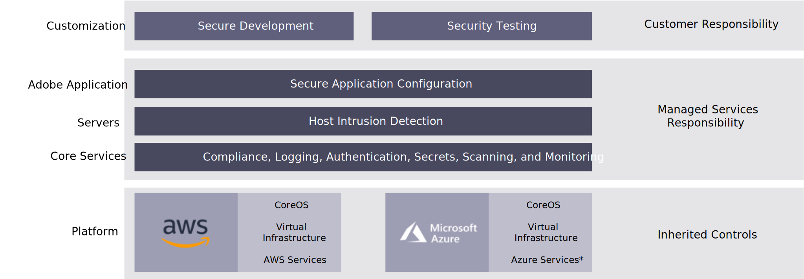

# 托管服务

Adobe云基础架构管理服务上的商务默认是安全的。

## 分担责任

Adobe商务专业计划依赖于共享责任安全模型。 在这种模式下，不同当事方在维护系统安全方面有不同的责任领域。 这种方法既允许灵活性，又允许使用同类最佳的云技术。

### Adobe管理的服务责任

Adobe Managed Services负责AdobeCommerce Pro云环境、核心AdobeCommerce Pro应用程序代码以及内部商务系统的安全性和可用性。 这包括但不限于：

- 服务器级修补
- 运行必要的服务以提供Adobe商务专业计划
- 漏洞测试
- 安全事件日志记录和监控
- 事件管理
- 运行监测
- 24/7支持
- 确保客户基础架构可以按照SLA使用

Adobe Managed Services还负责管理服务器防火墙配置(iptables)和外围防火墙配置（安全组）。 Adobe还可以定期发布对核心应用程序的安全更新。 客户有责任应用这些修补程序。 这些领域都包括在云基础架构系统上Adobe商务的PCI认证中。

### AWS职责

Adobe Managed Services将Amazon Web Services(AWS)用于云服务器基础设施。 AWS负责网络的安全，包括通过防火墙系统和入侵检测系统(IDS)进行路由、交换和外围网络安全。 AWS负责对管理Adobe商务云环境的数据中心进行物理安全，并负责环境安全，以确保实施适当的电源、冷却和机制控制。

Adobe商务专业版计划使用：

- Amazon Elastic Compute Cloud(EC2)
- Amazon Simple Storage Service(S3)
- Amazon Elastic Block Store(EBS)
- Amazon Virtual Private Cloud(VPC)
- Amazon弹性负载平衡器(ELB)
- Amazon云跟踪服务。

Amazon拥有广泛的合规计划，其中包括PCI DSS、SOC 2和ISO 27001认证。

### 解决方案合作伙伴/客户责任

客户主要负责其在Adobe商务Pro计划云环境中运行的Adobe商务应用程序的自定义实施的安全性。 这包括：

- 确保应用程序和安全监控活动的安全配置和编码，包括渗透测试和定期漏洞扫描。

- 在其系统中使用的任何自定义、扩展、其他应用程序或集成的安全性。

- 用户的安全性，以及授予对其配置和应用程序的访问权限。

- 客户可控制其非生产环境的所有代码部署。 此控制还负责将应用程序安全修补程序应用到核心Adobe商务应用程序、扩展或任何自定义代码。

- 客户应对其自定义应用程序进行渗透测试。 客户、实施合作伙伴或Adobe商务专业服务可通过技术资源来解决这些责任。

- 客户负责其定制应用程序和自身流程的PCI要求。 客户的PCI合规性建立在AWS和Adobe商务的PCI认证之上，以最大限度地减少必须审查的领域。
