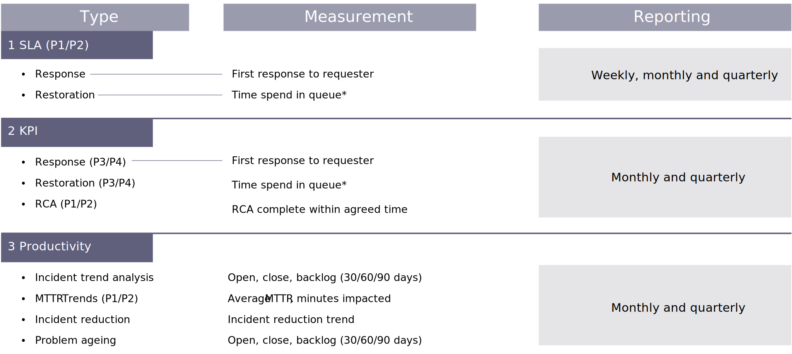

# 支持量度

下图显示了为L1函数收集和报告的典型量度/KPI:

L2服务（增强功能和可选服务）的测量和报告与开发项目类似。 L2团队的绩效和进度由速度、代码质量、测试有效性和工作效率等量度来衡量。

| 关键性能测量 | 单位 | 报告的量度 |
|------------------------------|---------------------|------------------------------------------------------------------------------------|
| 速度 | 数值 | 不。 团队为短跑比赛提供的故事点 |
| Sprint承诺效率 | 百分比 | 合计否。 Sprint提交的故事点数与交付次数 |
| Sprint Burn（冲刺失效） | 数值 | 图表（报表，跟踪冲刺期间的工作完成情况） |
| 代码质量 | 数字、百分比 | Complecy（复杂性）、 LoC(LoC)、Ivolations（违规）、Code（代码）的冲刺覆盖 |
| 需求波动 | 数值 | sprint的要求数目变动/总要求数目 |
| 缺陷密度 | 百分比 | [不。 发现的有效缺陷/已执行测试用例总数]*100用于冲刺 |
| 测试有效性 | 百分比 | [有效缺陷产生/（有效缺陷产生+已拒绝缺陷）]*100用于冲刺 |
| 工作效率 | 数字（趋势） | 每冲刺/容量投放的故事点数 |
