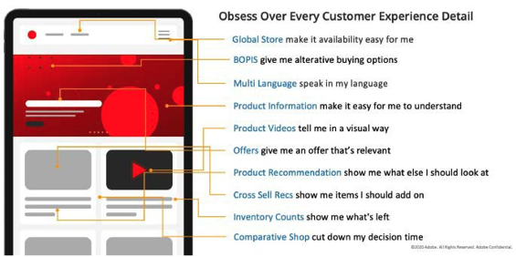

# 什么是电子商务？

在电子商务（社交销售和数字市场）的重叠世界中，客户体验为消费者提供了参与他们喜欢的渠道的选择，因此，在您的在线参与和销售方式上做出正确选择从未像现在这样至关重要。 电子商务和在线购物经常互换使用，但其核心电子商务比这更广泛。 它体现了在线开展业务的概念，并纳入了多种不同的服务。

电子商务正在经历巨大的增长。 它从2014年的1.3万亿美元行业，变为2019年的3.5万亿美元行业。 专家预测，到2023年，电子商务品牌将达到6.5万亿以上，这意味着电子商务品牌将拥有巨大的机会利用转化优化。 电子商务的力量不应被低估，因为它继续在日常生活中盛行，为中小企业和大企业及在线投资者提供了重大机遇。

无论您是刚刚开始电子商务业务，还是已经从事电子商务业务一段时间，您都可能知道，成功很难，这就是为什么我们编写了本指南，介绍如何经营一家成功的电子商务业务。

下面根据每个不同类别快速总结了外部电子商务业务的类型：

以下是不同的电子商务业务模式：

- 企业对企业(B2B)
- 企业对消费者(B2C)
- 消费者对消费者(C2C)
- 消费者对企业(C2B)

以下是不同的电子商务收入模型：

- Dropshipping
- 订阅
- 私有标签和制造业
- 白色标签
- 批发
- 租金和贷款

以下是不同类型的电子商务网站：

- 个人品牌网站（一个卖家）
- 在线零售商（选择销售商数量）
- 市场（多个卖家）

## 优缺点

电子商务让人们能够打开自己虚拟商店的大门。 在线销售让小型、专业化的商店和大品牌的商店更容易吸引到广大的受众。 然而，与传统企业一样，电子商务也有利弊。

### 优势

- 与实体电商相比，电商开销较低
- 网上商店开24/7
- 即时购买
- 个性化和自定义的用户体验
- 全球客户触及潜力

### 缺点

- 网上竞争激烈
- 运输可能不可预测

利大于弊，这就是市场、零售商和商户收入增长方便的原因。

## 客户挑战

以下是组织遇到的一些常见电子商务挑战：

- 您可能使用过时的平台来让访客离开您的网站。
- 您的网站可能无法响应，从而导致移动设备访客不得不前往其他位置。
- 您的内部团队可能缺乏能够有效运行商业平台的结构和技能。
- 您可能会质疑您的基础架构是否适合您的业务。

客户期望值在上升，而且始终有新的增长技术来提高转化率。 本手册将详细概述和解释如何解决其中的一些客户难题，并成功运行电子商务网站以充分发挥其潜力。

## 商业行业

