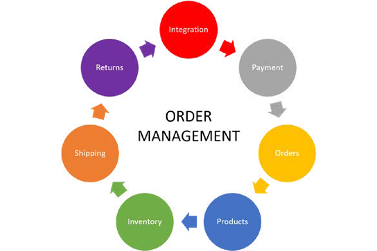

# 订单管理

对于全新业务而言，订单量较低，更易于以较低成本完成订单。 但是，当需求增加时，订单会增加，并且很难通过小型团队或自己以较低的成本处理订单。 根据业务的性质，您可能需要更大的设施，如仓库或多个仓库，这可能成本高昂，需要更多员工。 这就是订单管理要介入的地方。

订单管理有助于满足不断变化的运营需求，以管理需求、库存、包装和运输。 将订单管理系统与平台集成可以帮助企业满足其不断变化的需求，并提高客户满意度、客户维系、高转化率和品牌忠诚度。 所有这些因素都直接或间接地影响业务的性能和收入增长。

订单管理系统有助于将所有关键数据集中到一个系统中，从而提供所有流（包括订单、产品、客户、库存、包装、退货和付款）的单一视图，以便您轻松满足客户的期望。

订单管理在任何电子商务业务中都是必不可少的，因为它形成一个链，并将所有因素捆绑在一起，以便企业可以执行以下操作：

- 在多个仓库中检查库存
- 维护产品库存水平，以便他们为任何促销或销售期间做好准备
- 为客户提供多种支付方式以增强客户体验
- 提供订单跟踪功能，方便客户查看订单状态，同时方便其内部客户服务团队快速查询订单
- 为业务中的所有部门提供支持，以免出现任何不协调的情况
- 保持发货状态，了解是否需要更多员工或发货方式以加快订单发货速度
- 监控客户回访，了解客户退货的原因，以便他们着手处理并改进
- 有助于了解客户对购买是否满意的总体体验，以及业务如何改进以更好地为客户服务

正确的订单管理系统及其正确使用可以为组织带来收入方面的惊喜。 它节省了资金和时间，提供了协同工作的不同部门的概况，并帮助业务部门预测需求并努力改善客户体验以提高转化率。

