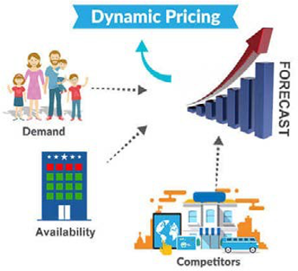

# 动态定价管理

动态定价是一种响应式定价策略，价格根据需求、供应、趋势和竞争实时变化。 这不是一个新概念，它已经存在了一段时间，但肯定正在取代电子商务。 动态定价使零售商能够改变价格，以获得竞争优势。 例如，您可以尝试降低销售不佳产品的价格来尝试提高销售量。

有三种因素驱动着动态定价，包括：

- **行业** — 零售商需要检查产品与其他品牌之间的最基本价格。

- **市场** — 当前供应和需求是什么？ 预计的供求情况如何？

- **客户** — 客户的购买行为是什么？ 客户愿意为产品支付的价格。

制定动态定价策略时，您需要了解每个方面。

## 优点

与其他策略一样，动态定价也有优缺点。 应用动态定价策略的一些好处包括：

- 允许零售商了解客户购买行为和市场趋势

- 零售商可以根据其他品牌为产品设定的最基本价格来设定不同的产品价格

- 允许零售商分析客户最可接受的消费价格

- 帮助最大限度地提高ROI

- 为零售商提供竞争优势

## 缺点

动态定价的一些缺点包括：

- 没有定期更新价格。 尽管价格由软件来管理，但必须始终提供人机交互

- 价格波动常常让客户感到困惑（有些客户可能会等待价格再次变化，有些客户可能会失去信任）

- 最初应用策略时，与其他品牌的竞争可能会增加

## 最佳实践

在实施动态定价策略时可以应用的一些最佳实践包括：

- 制定更基于初始定价的良好定价策略。 初始定价简单明了，有助于您了解市场和市场定价。

- 引入忠诚度计划有助于为不同类型的客户引入不同的动态定价级别

- 在制定价格时分析产品的实时需求

- 在实施动态定价时应用整体方法，因为产品在不同商店中的价格可能不同（例如，宜家的热狗价格低于在超市购买一包包面包）

从实施动态定价策略中获益的最有效方法是不断了解您的客户、竞争对手和市场。

## B2B与B2C

B2B和B2C业务的动态定价有所不同。

### B2B应该

- 为客户提供定制的定价

- 基于数量的价格自动更改

### B2C应该

- 保持一致性

- 维护价格

- 显示促销和折扣

- 要显示的条款和条件
