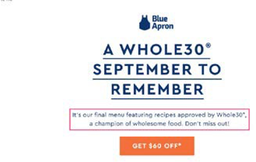

# 电子邮件营销

电子邮件营销（简而言之）是通过电子邮件向潜在客户和当前客户发送营销消息，以向客户促销、吸引和销售产品。 营销团队可以完全控制如何检索客户信息，以及如何通过直接电子邮件促销活动向客户发送个性化内容。 电子邮件作为一种工具，有助于在您的客户和品牌之间建立关系。

为什么应考虑电子邮件营销：

- 让您与当前和未来客户建立关系

- 帮助推动销售并提高转化率

- 帮助加快业务增长

- 不需要第三方，例如Instagram或Facebook

## 欢迎电子邮件

在电子商务业务中，留下第一印象至关重要。 如果您发送给新客户的第一个电子邮件是有效的，则会在客户的记忆中留下持久的印象。 尽量保持设计简单原始。 例如，某些品牌在客户注册时在电子邮件中提供折扣。

## 策划的电子邮件

策划电子邮件是电子邮件的最佳形式之一，因为它允许订阅者了解有关产品的更多信息。 您还可以发送基于客户细分的精选电子邮件。

## 参与度电子邮件

客户可以轻松地忽略电子邮件，但如果电子邮件作为参与电子邮件发送，则客户删除它而不查看它的概率较低。 参与电子邮件的形式可以是促销活动，为用户提供促销活动，如免费送货。

## 推荐电子邮件

口碑营销是最好的营销策略之一。 例如，向现有客户发送推荐电子邮件。 例如，“推荐一位朋友并接收$10！” 推荐电子邮件促使客户有机地传播消息，这有助于您获得更多客户。

## 折扣电子邮件

通过电子邮件提供折扣是一种有效的营销策略。 您应向订阅者提供折扣以保持其忠诚度。

## 放弃电子邮件

客户放弃购物车有各种原因，包括运输成本高或退货政策不尽人意。 您可以尝试将这些客户转化为成功的购物者，方法是：向其发送有关购物车中余留产品的提醒电子邮件。 此外，您还可以提供完成结账的激励措施，包括免运费、折扣或下次购买优惠券。 这有助于提高转化率。

## 订单确认电子邮件

订单确认电子邮件不仅有助于提高销售额，而且还能让客户相信他们下了订单，从而提高客户体验和忠诚度。

## 调查电子邮件

客户收到订单后，您应发送一封跟进调查电子邮件，询问他们的体验和改进建议。 如果客户完成调查，一些零售商还会提供礼品券，因为大多数时候客户没有完成调查的动机，所以他们不会这样做。

