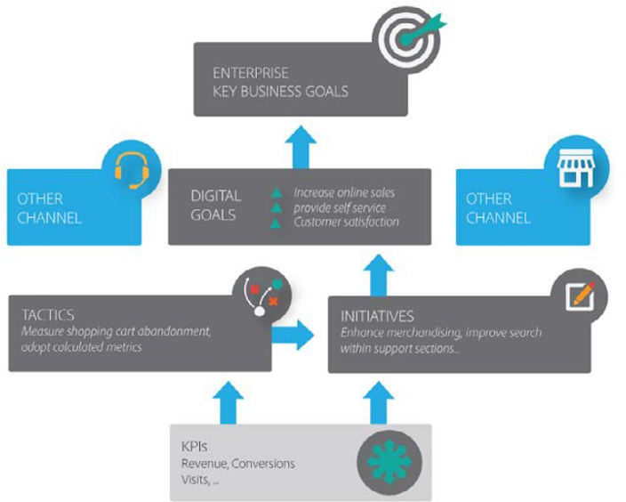

# Commerce策略

数字商业是一股快速发展的力量，每年都在迅速演变。 虽然这对个人而言可能令人兴奋，但对于试图在电子商务领域取得进展的组织而言，这也带来了许多挑战。

随着电子商务继续在B2B和B2C中发展，企业发现客户行为和期望发生了巨大变化；从研究产品/服务、考虑并完成购买或向品牌展示忠诚度的方式，到向同行传达所有这些信息的方式。 客户行为和预期可能迅速转变，企业可能难以适应新的市场趋势，并创建一种既现实又可实现的数字战略。

因此，任何数字战略的执行和规划都是任何成功的电子商务业务的关键。

每个企业的整体电子商务战略在本质上都是独一无二的，取决于成熟度、团队规模和资源。 以下部分介绍了解锁核心商务功能的策略，包括：

- 意识
- 考虑
- 购买
- 支持

## 意识

- 产品目录管理
- 产品比较
- 产品搜索和导航
- 产品信息
- 个性化体验
- 产品捆绑包管理
- 促销活动

## 考虑

- 产品选择支持和推荐
- 客户特定定价产品可用性和库存
- 价格标识和价目表管理
- 自助报价请求/询价
- 配置、定价、报价
- 动态定价

## 购买

- 订单创建
- 购物车和结帐市场
- 报价到订单的转换
- 订阅服务
- 联机PO事务处理和联机支付发票
- NextGen B2B集成排序（例如Punchout）
- 采购工作流和集成

## 支持

- 订单管理状态和跟踪
- 装运和交货状态
- 检索发票（订单历史记录）
- 一键重新排序
- 退货管理
- 查看帐户对帐单发票和贷项
- 自动续订和补充
- 产品注册/激活

## 目标

以下列表包括规划业务的数字战略时要考虑的主要目标：

- 一致性很重要
- 定期审查客户分析
- 在线改进
- 交互式产品可视化
- 在适用的情况下利用新技术
- 人工智能
- 更多提交选项
- 适当规划升级和站点维护

有关建议的电子商务策略框架，请参阅下图：

