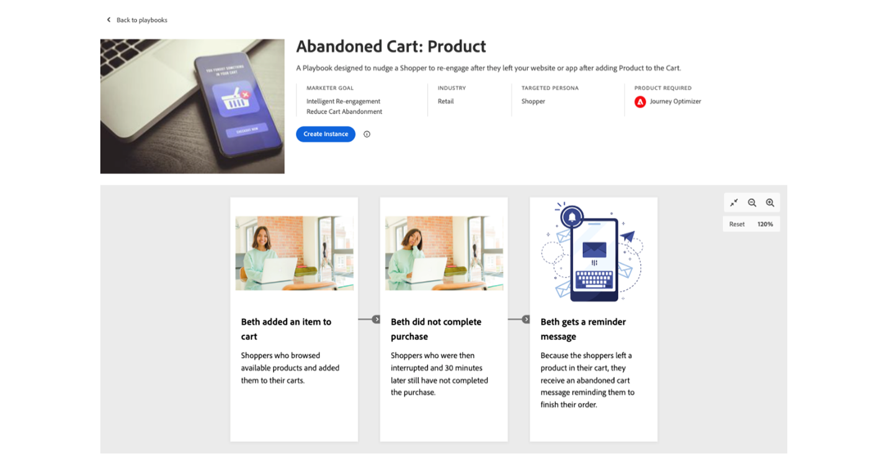

# Adobe Commerce 2月产品公告

Adobe Commerce一直与客户密切合作，开发以体验为导向的新商务功能，这些功能使他们能够更快地移动并加快销售。 像Hanesbrands这样的客户已经受益于使用这些新功能更快的网站、更高的转化率和更好的促销活动。 雀巢Purina利用我们统一的开发人员体验简化了可组合开发。 在此2月产品发布概述中了解这些新功能以及如何入门。

{zoomable=&quot;yes&quot;}

## 向其他电子商务领导者学习

参加这些面对面和虚拟活动，向电子商务领袖和从业人员了解有关Adobe Commerce的更多信息：

- **2024年3月15日**：Adobe Commerce：构建以体验为导向的Commerce平台，格林威治标准时间上午10:00 /下午6:00。 [注册实时网络研讨会](https://engage.adobe.com/BdgxpComWBR-register.html).

- **2024年3月26日至28日**：与成千上万的电子商务领袖和从业人员一起在拉斯维加斯的Adobe Summit生活。 了解更多关于 [Adobe Summit](https://business.adobe.com/summit/adobe-summit.html) 和 [Commerce跟踪](https://reg.adobe.com/flow/adobe/as24/sessions/page/catalog?tab.allsessions=1643149273691001NFtR&amp;search.track=1601680652403006TXuG) 扬声器 [Hanesbrand](https://reg.adobe.com/flow/adobe/as24/sessions/page/catalog?tab.allsessions=1643149273691001NFtR&amp;search=S435)， [可口可乐](https://reg.adobe.com/flow/adobe/as24/sessions/page/catalog?tab.allsessions=1643149273691001NFtR&amp;search=S434)， [联合利华](https://reg.adobe.com/flow/adobe/as24/sessions/page/catalog?tab.allsessions=1643149273691001NFtR&amp;search=s430)、和 [雀巢普瑞纳](https://reg.adobe.com/flow/adobe/as24/sessions/page/catalog?tab.allsessions=1643149273691001NFtR&amp;search=S437).

以前活动的录像：

- [简化电子商务](https://experienceleague.adobe.com/docs/events/learn-from-your-peers-recordings/commerce/feb2024/agile-sdlc.html?lang=en)：Agile SDLC中的通信、要求和测试方法。 2023年2月22日。

- [Hanesbrands：将数据付诸行动，以提供卓越的商业体验](https://engage.adobe.com/Q1PersWBR-register1.html). 2023年2月28日。

- [Adobe Commerce产品更新](https://experienceleague.adobe.com/docs/events/adobe-commerce-product-update-recordings/overview.html?lang=en) 自2023年第三季度至第四季度。

## 使用App Builder简化可组合开发

Adobe Commerce是一个可组合的电子商务平台，旨在更快地启动电子商务功能、在第三方系统之间轻松共享数据，并降低集成和自定义的拥有成本。

传统可组合应用程序是通过多个服务之间的点对点集成构建的。 这种方法导致易碎的集成层，且技术债务不断增加。 Adobe Commerce为开发人员提供了全面的扩展点以及可扩展平台，以编排API、事件和数据，从而实现灵活的可组合架构。 Adobe Commerce平台包括：

- 全面 [API](https://developer.adobe.com/commerce/webapi/) 覆盖
- [Webhooks](https://developer.adobe.com/commerce/extensibility/webhooks/) 自定义本机商务流程
- [管理员UI](https://developer.adobe.com/commerce/extensibility/admin-ui-sdk/) 可扩展性
- 超过700 [事件](https://experienceleague.adobe.com/docs/commerce-learn/tutorials/adobe-developer-app-builder/io-events/getting-started-io-events.html)

{align="center" zoomable="yes"}

[Adobe Developer App Builder](https://experienceleague.adobe.com/docs/commerce-learn/tutorials/adobe-developer-app-builder/introduction-to-app-builder.html) for Adobe Commerce是一个用于构建自定义功能并与第三方解决方案集成的云原生可扩展性平台。 它包括以下内容的API编排： [API网格](https://experienceleague.adobe.com/docs/commerce-learn/tutorials/adobe-developer-app-builder/api-mesh/getting-started-api-mesh.html)，使用的可伸缩的基于事件的数据路由 [Adobe I/O事件](https://developer.adobe.com/events/docs/)，和 [无服务器运行时](https://developer.adobe.com/runtime/docs/guides/overview/howitworks/).

此方法简化了开发人员在其可组合栈栈中添加新服务或替换现有服务的方式。 借助App Builder，开发人员可以轻松构建应用程序和集成，而Adobe则可处理App Builder基础架构的配置、扩展和安全性。 统一的Web控制台、开发人员工具、日志记录和监控可提供卓越的开发人员体验，并简化应用程序和集成的构建、运行和管理。 最重要的是，您可以将第三方服务插入App Builder，以便为现有投资添加强大的可扩展性。

>[!TIP]
>
>要了解如何开始使用App Builder，请查看我们的 [学习路径](https://developer.adobe.com/commerce/extensibility/app-development/learning-path/).

## Webhook和AdminUI SDK增强功能

[!BADGE 现在可用]{type=Informative tooltip="现在可用"}

在最新版本中，Adobe在简化电子商务企业的可组合开发方面继续处于领先地位。 您现在可以 [通过管理员UI配置webhook](https://developer.adobe.com/commerce/extensibility/webhooks/admin-configuration/) 使扩展本机商务流程（如结帐、添加到购物车等）变得更加简单。 Webhook现在也可以有条件触发。 例如，您只能针对特定邮政编码触发结账流程的送货计算webhook。

开发人员现在拥有更细粒度的控制来扩展管理员UI，例如添加其他 [列](https://developer.adobe.com/commerce/extensibility/admin-ui-sdk/extension-points/product/grid-columns/)， [按钮](https://developer.adobe.com/commerce/extensibility/admin-ui-sdk/extension-points/order/view-button/)、和 [成批活动](https://developer.adobe.com/commerce/extensibility/admin-ui-sdk/extension-points/order/mass-action/) 到现有的管理员面板。

今年晚些时候，Adobe将使API Mesh在全球超过200个地点可用，从而减少网络延迟并提供更好的计算时间；为购物者提供更好的整体体验。

>[!TIP]
>
>要了解如何开始使用Webhook，请阅读我们的 [文档](https://developer.adobe.com/commerce/extensibility/webhooks/).

## 集成入门套件和预建ERP集成

[!BADGE 2024年6月推出]{type=Informative tooltip="2024年6月推出"}

将电子商务平台与ERP、OMS或CRM集成是一项关键任务。 公司可以花费数万美元来构建这些集成。 为了降低与后台系统集成的成本并提高实时连接的可靠性，Adobe引入了一个集成启动套件。

该套件包括常用商业数据（包括订单、产品和客户）的引用集成。 它还包含载入脚本和标准化架构，供开发人员基于以下最佳实践进行构建。 入门套件（目前为Beta版）预计最多可减少50%的集成工作。

今年晚些时候，Adobe还将发布使用集成入门工具包为两个通用ERP预建的集成：

- [Microsoft Dynamics财务与运营](https://www.microsoft.com/en-us/dynamics-365/products/finance)
- [SAP S/4HANA](https://www.sap.com/products/erp/s4hana.html)

开发人员可以轻松自定义这些参考集成，以满足业务需求，从而缩短面市时间和降低集成成本。

>[!TIP]
>
>文档即将推出。

## Adobe Commerce中的Edge Delivery Services

[!BADGE 现在可用]{type=Informative tooltip="现在可用"}

研究表明，关于 [64%的购物者](https://techreport.com/statistics/website-load-time-statistics-data) 如果Web体验不佳，则将前往竞争对手的网站购买类似商品。 反之，网站速度每提高0.1秒，企业就会 [平均订单价值增长9.2%](https://techreport.com/statistics/website-load-time-statistics-data).

2023年， [Edge Delivery Services](https://business.adobe.com/products/experience-manager/sites/aem-sites.html) 在Adobe Experience Manager中引入此功能，以通过创建更快、更吸引人的网站来应对这些市场趋势。 Adobe现在通过新的高性能店面将这一强大的技术引入到Adobe Commerce。

为了提供真正强大而完整的商务体验，这个新店面不仅包括提供的相同优势和功能， [Edge Delivery Services](https://business.adobe.com/products/experience-manager/sites/aem-sites.html) 基于文档的创作、性能优先的体系结构和开箱即用的本机实验；还可以利用的规模和性能 [Adobe Commerce SaaS](https://experienceleague.adobe.com/docs/commerce-merchant-services/user-guides/home.html) 以及内置组件的灵活性和便利性，这些组件提供了在线交易所需的商务功能。

这个全新的高性能店面已经由数家Adobe Commerce商户成功试用，例如 [Maidenform](https://business.adobe.com/blog/perspectives/how-hanesbrands-and-adobe-built-one-of-the-fastest-ecommerce-websites-in-the-world)，HanesBrands的一个资产。 结果本身就说明问题。 Maidenform页面始终在Google Lighthouse中打分100和 [核心Web Vitals结果](https://www.rumvision.com/tools/core-web-vitals-history/www.maidenform.com/?path=/) 远高于行业平均水平。

{width=&quot;50%&quot; align=center}

{zoomable=&quot;yes&quot;}

来源： [https://treo.sh/sitespeed/www.maidenform.com](https://treo.sh/sitespeed/www.maidenform.com)

_“像我们一样对业务做出回应是一个梦想成真。 我们说，‘嘿，你想要更快点的？ 我们或许拥有世界上最快的电子商务网站。”_ - Leo Griffin，HanesBrands， Inc副总裁兼消费者技术全球总监

若要了解有关Adobe Commerce中Edge Delivery Services的更多信息，请访问 [Adobe Summit](https://reg.adobe.com/flow/adobe/as24/sessions/page/catalog?tab.format=1643049381306001SAYb&amp;search=masterclass&amp;search.track=1601680652403006TXuG)，包括我们的现成店面组件，这些组件支持更快地采用这种性能优先的架构。

此外，我们还举办了 [实验室会议](https://reg.adobe.com/flow/adobe/as24/sessions/page/catalog?tab.format=1643049381306001SAYb&amp;search=%5BL445%5D&amp;search.track=1601680652403006TXuG&amp;search.track=option_1636755664165) 以更深入地了解此新店面产品的内部操作和配置。

## Adobe Commerce的HIPAA就绪解决方案

[!BADGE 现在可用]{type=Informative tooltip="现在可用"}

Adobe拥有为各种规模的医疗保健客户部署HIPAA就绪服务的丰富经验。 从付款人到供应商，再到制药和医药技术供应商，Adobe为负责任的消费者数据管理设定了标准。 现在，借助适用于HIPPA的Adobe Commerce云平台版本，该专业知识正扩展到快速增长的医疗保健数字商业市场。

Adobe Commerce Cloud和Managed Service客户可以使用HIPAA就绪产品。 它包括额外的安全性和隐私控制以确保对电子个人健康信息(ePHI)的保护，从而使医疗保健和生命科学组织可以更轻松地履行其法规遵从性义务。 该解决方案支持多种使用案例，包括快速方便地在线销售医疗保险、处方、处方医疗设备和医疗用品。 Adobe Commerce现在加入了 [Adobe Experience Cloud医疗保健版](https://business.adobe.com/solutions/industries/healthcare.html) 一整套解决方案，使客户能够在尊重消费者偏好的同时，提供安全而卓越的病人体验。

>[!TIP]
>
>要详细了解Adobe Commerce上的HIPAA准备工作，请阅读我们的 [文档](https://experienceleague.adobe.com/docs/commerce-admin/start/compliance/hipaa-ready-service.html).

## B2B商务

[!BADGE 2024年4月推出]{type=Informative tooltip="2024年4月推出"}

Adobe Commerce多年来一直提供任务关键型B2B电子商务功能，包括公司帐户、购买批准规则、报价管理和客户价格手册。 这就是为什么B2B电子商务领袖喜欢 [Watsco](https://business.adobe.com/content/dam/dx/us/en/resources/ebooks/building-better-experiences/building-better-experiences-and-bigger-profits.pdf)， [SealedAir](https://business.adobe.com/customer-success-stories/sealed-air-case-study.html)， [Sunbelt租赁](https://business.adobe.com/customer-success-stories/sunbelt-rentals-case-study.html)， [Transcat](https://business.adobe.com/customer-success-stories/transcat-case-study.html)， [FoodServiceDirect.com](https://business.adobe.com/customer-success-stories/foodservicedirect-case-study.html)、和 [Univar解决方案](https://business.adobe.com/summit/2023/sessions/debunking-top-b2b-commerce-myths-s517.html) 在Adobe Commerce上加强全球B2B电子商务渠道。

Adobe很高兴地告诉大家，新的报价和公司管理功能将在4月推出。

公司管理功能允许企业使用Adobe的新父/子帐户结构配置支持B2B2X、企业集团或全球企业所需的任何买方公司结构。 购买者还可以切换多个子帐户，以简化购买。

基于我们强大的内置报价工具，B2B销售商可以利用新的询价(RFQ)工具（包括草稿报价、重复报价、拆分、报价模板和多管理员访问报价）更快地获得更多收入。

这两项功能将与Adobe Commerce的本机店面架构以及GraphQL API的Headless商业部署兼容。

>[!TIP]
>
>要了解有关B2B Commerce功能的更多信息，请阅读我们的文档：
>
>- [《 B2B for Adobe Commerce用户指南》](https://experienceleague.adobe.com/docs/commerce-admin/b2b/guide-overview.html)
>- [适用于Adobe Commerce的B2B开发人员指南](https://developer.adobe.com/commerce/webapi/rest/b2b/)

## Adobe Commerce与Adobe Experience Platform之间的更深入集成

[!BADGE 2024年6月推出]{type=Informative tooltip="2024年6月推出"}

去年，Adobe Commerce发布了 [数据连接](https://experienceleague.adobe.com/docs/commerce-merchant-services/data-connection/overview.html)，自动收集、映射和共享一系列Commerce数据，包括店面点击次数、后台订单状态和订单历史记录信息。 如今，数字商务领袖正在使用Data Connection划分数据孤岛，创建统一的客户个人资料和受众，个性化客户历程，以及提供强大的分析功能。

今年上半年，Adobe将共享更多数据，包括 [Commerce客户配置文件](https://experienceleague.adobe.com/docs/commerce-admin/customers/customer-accounts/manage/update-account.html)、移动设备应用程序行为和后台事件的自定义属性，以大规模地个性化营销活动和体验。

例如，客户将能够使用实时商务客户注册在中触发欢迎电子邮件营销活动 [Adobe Journey Optimizer](https://experienceleague.adobe.com/docs/journey-optimizer/using/get-started/get-started.html).

{align="center" zoomable="yes"}

根据对Adobe Commerce及其他Adobe Experience Cloud解决方案的数百种实施的了解，Adobe即将推出 [用例行动手册](https://experienceleague.adobe.com/docs/journey-optimizer/using/get-started/playbooks.html)，这些是现成的实施资产，允许客户体验即时的价值实现。

最初的Adobe Commerce行动手册指导客户完成数据设置过程，从而使客户能够轻松启动放弃的购物车促销活动。 连接后，客户可以快速启动促销活动，从而节省时间并帮助提高销售额。 一家全球零售商实现了1.9倍的点击转化率、每周再有1,000人参与，以及通过Adobe Commerce和Adobe Journey Optimizer启动放弃促销活动的两位数收入提升。

Adobe还在Adobe Experience Platform中添加特定于Commerce的仪表板，以帮助营销人员分析其Commerce数据并确定个性化机会。

{zoomable=&quot;yes&quot;}

去年，Adobe Commerce也推出了 [Audience Activation](https://experienceleague.adobe.com/docs/commerce-admin/customers/audience-activation.html)，可利用Real-Time CDP中的统一客户配置文件和受众来个性化购物者历程。 具体来说， [Adobe Real-Time CDP](https://experienceleague.adobe.com/docs/experience-platform/rtcdp/intro/rtcdp-intro/get-started.html) 将Commerce数据与其他来源的数据拼合在一起，以构建详细的客户配置文件和受众区段，从而在Adobe Commerce中定位内容和促销选件。

今年上半年，Adobe正在扩大这些业务 [Audience Activation](https://experienceleague.adobe.com/docs/commerce-admin/customers/audience-activation.html) 功能允许营销人员和商家使用Adobe Real-Time CDP中定义的受众来个性化Adobe Commerce购物体验的更多方面，包括 [相关产品](https://experienceleague.adobe.com/docs/commerce-admin/marketing/promotions/product-relationships/product-related-rules.html)， [促销活动](https://experienceleague.adobe.com/docs/commerce-admin/marketing/promotions/cart-rules/price-rules-cart.html)、和 [内容块](https://experienceleague.adobe.com/docs/commerce-admin/content-design/elements/dynamic-blocks/dynamic-blocks.html). 除了Web渠道之外，Adobe还将发布对跟踪Adobe Commerce本机移动应用程序部署的用户行为的支持。

>[!TIP]
>
>要了解如何开始使用Adobe Commerce数据连接，请阅读我们的 [文档](https://experienceleague.adobe.com/docs/commerce-merchant-services/data-connection/overview.html)：

## Adobe Commerce支付服务

[!BADGE 现在可用]{type=Informative tooltip="现在可用"}

[Adobe Commerce支付服务](https://business.adobe.com/products/magento/payment-services.html) 是一项SaaS服务，可简化支付并提高转化率和销售收入。 它被Toyota North America等公司使用，支持多种支付方法和可选的跨多个市场的欺诈和滥用保护功能。 它允许商户在一个管理员体验中安全地管理支付和订单数据，以提高效率。

最新版本建立在2023年的一系列更新之上，这些更新添加了Apple Pay、与Signifyd的集成、在英国、法国和澳大利亚的国际支持、用于企业交易量的基础设施扩展以及交易报告。 新功能扩展了支付选项，使得无论使用何种店面技术都能更轻松地开始使用。

>[!TIP]
>
>要了解如何开始使用支付服务，请阅读我们的 [文档](https://experienceleague.adobe.com/docs/commerce-merchant-services/payment-services/guide-overview.html).

### 对支付服务的Headless支持

[!BADGE 现在可用]{type=Informative tooltip="现在可用"}

在最新版本中，Payment Services现在包括GraphQL支持，因此商家可以接受和处理Headless店面实施(如Adobe Experience Manager和其他自定义前端)上的付款。

Payment Services还为您提供合适的定价选项，包括Interchange++，以实现更具竞争力的支付处理费率，并且 [自助式入门](https://experienceleague.adobe.com/docs/commerce-merchant-services/payment-services/get-started/production.html#standard-onboarding) 到Payment Services Basic，为全世界近200个地区提供支付处理功能。

>[!TIP]
>
>要了解如何开始使用Payment Services API，请参阅我们的 [文档](https://developer.adobe.com/commerce/webapi/graphql/payment-services/).

### Google Pay for Payment Service

[!BADGE 2024年上半年推出]{type=Informative tooltip="2024年上半年推出"}

Adobe Commerce预计将在今年上半年发布对领先数字钱包Google Pay的支持。 根据Insider Intelligence的数据，Google Pay有望达到 [3600万消费者](https://forecasts-na1.emarketer.com/591373e4aeb8830e3829e400/5efc402eac4d4d07841472f9?_gl=1*qmtm8x*_ga*OTEwMjg4NjExLjE3MDY2MzQ2MTk.*_ga_XXYLHB9SXG*MTcwNjk3NjkzNS44LjAuMTcwNjk3NjkzNS42MC4wLjA。*_gcl_au*MTkwNzgzOTY5OS4xNzA2NjM0NjE5LjQ3MzE4MjY5LjE3MDY3MTcyMjUuMTcwNjcxNzIyNQ.) 在2024年。 Google Pay的新增功能拓展了对常用数字钱包的支持，包括Apple Pay和PayPal。

这些数字钱包为购物者提供正确的支付方式，提高购买信心和完成购买。

>[!TIP]
>
>文档即将推出。

## 带实时搜索的AI支持的个性化

[!BADGE 现在可用]{type=Informative tooltip="现在可用"}

各公司都在寻求将购买历程的各个环节个性化，从帮助客户找到合适的产品到跨所有渠道提供个性化的促销活动、优惠和通信。

[实时搜索，由Adobe Sensei提供支持](https://business.adobe.com/products/magento/live-search.html)，可帮助您个性化客户如何准确地找到他们所需的内容，以便您提高转化率。 事实上，Live Search客户在启动Live Search后平均将转化率提升了7%，其中15%的客户的转化率提升超过40%。

Adobe最新版本的Live Search着重于使这些功能易于使用，并允许您完全自定义搜索体验以满足独特需求。 您现在可以应用特定 [AI重新排名规则](https://experienceleague.adobe.com/docs/commerce-merchant-services/live-search/live-search-admin/rules/rules-add.html) 对于最高容量搜索，则使用默认回退规则补充这些规则，以覆盖 _所有其他查询_.

例如，商家可以设置一条规则，任何包含短语“dress”的搜索查询都应按此规则进行排序 _趋势项_ 算法。 然后同一商家可以使用 _购买次数最多_ 算法执行搜索查询。 通过此更新，品牌可以展示其针对每个搜索的顶级产品，从而简化个性化促销。

{align="center" zoomable="yes"}

Adobe还为Live Search引入了新的自定义选项。 使用实时搜索的 [PLP小组件](https://experienceleague.adobe.com/docs/commerce-merchant-services/live-search/live-search-storefront/plp-styling.html) 和 [弹出框小组件](https://experienceleague.adobe.com/docs/commerce-merchant-services/live-search/live-search-storefront/storefront-popover.html)中，您可以使用低代码配置工具来设计Live Search UI功能，包括颜色色板、产品详细信息页面布局选项、添加到购物车按钮、价格滑块等。 Adobe通过 [打开代码存储库](https://experienceleague.adobe.com/docs/commerce-merchant-services/live-search/onboard/technical-overview.html?lang=en#widget-code-repository)，用作最佳实践参考实施。

>[!TIP]
>
>要了解如何开始使用Live Search，请参阅我们的 [文档](https://experienceleague.adobe.com/docs/commerce-merchant-services/live-search/guide-overview.html)：

## 由Zuora提供支持的订阅商务

[!BADGE 现在可用]{type=Informative tooltip="现在可用"}

据金融服务公司瑞银的数据，订阅经济有望达到1.5万亿美元，高于2021年的6,500亿美元。 消费者和企业都因为方便和价值而越来越愿意购买订阅产品和服务。

为了让企业能够为其业务添加订阅收入流并支持现有的经常性收入业务模式，Adobe Commerce已与行业领先的订阅管理平台Zuora合作推出了 [Adobe Commerce的Zuora订阅管理](https://commercemarketplace.adobe.com/zuora-revenue-management-with-subcriptions.html) 扩展。

基于Adobe的App Builder框架构建， [Zuora扩展](https://commercemarketplace.adobe.com/zuora-revenue-management-with-subcriptions.html) 已收到 [Adobe Commerce应用程序保障计划](https://developer.adobe.com/commerce/marketplace/guides/sellers/assurance/) 识别以下简化的可组合开发最佳实践，包括React原生前端架构以及使用Adobe I/O事件和AdobeAPI网状架构来限制核心Adobe Commerce平台内的自定义。

>[!TIP]
>
>要了解如何开始使用Zuora扩展，请阅读 [文档](https://commercemarketplace.adobe.com/media/catalog/product/zuora-revenue-management-with-subcriptions-1-0-0-ece/installation_guides.pdf?1708112475).

## Adobe Experience Manager Assets集成

[!BADGE Beta版将于2024年6月推出]{type=Informative tooltip="Beta版将于2024年6月推出"}

以体验为先导意味着为购物者提供高质量的产品图片和视频，迫使他们购买。 Adobe Commerce通过与集成，使创建和管理这些关键资源更加容易 [Adobe Experience Manager Assets](https://business.adobe.com/products/experience-manager/assets/aem-assets.html). 客户将可以使用新的规则引擎服务来自动将Adobe Experience Manager Assets中的图像和视频匹配和附加到Adobe Commerce中的相应产品，而不必在产品之间手动映射和更新资源。 添加到Adobe Experience Manager Assets的新图像或更新图像会自动匹配和共享，用户可以利用批量匹配功能高效地管理季节性更新或新产品系列推出。

AdobeExperience Management Manager Assets也是的关键组件 [Adobe GenStudio](https://business.adobe.com/solutions/adobe-genstudio.html)，这是一个端到端解决方案，通过创作AI和智能自动化加速并简化内容供应链管理。 Adobe Commerce客户可以利用这个更广泛的解决方案来创建新的和变体内容，其中 [Adobe Firefly](https://www.adobe.com/products/firefly.html) 创作AI和Adobe Express，用于提升销售额的新鲜和个性化资产。

新规则引擎服务的测试版预计于今年6月发布。 您可以在中详细了解此与Adobe Experience Manager Assets的集成 [Adobe Commerce 2024年路线图审查](https://reg.adobe.com/flow/adobe/as24/sessions/page/catalog?tab.allsessions=1643149273691001NFtR&amp;search=s432) Adobe Summit时分组会话。

>[!TIP]
>
>文档即将推出。

## Adobe Commerce 2.4.7正式发布

[!BADGE 2024年4月推出]{type=Informative tooltip="2024年4月推出"}

Adobe将继续致力于提高性能，4月即将发布Adobe Commerce 2.4.7。 此新版本支持几项关键的性能改进，包括支持100,000个活跃促销、1,000万个活跃优惠券、针对单笔订单兑现多个促销的功能、GraphQL响应速度提高30%、改进的GraphQL缓存，以及以JSON格式每分钟将多达100,000个产品导入Adobe Commerce的功能。 Adobe Commerce已发布 [测试版](beta.md) 供开发人员用于构建和测试。

>[!TIP]
>
>要了解有关2.4.7版本的更多信息，请阅读 [文档](https://experienceleague.adobe.com/docs/commerce-operations/release/notes/adobe-commerce/2-4-7.html).

## 展望未来

随着我们进一步迈入2024年，电子商务领袖必须通过改善店面性能和使用AI支持的个性化功能来实现体验导向型商务。 技术专业人员还必须使用简化的、可组合的开发框架快速移动。 Adobe Commerce的整个团队都热切期待电子商务业务在我们的平台上蓬勃发展，而我们的最新发布突出了我们平台的广泛覆盖。

与Adobe Commerce互动的其他方式：

- [了解有关Adobe Commerce的更多信息](https://business.adobe.com/products/magento/magento-commerce.html) 或者与我们一起直播 [Adobe Summit](https://business.adobe.com/summit/adobe-summit.html) 2024年3月25日至28日
- 阅读2024年2月的Adobe Commerce [发布博客帖子](https://business.adobe.com/blog/the-latest/adobe-commerce-continues-investment-in-composable-development-tools-and-ai-powered-personalization)
