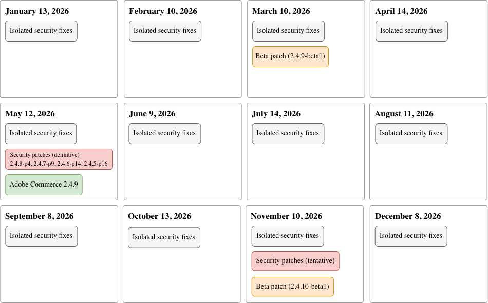

# 修补程序发布计划

Adobe不断努力在使产品升级变得简单且可预测，同时更快地为早期采用者提供改进之间找到合适的平衡（请参阅[版本控制策略](versioning-policy.md)）。

此时间表的目的是提供Adobe计划何时宣布核心Adobe Commerce PHP应用程序的每个受支持发行行的[修补程序](versioning-policy.md#patch-release)的发布日期。 修补程序版本提供了升级核心代码库的机会，可确保您的平台安全、可靠且高性能。

>[!NOTE]
>
>要了解有关新功能、云基础架构和可扩展性版本的更多信息，请参阅[Adobe Commerce Services](https://experienceleague.adobe.com/zh-hans/docs/commerce/user-guides/release-information/release-notes-all)版本文档。

除了此页面上列出的计划质量、安全性和测试版修补程序之外，Adobe还通过[质量修补程序工具](versioning-policy.md#individual-patch)提供对[单个修补程序](../tools/quality-patches-tool/usage.md)的访问。 该工具允许您应用、还原和查看有关已安装Adobe Commerce版本可用的所有单个修补程序的一般信息。

从2026年1月开始，Adobe Commerce将采用以下策略转向每月一次的修补程序发布计划：

- **隔离的安全修复** — 单独的非累积[安全修复](versioning-policy.md#isolated-patch)可能每月发布并包含所有[支持的](lifecycle-policy.md)发行行的安全修复（包括常规和扩展支持）。

- **安全修补程序** — 至少每年（5月）为所有[受支持](versioning-policy.md#security-patch-release)版本行发布[安全修补程序](lifecycle-policy.md)。 这些修补程序包括所有以前发布的独立安全修补程序。 如有必要，Adobe可能会在11月发布其他安全修补程序，但无法保证。

- **Patch** — 每年（5月）发布适用于Adobe Commerce 2.4.x LTS版本行的完整[修补程序](versioning-policy.md#patch-release)（3年支持期）。

- **Beta修补程序**—Adobe Commerce 2.4.x LTS版本线的两个[测试版修补程序](versioning-policy.md#beta-patch-release)每年发布两次（3月和11月）。

有关详细信息，请参阅以下图像：

<!-- The SVG source for the following image is located here: /help/assets/release/release-calendar.drawio.svg -->

