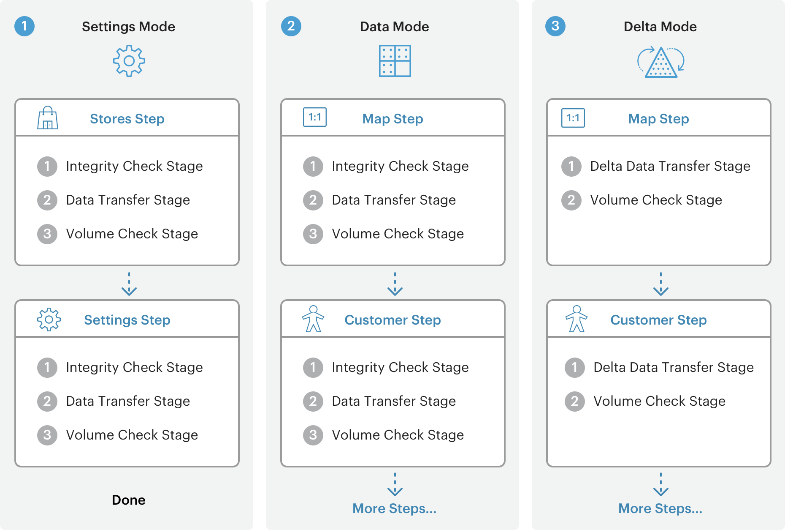
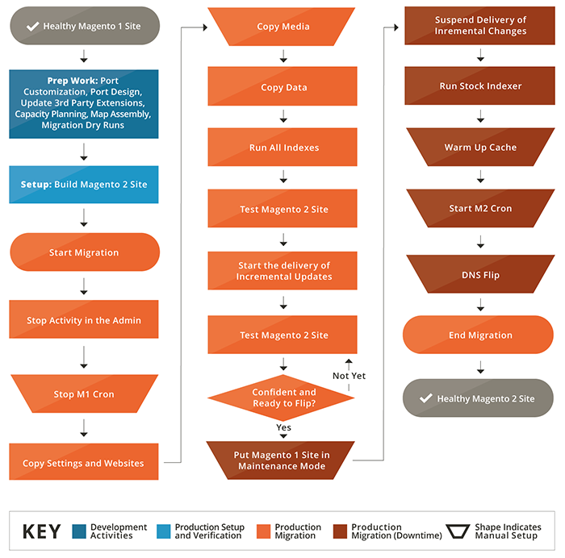

# 数据迁移的工作方式

本主题简要介绍如何使用将数据从Magento1迁移到Magento2 [!DNL Data Migration Tool].

此 [!DNL Data Migration Tool] 是一个命令行界面(CLI)工具，用于将数据从Magento1传输到Magento2。 该工具验证Magento1和2数据库结构（表和字段）之间的一致性，跟踪数据传输进度，创建日志，并运行数据验证测试。

## 术语

* **模式**  — 一组有序操作，用于将数据从Magento1.x迁移到Magento2.x。
* **步骤**  — 模式中的任务，用于定义要迁移的数据类型。
* **暂存**  — 步骤中验证、传输和验证数据的任务。
* **映射文件**  — 定义Magento1.x和Magento2.x数据结构之间的规则和连接以完成阶段的XML文件。

## 模式

此 [!DNL Data Migration Tool] 将迁移过程分为三个阶段或 *模式* 以便将数据从Magento1.x传输并调整到Magento2.x。此处列出了三种模式，必须按此顺序运行：

1. **设置模式**：迁移系统配置和网站相关的设置。
1. **数据模式**：批量迁移数据库资产。
1. **增量模式**：迁移增量更改（自上次运行以来的更改），如新客户和订单。

## 步骤

此 [!DNL Data Migration Tool] 使用列表 *步骤* 在每个模式中迁移特定类型的数据。 例如，在“设置”模式下，有两个步骤可用于迁移所有设置数据：存储步骤和设置步骤。 有关在每个步骤中迁移的特定数据（以及其他模式中的步骤）的详细信息，请参阅 [[!DNL Data Migration Tool] 技术规范](technical-specification.md).

## 暂存

每个步骤中包含三个 *阶段* 它们始终按此顺序执行，以确保数据得到正确迁移：

1. **完整性检查**：比较表字段名称、类型和其他信息，以验证Magento1和2数据结构之间的兼容性。
1. **数据传输**：从Magento1和2中按表传输数据表。
1. **音量检查**：比较表之间的记录数以验证传输是否成功。

## 映射文件

迁移过程的最低级别是XML *映射文件*. 此 [!DNL Data Migration Tool] 在步骤的阶段中使用映射文件，在Magento1.x表和2.x表之间转换不同的数据结构。

例如，当您将数据从Magento Open Source1.8.0.0数据库转换为Magento Open Source2.x.x时，映射文件会考虑表被重命名这一事实，并在目标数据库中相应地重命名表。 如果数据结构或数据格式没有差异，则 [!DNL Data Migration Tool] 按原样将数据（包括扩展创建的表中的数据）传输到Magento2数据库。

如果未在映射文件中声明差异，则 [!DNL Data Migration Tool] 显示错误，并且不会启动。

有关映射文件的更多详细信息，请参见[[!DNL Data Migration Tool] 技术规范]。

## 迁移流程图

[[!DNL Data Migration Tool] 技术规范](technical-specification.md)

我们很高兴您考虑从全球的#1商业平台(Magento1.x)迁移到未来的平台(Magento2)。 我们非常高兴与大家分享关于此过程（我们称之为“迁移”）的详细信息。

## 迁移组件

Magento2迁移涉及四个组件：数据、扩展和自定义代码、主题和自定义。

### 数据

我们已经开发了 **MAGENTO2[!DNL Data Migration Tool]** 帮助您高效地将所有产品、客户和订单数据、存储配置、促销活动等转移到Magento2。 本指南提供有关使用该工具迁移数据的信息和最佳实践。

### 扩展和自定义代码

我们一直在与开发社区合作，帮助您在Magento2中使用Magento1扩展。 现在我们很荣幸地介绍 [Commerce Marketplace](https://marketplace.magento.com/)，您可以在其中下载或购买最喜爱扩展的最新版本。

有关为Magento2开发扩展的更多信息，请参阅 [PHP开发人员指南](https://developer.adobe.com/commerce/php/development/).

### 主题和自定义

Magento2采用新的方法和技术，使商家具有无可比拟的能力，创造创新的购物体验，并扩展到新的水平。 为了充分利用这些优势，开发人员必须对其主题和自定义进行更改。 提供了有关创建Magento2的联机文档 [主题](https://developer.adobe.com/commerce/frontend-core/guide/themes/)， [版面](https://developer.adobe.com/commerce/frontend-core/guide/layouts/)、和 [自定义](https://developer.adobe.com/commerce/frontend-core/guide/layouts/xml-manage/).

## 迁移工作

与1.x版本（例如，从v1.12到v1.14）之间的升级一样，从Magento1迁移到Magento2的工作量级别取决于您构建网站的方式及其自定义级别。
然而，我们不断改进 [!DNL Data Migration Tool] (请参阅 [Changelog](https://github.com/magento/data-migration-tool/blob/2.3/CHANGELOG.md) 因此，迁移工作正在不断减少。
