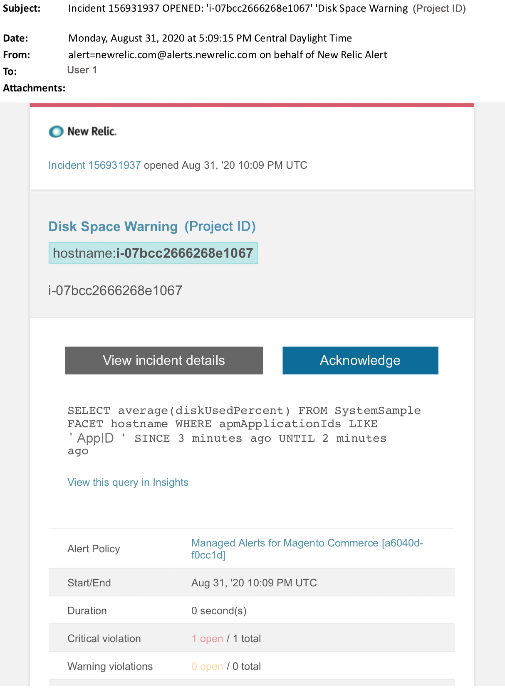

# Adobe Commerce托管警报：磁盘警告警报

本文提供了在[!DNL New Relic]中收到Adobe Commerce的警告磁盘警报时的故障排除步骤。 需要立即采取措施来解决问题。 根据您选择的警报通知渠道，警报将类似于以下内容。

{width="500"}

## 受影响的产品和版本

* 云基础架构上的Adobe Commerce，专业规划架构。

## 问题

如果您已为Adobe Commerce[!DNL New Relic]注册了[托管警报，并且一个或多个警报阈值已超出，则将在](managed-alerts-for-magento-commerce.md)中收到警报。 这些警报由Adobe开发，旨在通过支持和工程部门的分析为客户提供一组标准。

<u> **做！** </u>

* 中止任何计划的部署，直到清除此警报。
* 如果您的网站处于或完全无响应，请立即将网站置于维护模式。 有关步骤，请参阅《Commerce安装指南》中的[启用或禁用维护模式](https://experienceleague.adobe.com/zh-hans/docs/commerce-operations/installation-guide/tutorials/maintenance-mode)。 确保将您的IP添加到免除IP地址列表，以确保您仍然能够访问站点进行故障排除。 有关步骤，请参阅《Commerce安装指南》中的[维护免除IP地址列表](https://experienceleague.adobe.com/zh-hans/docs/commerce-operations/installation-guide/tutorials/maintenance-mode#maintain-the-list-of-exempt-ip-addresses)。

<u> **不要！** </u>

* 启动其他营销活动，这可能会给您的网站带来其他页面查看次数。
* 运行索引器或其他cron，这可能会在CPU或磁盘上造成额外的压力。
* 执行任何主要管理任务(即Commerce管理、数据导入/导出)。
* 清除缓存。 如果您在调查并解决警报原因之前执行了任何“不响应”操作，则您的网站可能会变得无响应（如果您尚未经历网站中断）。

## 解决方案

按照以下步骤确定原因并排除故障：

1. 在[!DNL New Relic]中，查看磁盘的最高使用率。 有关步骤，请参阅&#x200B;**[!UICONTROL Storage]**&#x200B;基础结构监视主机页面上的[[!DNL New Relic] 选项卡： [!UICONTROL Storage]选项卡](https://docs.newrelic.com/docs/infrastructure/infrastructure-data/infrastructure-ui-pages/infra-hosts-ui-page/#storage)：
   * 如果您在[!DNL New Relic]中看到磁盘使用率增长缓慢，请尝试以下选项：
      * 通过调整空间分配优化磁盘空间。 有关步骤，请参阅Commerce on Cloud指南中的[管理磁盘空间](https://experienceleague.adobe.com/zh-hans/docs/commerce-on-cloud/user-guide/develop/storage/manage-disk-space)。 您可能还需要请求更多磁盘空间(请联系您的Adobe客户团队)。
      * 清除MySQL的磁盘空间。 有关步骤，请参阅[MySQL磁盘空间不足](https://experienceleague.adobe.com/zh-hans/docs/commerce-knowledge-base/kb/troubleshooting/database/mysql-disk-space-is-low-on-magento-commerce-cloud)。
      * 如果[!DNL New Relic]显示磁盘使用率快速增加，这可能表示存在导致目录中文件快速增加的问题。 执行以下检查：
         1. 通过在CLI/终端中运行以下命令检查整体磁盘空间以识别问题： `df -h`
         1. 在发现目录异常大且磁盘使用量不断增加后，您需要检查受影响的文件系统。 以下示例说明如何检查文件目录`pub/media/`。 这是Adobe Commerce用于存储日志和大型媒体文件的目录。 但是，您应该对任何显示意外磁盘使用的目录运行此命令： `du -sch ~/pub/media/*`。

如果终端的输出显示其中某个目录中的文件在磁盘使用量中迅速增加，并且您知道不需要该文件内容，请考虑删除该文件。 如果不想执行这项操作，请[提交Adobe Commerce支持票证](https://experienceleague.adobe.com/zh-hans/docs/commerce-knowledge-base/kb/help-center-guide/magento-help-center-user-guide#support-case)。
