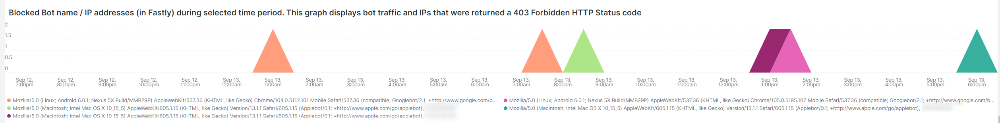

# 此 [!UICONTROL bots] 选项卡

此选项卡包含的信息说明了如何识别是否存在以及什么内容 [!DNL bots] 导致站点问题。

## 的整体概述 [!DNL bots]：

* A [!DNL bot] 是一款运行重复性自动化任务的软件。 随着人工智能和机器学习的演化，任务、方法和交互 [!DNL bots] 正在改变。 有 *良好* [!DNL bots] 这些技术通过爬取网站并将其添加到互联网搜索引擎而令网站受益。 这会导致通过搜索引擎结果引导互联网用户访问网站。 A *良好* [!DNL bot] 通常遵循以下位置上的边界： [!DNL bot] 按 `robots.txt` 搜索引擎控制台中的文件或设置。 边界可以限制对站点或部分站点的访问。
* 恶意 [!DNL bots] 忽略 `robots.txt` 文件或者他们可能伪造物品 [!DNL bot] 通过HTTP请求数据的请求用户代理字段。 一些恶意 [!DNL bots] 执行：
   * 向站点添加负载以拒绝合法用户访问该站点。
   * 未经允许擦除和重新使用内容。
   * 注册虚假帐户以泛洪电子邮件服务或地址，或重定向到其他站点([!DNL SPAM bots])。
   * 创建假视图([!DNL Viewbots])。
   * 购买产品或票证([!DNL Focused bots])。
* 管理 [!DNL bots]
   * [!DNL Observation for Adobe Commerce] 查看了 [!DNL bot] 流量：
      * 它显示未缓存的总数 [!DNL bot] 活动，显示满足以下条件的负荷： [!DNL bot] 添加到站点以及何时进行加载。
      * 它显示 [!DNL bots] 正在生成错误。 通常如果 [!DNL bot] 正在添加导致站点问题的负载，即 [!DNL bot] 或IP地址的错误频率最高。
      * 它显示 [!DNL bot] 名称（请求用户代理字段值）和IP地址，可通过以下方式管理：
         * [!DNL Fastly] (速率限制或 [!DNL VCLs] 阻止IP地址、范围或 [!DNL bots] （按名称值）。
         * 添加完好 [!DNL bot] 提供给 `robots.txt field` 以限制或限制网站访问速率。
         * 管理 [!DNL Bing] 或 [!DNL Google bots] 通过搜索引擎控制台。

## [!UICONTROL Experimental Potential Malicious Bots frame]

此 **[!UICONTROL Experimental Potential Malicious Bots frame]** 帧通过12个单独的复杂查询运行。 它检测恶意IP请求签名，然后聚合结果，按降序对结果求和排序。 查询包含大量的CVE攻击和其他恶意请求的数据签名。 即使攻击被安全修复/补丁阻止，并且对网站不构成威胁，该请求仍必须由网站处理。 请求的数量可能会在短时间内变得相当大。 此帧不显示来自IP地址的总请求数，而是显示具有指示请求具有可疑意图信号的请求。

确保验证流量是否可疑并且不是源自 [!DNL Content Distributed Network] (CDN)地址，也可能传送有效请求。 如果确定请求来自CDN IP地址，请与服务提供商联系，帮助阻止通过其网络的可疑流量。 如果需要阻止地址或请求URL，请参阅 [阻止上的Adobe Commerce恶意流量 [!DNL Fastly] level](https://experienceleague.adobe.com/docs/commerce-knowledge-base/kb/how-to/block-malicious-traffic-for-magento-commerce-on-fastly-level.html) 在Adobe Commerce支持知识库中。

## [!UICONTROL Rate of HTTP request per second (top 25) during requested time period]

此 **[!UICONTROL Rate of HTTP request per second (top 25) during requested time period]** frame显示选定时间范围内每秒IP地址的最大请求数。 如果这些地址也包含在上表中，请确保它们不是CDN地址和恶意地址，并通过阻止它们 [!DNL Fastly].

## [!UICONTROL Total Bot traffic by bot name]:

此 **[!UICONTROL Total Bot traffic by bot name during selected time period]** 该表包含未缓存请求的聚合计数，其中 [!UICONTROL request_user_agent] 字段包含字符串 [!DNL bots] 在值中。 这可以是也可能不是指定的 [!DNL bot] 作为 [!UICONTROL request_user_agent] 字段值可被伪造。 下的值 [!UICONTROL Count] 栏是最重要的。

## [!UICONTROL Total Bot Traffic by Bot name/IP address]

此 **[!UICONTROL Total Bot Traffic by Bot name/IP address during selected time period How to block bot traffic on Fastly level OR manage bots through your robots.txt file Best practices for Adobe Commerce robots.txt]** 该表显示与上表相同的数据，但添加代表指定用户发出请求的IP地址 [!DNL bot]. 恶意 [!DNL bots] 恶搞良好 [!DNL bots]，IP地址应通过标识滥用IP地址的网站或通过以下方式验证 *哇* 服务或 [!DNL DNS lookups]. 例如， [!DNL Google] 发布其 [[!DNL googlebot] IP地址](https://developers.google.com/search/apis/ipranges/googlebot.json) 和 [!DNL Microsoft] 具有验证工具 [[!DNL Bingbots]](https://www.bing.com/webmasters/help/Verify-Bingbot-2195837f).

## [!UICONTROL Graph - Bots with HTTP status errors]

此 **[!UICONTROL Graph - Bots with HTTP status errors during selected time period How to block bot traffic on Fastly level OR manage bots through your robots.txt file Best practices for Adobe Commerce robots.txt]** 图表显示以下项中的错误： [!DNL bots] 在“请求用户代理”字段中声明自身。 这并不一定意味着错误是由于 [!DNL bot] 或其他流量。 错误可能是 [!DNL bot] 请求的信息不存在或请求中存在其他问题。

如果站点不稳定或中断期间的IP地址出现错误高峰，则它们可能是站点问题中的嫌疑人。

## [!UICONTROL Table - IPs that do not identify as bots]

此 **[!UICONTROL Table - IPs that do not identify as bots with HTTP status errors during selected time period How to block bot traffic on Fastly level OR manage bots through your robots.txt file Best practices for Adobe Commerce robots.txt]** 该表将显示具有非自标识为的非200 http状态代码的IP请求 [!DNL bots] 在“请求用户代理”字段中。 这些IP地址可能是恶意IP地址，尤其是在选定时间段内计数较高的情况下。

如果非200 http状态代码计数低且IP地址范围不同，则这些地址可能没有造成站点问题。

## [!UICONTROL Table – Cache Status 'ERROR']

当IP地址频繁发生错误时，请询问它们正在做什么？ 此 **[!UICONTROL Table – Cache Status 'ERROR' detail table (what are these IPs doing?) How to block bot traffic on Fastly level OR manage bots through your robots.txt file Best practices for Adobe Commerce robots.txt]** 该表将显示具有缓存状态的请求所请求的URL以及HTTP状态值 [!UICONTROL ERROR] 值。 频率由URL分面，因此计数可能会较低。 请记住，IP地址可能会在选定的时间段内发出数千个请求。 这是一个视图，在该时间范围内（记录显示限制）最多可显示2000个请求。

## [!UICONTROL Show 5XX status distribution]

此 **[!UICONTROL Show 5XX status distribution across IP addresses (top 200 addresses) How to block bot traffic on Fastly level OR manage bots through your robots.txt file Best practices for Adobe Commerce robots.txt]** 框架功能强大。 它显示在所选时段内具有5XX http状态代码的IP地址。 如果IP地址发出大量请求，并且站点受到影响，以至于无法处理流量，则发出请求频率最高的IP地址通常具有最高的错误量。 5XX http状态代码通常表示站点难以响应请求。

栏越宽，IP地址在该时段内的5xx错误总数中的错误百分比越大。 注意：如果某个IP地址具有多个http状态代码（例如502和503 http状态），则该地址在图形中可能具有多个区段。

典型分布将指示在IP地址宽度相等的栏的右侧，或者会有一些计数非常低的宽栏。

如果将鼠标悬停在条形图区段上，它将显示在选定时间段内所指示的错误数。

## [!UICONTROL IP cache status (MISS, PASS, ERROR) and HTTP status]

此 **[!UICONTROL IP cache status (MISS, PASS, ERROR) and HTTP status during selected time period How to block bot traffic on Fastly level OR manage bots through your robots.txt file Best practices for Adobe Commerce robots.txt]** 框架显示选定时间范围内按IP分类的HTTPS状态代码计数和非缓存请求。 这表示每个IP地址的负载比例和总容量。 它将显示请求数量最多的IP地址。

## [!UICONTROL Fastly Cache Summary for selected time period]

如果您单击 [!UICONTROL Error] 图标时，您可以对前两个图形进行比较。 这有助于指示负载在何处导致站点问题。

## [!UICONTROL Graph - IPs that do not identify as bots]

此 **[!UICONTROL Graph - IPs that do not identify as bots without error during selected time period How to block bot traffic on Fastly level OR manage bots through your robots.txt file Best practices for Adobe Commerce robots.txt]** frame显示请求用户代理字段、IP地址和请求状态代码，其中请求用户代理字段未指示 [!DNL bot]. 此帧可能显示来自任何IP地址的高频请求，但请注意高频请求，尤其是在网站可能出现问题的时段。

## [!UICONTROL Graph - Suspicious Non-Bot traffic]

此 **[!UICONTROL Graph - Suspicious Non-Bot traffic during selected time period]** 图形查找Go-http-client的请求用户代理值，但将扩展以查看其他可疑请求用户代理值。 此请求用户代理值由站点用于连接服务，可能有效，但也被恶意使用 [!DNL bots].

## [!UICONTROL Graph - Bot traffic by Bot name]

此 **[!UICONTROL Graph - Bot traffic by Bot name during selected time period]** 帧显示的数据与机器人总流量相同，数据来源： [!DNL Bot] 选项卡顶部的“选定时间段内的名称”表。 它通过时间轴显示数据，以便您能够看到何时发出请求 [!DNL bots] 制作和分发。

## [!UICONTROL Graph - Top 250 Bot Names and IP addresses]

此 **[!UICONTROL Graph - Top 250 Bot Names and IP addresses during selected time period How to block bot traffic on Fastly level OR manage bots through your robots.txt file Best practices for Adobe Commerce robots.txt]** 帧显示的数据与总计的数据相同 [!DNL Bot] 选项卡顶部选定时间段内按机器人名称/IP地址显示的流量。 它通过时间轴显示数据，并按IP地址对其进行分面。 这会显示何时发出请求 [!DNL bots] 创建、哪个IP正在发出请求以及请求的分布情况。

## [!UICONTROL Blocked Bot name / IP addresses (in Fastly)]

此 **[!UICONTROL Blocked Bot name / IP addresses (in Fastly) during selected time period. This graph displays bot traffic and IPs that were returned a 403 Forbidden HTTP Status code]** 帧显示被阻止的机器人名称和IP地址。 您可以在此图表中查看如何阻止所有请求 [!DNL Fastly] 往前走。

## [!UICONTROL Blocked non-Bot name / IP addresses (in Fastly)]

此 **[!UICONTROL Blocked non-Bot name / IP addresses (in Fastly) during selected time period graph displays non-bot traffic and IPs that were returned a 403 Forbidden HTTP Status code]** 帧显示未标识为的IP地址 [!DNL bot] 已被阻止的客户 [!DNL Fastly].

## [!UICONTROL This table shows the number of user agents per IP address, number of successful, unsuccessful and blocked requests:]

恶意 [!DNL bots] 经常欺骗他人 [!DNL bots] 通过 [!UICONTROL Request User Agent] 字段。 此表显示IP地址在该字段中有多少个唯一值。 中的值越高 [!UICONTROL Request User Agent] 字段，则IP地址越可疑。

## [!UICONTROL IP with non-200 status errors]

此 **[!UICONTROL IP with non-200 status errors – without 403 status]** frame显示IP地址在选定时间范围内的分布，HTTP状态代码不是200。 如果单个IP地址或一组IP地址的值较高，则需要进一步调查。

## [!UICONTROL IP with 403 status codes:]

此 **[!UICONTROL IP with 403 status codes]** 框架显示未缓存的请求 [!UICONTROL cache_status=ERROR] HTTP状态为403的用户。 这可能表明原始服务器是403（未授权）的源，而不是来自的块 [!DNL Fastly].

## [!UICONTROL Top 5 with non-200 status codes]

此 **[!UICONTROL Top 5 with non-200 status codes showing cache_status]** 此表在IP/状态级别显示每个的计数，带有 [!UICONTROL cache_status] 值。

## [!UICONTROL Pageview Latency will show as spikes]

此 **[!UICONTROL Pageview Latency will show as spikes on this graph:]** 框架显示页面加载/API响应延迟，这可能与 [!DNL bot] 流量。
