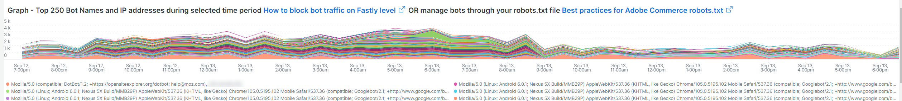
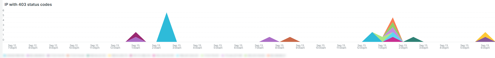

# [!UICONTROL bots]选项卡

此选项卡包含的信息说明如何识别[!DNL bots]是否以及哪些原因导致站点问题。

## [!DNL bots]的高级概述：

* [!DNL bot]是运行重复自动任务的软件。 随着人工智能和机器学习的发展，[!DNL bots]的任务、方法和交互正在发生变化。 有&#x200B;*个好的* [!DNL bots]通过爬网并将其添加到互联网搜索引擎而有益于站点。 这会导致通过搜索引擎结果引导互联网用户访问网站。 *良好* [!DNL bot]通常遵循搜索引擎控制台中的[!DNL bot]文件或设置放置在`robots.txt`上的边界。 边界可以限制对站点或部分站点的访问。
* 恶意[!DNL bots]忽略`robots.txt`文件，或者他们可能通过HTTP请求数据的请求用户代理字段欺骗完好的[!DNL bot]。 恶意[!DNL bots]执行的某些操作：
   * 向站点添加负载以拒绝合法用户访问该站点。
   * 未经允许擦除并重用内容。
   * 注册虚假帐户以泛洪电子邮件服务或地址，或重定向到其他站点([!DNL SPAM bots])。
   * 创建虚假视图([!DNL Viewbots])。
   * 购买产品或票证([!DNL Focused bots])。
* 管理[!DNL bots]
   * [!DNL Observation for Adobe Commerce]具有[!DNL bot]流量的视图：
      * 它显示未缓存的[!DNL bot]活动总数，该活动显示[!DNL bot]正在添加到网站的负载以及发生该负载的时间。
      * 它显示正在生成错误的[!DNL bots]。 通常，如果[!DNL bot]正在添加导致站点问题的负载，则[!DNL bot]或IP地址具有最高的错误频率。
      * 它显示要通过管理的[!DNL bot]名称（请求用户代理字段值）和IP地址：
         * [!DNL Fastly] （速率限制或[!DNL VCLs]，按名称值阻止IP地址、范围或[!DNL bots]）。
         * 向[!DNL bot]添加完好的`robots.txt field`信息以限制或限制网站访问速率。
         * 通过搜索引擎控制台管理[!DNL Bing]或[!DNL Google bots]。

## [!UICONTROL Experimental Potential Malicious Bots frame]

**[!UICONTROL Experimental Potential Malicious Bots frame]**&#x200B;帧通过12个单独的复杂查询运行。 它检测恶意IP请求签名，然后聚合结果，按降序对结果求和排序。 查询中包含大量的CVE攻击和其他恶意请求的数据签名。 即使这些漏洞被安全修补程序/补丁阻止，并且不会威胁到网站，该请求仍必须由网站处理。 请求量可能会在短时间内变得非常大。 此帧不显示来自IP地址的总请求，而是显示具有指示请求具有可疑意图的信号的请求。

请确保验证该通信是否可疑，并且不是来自可能也在传递有效请求的[!DNL Content Distributed Network] (CDN)地址。 如果确定请求来自CDN IP地址，请与服务提供商联系，帮助阻止可疑流量通过他们的网络。 如果需要阻止地址或请求URL，请参阅Adobe Commerce支持知识库中的[阻止Adobe Commerce在 [!DNL Fastly] 级别](https://experienceleague.adobe.com/docs/commerce-knowledge-base/kb/how-to/block-malicious-traffic-for-magento-commerce-on-fastly-level.html)上的恶意流量。

## [!UICONTROL Rate of HTTP request per second (top 25) during requested time period]

**[!UICONTROL Rate of HTTP request per second (top 25) during requested time period]**&#x200B;帧显示在所选时间范围内每秒的最大IP地址请求数。 如果这些地址也包含在上表中，请确保它们不是CDN地址和恶意地址，并通过[!DNL Fastly]阻止它们。

## [!UICONTROL Total Bot traffic by bot name]：

**[!UICONTROL Total Bot traffic by bot name during selected time period]**&#x200B;表包含非缓存请求的聚合计数，其中[!UICONTROL request_user_agent]字段的值包含[!DNL bots]字符串。 这可能是也可能不是名为[!DNL bot]，因为[!UICONTROL request_user_agent]字段值可以被欺骗。 [!UICONTROL Count]列下的值最重要。

## [!UICONTROL Total Bot Traffic by Bot name/IP address]

**[!UICONTROL Total Bot Traffic by Bot name/IP address during selected time period How to block bot traffic on Fastly level OR manage bots through your robots.txt file Best practices for Adobe Commerce robots.txt]**&#x200B;表显示与上一个表相同的数据，但添加了代表命名[!DNL bot]发出请求的IP地址。 作为恶意[!DNL bots]欺骗的好[!DNL bots]，应通过识别滥用IP地址的网站或通过&#x200B;*whois*&#x200B;服务或[!DNL DNS lookups]验证IP地址。 例如，[!DNL Google]发布其[[!DNL googlebot] IP地址](https://developers.google.com/search/apis/ipranges/googlebot.json)，[!DNL Microsoft]具有[[!DNL Bingbots]](https://www.bing.com/webmasters/help/Verify-Bingbot-2195837f)的验证工具。

## [!UICONTROL Graph - Bots with HTTP status errors]

**[!UICONTROL Graph - Bots with HTTP status errors during selected time period How to block bot traffic on Fastly level OR manage bots through your robots.txt file Best practices for Adobe Commerce robots.txt]**&#x200B;图形显示[!DNL bots]上在请求用户代理字段中声明自身的错误。 这并不一定意味着该错误是由于[!DNL bot]或其他流量中的卷引起的。 错误可能是[!DNL bot]请求的信息不存在或请求中存在其他问题。

如果站点不稳定或中断期间的IP地址出现错误高峰，则它们可能是站点问题中的嫌疑人。

## [!UICONTROL Table - IPs that do not identify as bots]

**[!UICONTROL Table - IPs that do not identify as bots with HTTP status errors during selected time period How to block bot traffic on Fastly level OR manage bots through your robots.txt file Best practices for Adobe Commerce robots.txt]**&#x200B;表将显示具有非200 http状态代码的IP请求，这些状态代码在请求用户代理字段中无法自我标识为[!DNL bots]。 这些IP地址可能是恶意IP地址，尤其是在选定时间段内计数较高的情况下。

如果非200 http状态代码计数较低且IP地址范围不同，则这些地址可能没有构成站点问题。

## [!UICONTROL Table – Cache Status 'ERROR']

当IP地址频繁发生错误时，请询问他们在做什么？ **[!UICONTROL Table – Cache Status 'ERROR' detail table (what are these IPs doing?) How to block bot traffic on Fastly level OR manage bots through your robots.txt file Best practices for Adobe Commerce robots.txt]**&#x200B;表将显示具有缓存状态[!UICONTROL ERROR]值的请求所请求的URL以及HTTP状态值。 频率通过URL分面，因此计数可能会较低。 请记住，该IP地址可能会在选定的时间段内发出数千个请求。 这是一个视图，针对该时间范围内最多2000个请求（记录显示限制）。

## [!UICONTROL Show 5XX status distribution]

**[!UICONTROL Show 5XX status distribution across IP addresses (top 200 addresses) How to block bot traffic on Fastly level OR manage bots through your robots.txt file Best practices for Adobe Commerce robots.txt]**&#x200B;框架功能强大。 它显示在所选时段内具有5XX http状态代码的IP地址。 如果IP地址发出大量请求，并且站点受到影响，以至于无法处理流量，则发出请求频率最高的IP地址通常具有最高的错误量。 5XX http状态代码通常表示站点在努力响应请求。

栏越宽，IP地址在该时间段内出现的5xx错误总数中的错误百分比就越大。 注意：如果IP地址具有多个http状态代码（例如502和503 http状态），则该图表中可能会有多个区段。

典型分布将指示在IP地址宽度相等的栏的右侧，或者会有一些计数非常低的宽栏。

如果将鼠标悬停在条形图区段上，它将显示选定时间段内所指示的错误数。

## [!UICONTROL IP cache status (MISS, PASS, ERROR) and HTTP status]

此&#x200B;**[!UICONTROL IP cache status (MISS, PASS, ERROR) and HTTP status during selected time period How to block bot traffic on Fastly level OR manage bots through your robots.txt file Best practices for Adobe Commerce robots.txt]**&#x200B;帧显示选定时间范围内按IP的HTTPS状态代码计数和非缓存请求。 这表示每个IP地址的负载比例以及总容量。 其中将显示请求数量最多的IP地址。

## [!UICONTROL Fastly Cache Summary for selected time period]

如果单击下图中的[!UICONTROL Error]图标，您可以比较后两个图。 这有助于指明负载在何处导致站点问题。

## [!UICONTROL Graph - IPs that do not identify as bots]

**[!UICONTROL Graph - IPs that do not identify as bots without error during selected time period How to block bot traffic on Fastly level OR manage bots through your robots.txt file Best practices for Adobe Commerce robots.txt]**&#x200B;帧显示请求用户代理字段、IP地址和请求状态代码，其中请求用户代理字段未指示[!DNL bot]。 此帧可能显示来自任何IP地址的高频请求，但请注意高频请求，尤其是在站点可能出现问题的时段。

## [!UICONTROL Graph - Suspicious Non-Bot traffic]

**[!UICONTROL Graph - Suspicious Non-Bot traffic during selected time period]**&#x200B;图形将查找Go-http-client的请求用户代理值，但将进行扩展以查看其他可疑的请求用户代理值。 此请求用户代理值由站点用于连接服务，可能有效，但也被恶意[!DNL bots]使用。

## [!UICONTROL Graph - Bot traffic by Bot name]

**[!UICONTROL Graph - Bot traffic by Bot name during selected time period]**&#x200B;帧在选项卡顶部显示的数据与所选时段内按[!DNL Bot]名称划分的机器人总流量相同。 它通过时间线显示数据，以便您能够查看何时发出[!DNL bots]的请求及其分发。

## [!UICONTROL Graph - Top 250 Bot Names and IP addresses]

**[!UICONTROL Graph - Top 250 Bot Names and IP addresses during selected time period How to block bot traffic on Fastly level OR manage bots through your robots.txt file Best practices for Adobe Commerce robots.txt]**&#x200B;帧显示的数据与选项卡顶部选定时间段内按机器人名称/IP地址统计的总[!DNL Bot]流量相同。 它通过时间轴显示数据，并按IP地址对其进行分面。 这会显示[!DNL bots]发出请求的时间、发出请求的IP以及请求的分布。

## [!UICONTROL Blocked Bot name / IP addresses (in Fastly)]

的机器人流量和IP

**[!UICONTROL Blocked Bot name / IP addresses (in Fastly) during selected time period. This graph displays bot traffic and IPs that were returned a 403 Forbidden HTTP Status code]**&#x200B;帧显示被阻止的机器人名称和IP地址。 您可以在此图中看到今后[!DNL Fastly]中阻止所有请求的方式。

## [!UICONTROL Blocked non-Bot name / IP addresses (in Fastly)]

的非机器人流量和IP

**[!UICONTROL Blocked non-Bot name / IP addresses (in Fastly) during selected time period graph displays non-bot traffic and IPs that were returned a 403 Forbidden HTTP Status code]**&#x200B;帧显示未标识为已通过[!DNL bot]阻止的[!DNL Fastly]的IP地址。

## [!UICONTROL This table shows the number of user agents per IP address, number of successful, unsuccessful and blocked requests:]

恶意[!DNL bots]经常通过[!DNL bots]字段的值欺骗其他[!UICONTROL Request User Agent]。 此表显示IP地址在该字段中有多少个唯一值。 [!UICONTROL Request User Agent]字段中的值越高，IP地址就越可疑。

## [!UICONTROL IP with non-200 status errors]

**[!UICONTROL IP with non-200 status errors – without 403 status]**&#x200B;帧显示选定时间范围内具有HTTP状态代码（200除外）的IP地址的分布。 如果单个IP地址或一组IP地址的值较高，则需要进一步调查。

## [!UICONTROL IP with 403 status codes:]

具有403状态代码的

**[!UICONTROL IP with 403 status codes]**&#x200B;帧显示不带[!UICONTROL cache_status=ERROR]的非缓存请求，其HTTP状态为403。 这可能表明源服务器是403（未授权）的源，而不是[!DNL Fastly]中的块。

## [!UICONTROL Top 5 with non-200 status codes]

**[!UICONTROL Top 5 with non-200 status codes showing cache_status]**&#x200B;表在IP/状态级别显示每个具有[!UICONTROL cache_status]值的计数。

## [!UICONTROL Pageview Latency will show as spikes]

**[!UICONTROL Pageview Latency will show as spikes on this graph:]**&#x200B;框架显示可能与[!DNL bot]流量一致的页面加载/API响应延迟。
