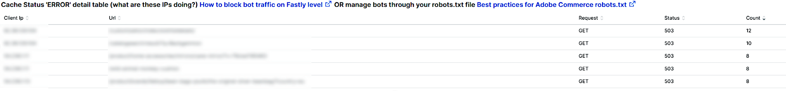
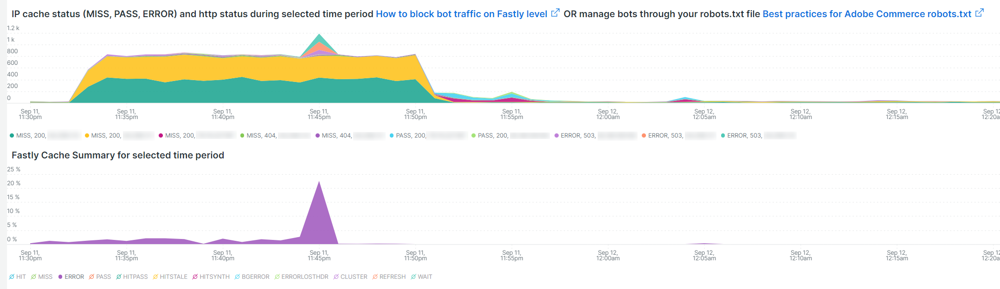
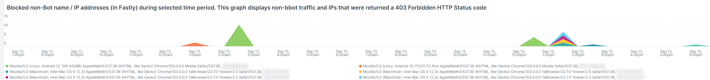

# 的 [!UICONTROL bots] 选项卡

此选项卡包含说明如何识别 [!DNL bots] 会导致站点问题。

## 高级概述 [!DNL bots]:

* A [!DNL bot] 是运行重复性自动任务的软件。 随着人工智能和机器学习的发展， [!DNL bots] 正在改变。 有 *好* [!DNL bots] 通过爬网并将其添加到互联网搜索引擎，可使网站受益。 这会导致通过搜索引擎结果将Internet用户引导至网站。 A *好* [!DNL bot] 通常遵循上边界 [!DNL bot] 按 `robots.txt` 文件或设置。 边界可以限制对站点或站点部分的访问。
* 恶意 [!DNL bots] 忽略 `robots.txt` 要不然他们会骗人 [!DNL bot] 通过HTTP请求数据的请求用户代理字段。 有些恶意 [!DNL bots] 执行：
   * 向站点添加负载以拒绝合法用户访问该站点。
   * 未经许可抓取和重复使用内容。
   * 注册虚假帐户以洪泛发送电子邮件服务或地址，或重定向到其他网站([!DNL SPAM bots])。
   * 创建假视图([!DNL Viewbots])。
   * 购买产品或票证([!DNL Focused bots])。
* 管理 [!DNL bots]
   * [!DNL Observation for Adobe Commerce] 具有 [!DNL bot] 流量：
      * 显示未缓存的总计 [!DNL bot] 活动，该活动显示 [!DNL bot] 将添加到网站，并且正在加载。
      * 它显示 [!DNL bots] 会产生错误。 通常，如果 [!DNL bot] 会增加导致站点问题的负载， [!DNL bot] 或IP地址出现错误的频率最高。
      * 它显示 [!DNL bot] 名称（请求用户代理字段值）和要通过以下方式管理的IP地址：
         * [!DNL Fastly] (限速或 [!DNL VCLs] 阻止IP地址、范围或 [!DNL bots] 按名称值)。
         * 添加好 [!DNL bot] 信息 `robots.txt field` 以限制或限制网站访问率。
         * 管理 [!DNL Bing] 或 [!DNL Google bots] 通过搜索引擎控制台。

## [!UICONTROL Total Bot traffic by bot name]:

* 的 **[!UICONTROL Total Bot traffic by bot name during selected time period]** 表包含非缓存请求的汇总计数，其中 [!UICONTROL request_user_agent] 字段包含字符串 [!DNL bots] 值中。 这可能是名称，也可能不是名称 [!DNL bot] 作为 [!UICONTROL request_user_agent] 字段值可能会被欺骗。 下的值 [!UICONTROL Count] 列是最重要的。

## [!UICONTROL Total Bot Traffic by Bot name/IP address]

* 的 **[!UICONTROL Total Bot Traffic by Bot name/IP address during selected time period How to block bot traffic on Fastly level OR manage bots through your robots.txt file Best practices for Adobe Commerce robots.txt]** 表显示与上表相同的数据，但会添加代表已命名的 [!DNL bot]. 恶意 [!DNL bots] 好 [!DNL bots]，则应通过识别滥用IP地址的网站或通过 *whoy* 服务或 [!DNL DNS lookups]. 例如， [!DNL Google] 发布 [[!DNL googlebot] IP地址](https://developers.google.com/search/apis/ipranges/googlebot.json) 和 [!DNL Microsoft] 具有 [[!DNL Bingbots]](https://www.bing.com/webmasters/help/Verify-Bingbot-2195837f).

## [!UICONTROL Graph - Bots with HTTP status errors]

* 的 **[!UICONTROL Graph - Bots with HTTP status errors during selected time period How to block bot traffic on Fastly level OR manage bots through your robots.txt file Best practices for Adobe Commerce robots.txt]** 图表显示错误 [!DNL bots] 在“请求用户代理”字段中声明自己的ID。 这不一定表示错误是由 [!DNL bot] 或其他流量。 错误可能是 [!DNL bot] 请求的信息不存在或请求中存在其他问题。
* 如果在站点不稳定或中断期间IP地址出现错误峰值，则它们可能是站点问题的嫌疑人。

## [!UICONTROL Table - IPs that do not identify as bots]

* 的 **[!UICONTROL Table - IPs that do not identify as bots with HTTP status errors during selected time period How to block bot traffic on Fastly level OR manage bots through your robots.txt file Best practices for Adobe Commerce robots.txt]** 该表将显示IP请求，其中包含非200个HTTP状态代码，且DO SELF标识为 [!DNL bots] 在请求用户代理字段中。 这些IP地址可能是恶意IP地址，特别是在选定时间段计数较高时。
* 如果非200 http状态代码计数较低，而IP地址范围不相似，则地址可能不会导致站点问题。

## [!UICONTROL Table – Cache Status 'ERROR']

* 当IP地址产生高频错误时，请问它们在做什么？ 的 **[!UICONTROL Table – Cache Status 'ERROR' detail table (what are these IPs doing?) How to block bot traffic on Fastly level OR manage bots through your robots.txt file Best practices for Adobe Commerce robots.txt]** 表将显示请求的URL以及具有缓存状态的请求的HTTP状态值 [!UICONTROL ERROR] 值。 频率会按URL进行多面处理，因此计数可能较低。 请记住，IP地址在选定的时间段内可能会发出数千个请求。 此视图针对的时间范围内最多2000个请求（记录显示限制）。

## [!UICONTROL Show 5XX status distribution]

* 的 **[!UICONTROL Show 5XX status distribution across IP addresses (top 200 addresses) How to block bot traffic on Fastly level OR manage bots through your robots.txt file Best practices for Adobe Commerce robots.txt]** 框架功能强大。 它会显示在选定时间段内具有5XX http状态代码的IP地址。 如果IP地址发出大量请求，并且站点受到影响，无法处理流量，则发出请求频率最高的IP地址通常会出现最大数量的错误。 5XX HTTP状态代码通常表示某个网站正在努力响应请求。
* 条越宽，IP地址在该时间段内的5xx错误总数中的错误百分比越大。 注意：如果IP地址具有多个http状态代码（例如502和503 http状态），则该地址在图表中可能具有多个区段。
* 在IP地址宽度相等的栏的右侧，将指示典型分布，或者会有一些计数非常少的宽栏。
* 如果将鼠标悬停在条形区段上，则会显示选定时间段内指示的错误数。

## [!UICONTROL IP cache status (MISS, PASS, ERROR) and HTTP status]

* 此 **[!UICONTROL IP cache status (MISS, PASS, ERROR) and HTTP status during selected time period How to block bot traffic on Fastly level OR manage bots through your robots.txt file Best practices for Adobe Commerce robots.txt]** frame显示选定时间范围内IP的HTTPS状态代码计数和未缓存请求。 这表示每个IP地址和总卷的成比例负载。 它将显示请求数最多的IP地址。

## [!UICONTROL Fastly Cache Summary for selected time period]

* 如果您单击 [!UICONTROL Error] 图标，您可以将最后两个图表进行比较。 这有助于指示负载导致网站问题的位置。

## [!UICONTROL Graph - IPs that do not identify as bots]

* 的 **[!UICONTROL Graph - IPs that do not identify as bots without error during selected time period How to block bot traffic on Fastly level OR manage bots through your robots.txt file Best practices for Adobe Commerce robots.txt]** frame显示请求用户代理字段、IP地址和请求用户代理字段未指示 [!DNL bot]. 此帧可能显示来自任何IP地址的高频请求，但应注意高频请求，特别是在站点可能遇到问题的时段内。

## [!UICONTROL Graph - Suspicious Non-Bot traffic]

* 的 **[!UICONTROL Graph - Suspicious Non-Bot traffic during selected time period]** 图形会查找Go-http-client的请求用户代理值，但会扩展以查看其他可疑的请求用户代理值。 此请求用户代理值由站点用于从服务连接，可能有效，但也被恶意用户使用 [!DNL bots].

## [!UICONTROL Graph - Bot traffic by Bot name]

* 的 **[!UICONTROL Graph - Bot traffic by Bot name during selected time period]** 帧显示的数据与机器人总流量(按 [!DNL Bot] 在选定时间段内的名称。 它通过时间轴显示数据，以便您能够查看 [!DNL bots] 正在进行并分发。

## [!UICONTROL Graph - Top 250 Bot Names and IP addresses]

* 的 **[!UICONTROL Graph - Top 250 Bot Names and IP addresses during selected time period How to block bot traffic on Fastly level OR manage bots through your robots.txt file Best practices for Adobe Commerce robots.txt]** 帧显示的数据与“总计” [!DNL Bot] 按机器人名称/IP地址划分的选定时间段内的流量表（位于选项卡顶部）。 它通过时间轴显示数据，并按IP地址对其分面。 这会显示 [!DNL bots] 请求，以及请求的分发。

## [!UICONTROL Blocked Bot name / IP addresses (in Fastly)]

* 的 **[!UICONTROL Blocked Bot name / IP addresses (in Fastly) during selected time period. This graph displays bot traffic and IPs that were returned a 403 Forbidden HTTP Status code]** frame显示机器人名称和被阻止的IP地址。 您可以在此图表中查看在 [!DNL Fastly] 向前看。

## [!UICONTROL Blocked non-Bot name / IP addresses (in Fastly)]

* 的 **[!UICONTROL Blocked non-Bot name / IP addresses (in Fastly) during selected time period graph displays non-bot traffic and IPs that were returned a 403 Forbidden HTTP Status code]** 框架显示无法识别为 [!DNL bot] 被封锁了 [!DNL Fastly].

## [!UICONTROL This table shows the number of user agents per IP address, number of successful, unsuccessful and blocked requests:]

* 恶意 [!DNL bots] 经常欺骗其他人 [!DNL bots] 的值 [!UICONTROL Request User Agent] 字段。 此表显示IP地址在该字段中具有的唯一值数。 中的值越高 [!UICONTROL Request User Agent] 字段中，IP地址越可疑。

## [!UICONTROL IP with non-200 status errors]

* 的 **[!UICONTROL IP with non-200 status errors – without 403 status]** 帧显示选定时间范围内IP地址在HTTP状态代码不为200时的分布。 如果您在单个IP或一组IP地址上看到较高的值，则需要进一步调查。

## [!UICONTROL IP with 403 status codes:]

* 的 **[!UICONTROL IP with 403 status codes]** frame显示未缓存的请求，而不 [!UICONTROL cache_status=ERROR] 的HTTP状态为403。 这可能表明源服务器是403（未授权）的源，而不是来自的块 [!DNL Fastly].

## [!UICONTROL Top 5 with non-200 status codes]

* 的 **[!UICONTROL Top 5 with non-200 status codes showing cache_status]** 表格在IP/状态级别上显示 [!UICONTROL cache_status] 值。

## [!UICONTROL Pageview Latency will show as spikes]

* 的 **[!UICONTROL Pageview Latency will show as spikes on this graph:]** frame显示页面加载/API响应延迟，该滞后可能与 [!DNL bot] 流量。

## [!UICONTROL Experimental Potential Malicious Bots] 框架

的 **[!UICONTROL Experimental Potential Malicious Bots]** frame运行十个单独的复杂查询。 它会检测恶意IP请求签名，然后对结果进行聚合，按计数的降序进行总和和排序。 这些查询包含CVE漏洞和其他恶意请求的大量数据签名。 即使安全修复/修补程序阻止了利用漏洞的攻击，并且该漏洞对站点没有威胁，仍然必须由网站处理该请求。 在很短的时间内，请求数量可能会变得相当显着。 此帧不显示来自IP地址的请求总数，而是显示具有指示请求有可疑意图的信号的请求。

确保验证流量是否可疑，且流量不是来自可能也传递有效请求的内容分布式网络(CDN)地址。 如果确定请求来自CDN IP地址，请联系该服务供应商以帮助阻止通过其网络的可疑流量。 如果您需要阻止地址或请求URL，请参阅 [阻止上Adobe Commerce的恶意流量 [!DNL Fastly] 级别](https://experienceleague.adobe.com/docs/commerce-knowledge-base/kb/how-to/block-malicious-traffic-for-magento-commerce-on-fastly-level.html) Adobe Commerce支持知识库。
