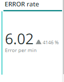

# 此 [!UICONTROL CDN] 选项卡

此选项卡包含的信息主要关注 [!DNL content delivery network (CDN)]. 对于Adobe Commerce Cloud，这是 [!DNL Fastly] 服务。

## [!UICONTROL HIT rate]

此 **[!UICONTROL HIT rate]** frame显示导致以下问题的可缓存请求数 [!UICONTROL HITS] 在最后一刻。 这表示缓存成功。 右箭头将显示一周前同一时间的上方或下方百分比。

## [!UICONTROL HIT Processing]

此 **[!UICONTROL HIT processing]** 框显示导致的可缓存请求数 [!UICONTROL HITS] 在一周之内。

## [!UICONTROL MISS rate]

此 **[!UICONTROL MISS rate]** 框显示最后一分钟未命中可缓存请求的次数。 未命中是指未缓存请求，并且请求必须传递到源服务器才能提供内容。 右边的值是一周前增加/减少与每分钟数之比较。

## [!UICONTROL MISS time]

## [!UICONTROL HIT Ratio]

## [!UICONTROL Error Percentage]

此 **[!UICONTROL Error Percentage]** 框显示请求的错误百分比值，并显示与一周前同一时间相比的相对增加/减少。

## [!UICONTROL Total Requests]

## [!UICONTROL ERROR rate]

## [!UICONTROL Fastly Cache Average Response for selected time period in seconds]

此帧显示可缓存请求的持续时间（以秒为单位），这意味着 `cache_response` 是 [!UICONTROL MISS]，它显示选定时间内未命中的缓存响应的平均值。

## [!UICONTROL Fastly Cache Average Response for selected time period in seconds, faceted by POP]

## [!UICONTROL Total Bandwidth (All POPs) during the selected timeframe, compared with 1 week ago (% increase/decrease)]

## [!UICONTROL Requests – Since selected timeframe compared with one week ago]

此框架类似于的摘要框 [!UICONTROL Total Requests] ，但显示前几周的请求计数。 所有这些都是请求，而不仅仅是可缓存的请求(其中 `is_cacheable` 为true)。

## [!UICONTROL Response Count]

## [!UICONTROL Bandwidth by POP]

## [!UICONTROL Top 5 URLs (5xx or 3xx status codes)]

此 **[!UICONTROL Top 5 URLs]** 视图显示出现5xx或3xx错误响应的前5个URL。 由于空间限制，您需要将鼠标悬停在该URL上才能查看与该URL关联的特定错误代码。 （上图红色框中的示例）。

## [!UICONTROL Top 25 URLs (200 status)]

此 **[!UICONTROL Top 25 URLs]** 框架显示在所选时间范围内按计数返回200状态的URL。

## [!UICONTROL Duration by Response Status]

此 **[!UICONTROL Duration by Response Status]** 图形按计数显示选定时间范围内的错误响应，并以错误状态代码分面。

## [!UICONTROL Duration by Response Status, top 25 urls]

此 **[!UICONTROL Duration by Response Status, top 25 URLs]** 该图按响应持续时间显示前25个URL（以秒为单位）。 您可能需要将鼠标悬停在URL上才能查看整个路径。 此外，要删除除一个URL之外的所有其他URL，请单击该URL。 然后，您可以通过分别单击其他URL来重新添加它们。 如果要删除单个URL，可以按住键并单击每个URL以将其从图形中删除。

## [!UICONTROL Duration by Response Status, top 25 non-200 status]

此 **[!UICONTROL Duration by Response Status, top 25 non-200 status]** 图表与上一个图表类似，不同之处在于图表侧重于非200状态代码或错误状态代码。 它将显示错误代码，然后显示URL。 您可能需要将鼠标悬停在URL上才能查看整个路径。 此外，要删除除一个URL之外的所有其他URL，请单击该URL。 然后，您可以通过分别单击其他URL来重新添加它们。 如果要删除单个URL，可以按住键并单击每个URL以将其从图形中删除。

## [!UICONTROL Error Count by POP timeline]

此 **[!UICONTROL Error Count by POP timeline]** 图形沿选定的时间范围时间轴显示错误状态的计数，以错误代码分面。

## [!UICONTROL Duration by Response status, top 25 client IP, non-200 status]

此 **[!UICONTROL Duration by Response status, top 25 client IP, non 200 status]** 该图按存在状态错误代码的选定时间范围内的平均持续时间显示了IP地址。

## [!UICONTROL IP Frequency]

此 **[!UICONTROL IP Frequency]** frame计算每个IP的（&#39;MISS&#39;和&#39;PASS&#39;）状态，从 [!DNL Fastly] 日志。 具有这些状态的Web请求将访问原始服务器，并将向服务器添加负载。 它显示频率排名前20的地址。 此帧可用于检测网站上的IP攻击或重负载源。 此图表也会显示在“摘要”选项卡中，并放置在此处，以便与 [!DNL Fastly] 此选项卡上显示的日志信息。
