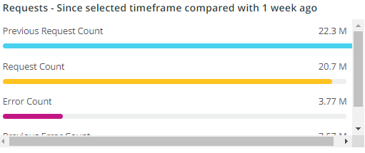

# 的 [!UICONTROL CDN] 选项卡

此选项卡的信息主要针对 [!DNL content delivery network (CDN)]. 对于Adobe Commerce Cloud，这是 [!DNL Fastly] 服务。

## [!UICONTROL HIT rate]

的 **[!UICONTROL HIT rate]** frame显示可缓存请求的数量，这些请求会导致 [!UICONTROL HITS] 最后一分钟。 这表示缓存成功。 右侧的箭头将显示一周前的同一时间上下的百分比。

## [!UICONTROL HIT Processing]

此 **[!UICONTROL HIT processing]** 框显示可缓存请求的数量，这些请求会导致 [!UICONTROL HITS] 在这周。

## [!UICONTROL MISS rate]

此 **[!UICONTROL MISS rate]** 框显示可缓存请求在最后一分钟的未命中次数。 如果未缓存请求，并且必须将请求传递到源服务器以提供内容，则会发生错误。 右侧的值是增加/减少与前一周每分钟的分钟数之比。

## [!UICONTROL MISS time]

## [!UICONTROL HIT Ratio]

## [!UICONTROL Error Percentage]

的 **[!UICONTROL Error Percentage]** 框显示请求的ERROR百分比值，并显示与前一周的同一时间相比的相对增加/减少。

## [!UICONTROL Total Requests]

## [!UICONTROL ERROR rate]

## [!UICONTROL Fastly Cache Average Response for selected time period in seconds]

此帧显示可缓存请求的持续时间（以秒为单位），这意味着如果 `cache_response` 是 [!UICONTROL MISS]，则会显示选定时间内未缓存响应的平均值。

## [!UICONTROL Fastly Cache Average Response for selected time period in seconds, faceted by POP]

## [!UICONTROL Total Bandwidth (All POPs) during the selected timeframe, compared with 1 week ago (% increase/decrease)]

## [!UICONTROL Requests – Since selected timeframe compared with one week ago]

此框架类似于 [!UICONTROL Total Requests] ，但会显示前几周的请求计数。 这些都是请求，而不只是可缓存的请求(其中 `is_cacheable` 为true)。

## [!UICONTROL Response Count]

## [!UICONTROL Bandwidth by POP]

## [!UICONTROL Top 5 URLs (5xx or 3xx status codes)]

的 **[!UICONTROL Top 5 URLs]** “视图”显示遇到5xx或3xx错误响应的前5个URL。 由于空间限制，您需要将鼠标悬停在URL上，以查看与该URL关联的特定错误代码。 （例如上图的红色框中）。

## [!UICONTROL Top 25 URLs (200 status)]

的 **[!UICONTROL Top 25 URLs]** 框架显示在选定时间范围内按计数返回200个状态的URL。

## [!UICONTROL Duration by Response Status]

的 **[!UICONTROL Duration by Response Status]** 图表按选定时间范围内的计数显示错误响应，按错误状态代码分面显示。

## [!UICONTROL Duration by Response Status, top 25 urls]

的 **[!UICONTROL Duration by Response Status, top 25 URLs]** 图表按响应持续时间（以秒为单位）显示前25个URL。 您可能需要将鼠标悬停在URL上才能看到整个路径。 此外，要删除除一个URL之外的所有URL，请单击该URL。 然后，您可以通过单击其他URL来逐个添加回来。 如果要删除单个URL，可以按住键并单击每个URL以从图表中删除它们。

## [!UICONTROL Duration by Response Status, top 25 non-200 status]

的 **[!UICONTROL Duration by Response Status, top 25 non-200 status]** 图表与最后一个图表类似，只是焦点在非200个状态代码或错误状态代码上。 它将显示错误代码，然后显示URL。 您可能需要将鼠标悬停在URL上才能看到整个路径。 此外，要删除除一个URL之外的所有URL，请单击该URL。 然后，您可以通过单击其他URL来逐个添加回来。 如果要删除单个URL，可以按住键并单击每个URL以从图表中删除它们。

## [!UICONTROL Error Count by POP timeline]

的 **[!UICONTROL Error Count by POP timeline]** 图表按错误代码显示错误状态在选定时间轴上的计数。

## [!UICONTROL Duration by Response status, top 25 client IP, non-200 status]

的 **[!UICONTROL Duration by Response status, top 25 client IP, non 200 status]** 图表按选定时间范围内存在状态错误代码的平均持续时间显示IP地址。

## [!UICONTROL IP Frequency]

的 **[!UICONTROL IP Frequency]** frame会计算来自 [!DNL Fastly] 日志。 具有这些状态的Web请求将到达源服务器并将向服务器添加负载。 它以频度显示排名前20的地址。 此框架可用于检测网站上的IP攻击或重负载源。 此图表也显示在“摘要”选项卡中，放在此处，以便与 [!DNL Fastly] 此选项卡上显示的日志信息。
