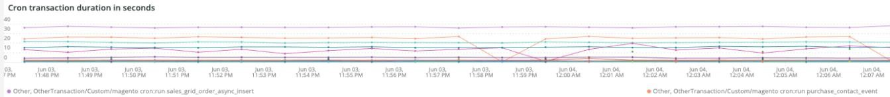

# 此 [!DNL Cron] 选项卡

此选项卡旨在尝试快速隔离以下问题的原因和原因 [!DNL cron] 问题。

## [!UICONTROL Cron transaction duration in seconds]

此 **[!UICONTROL Cron transaction duration in seconds]** 框架显示 [!DNL crons] 事务持续时间（以秒为单位）。 这将显示运行时间较长的事务。 对APM的更深入了解将显示有关事务/操作可能正在运行的查询的更多详细信息。

## [!UICONTROL MySQL Non-Sleeping Threads by Node]

此 **[!UICONTROL MySQL Non-Sleeping Threads by Node]** 框架按节点显示选定时间范围内的MySQL非休眠线程。

## [!UICONTROL SQL Trace count by path]

此 **[!UICONTROL SQL Trace count by path]** frame按路径查看MySQL跟踪计数，这有助于在选定的时间范围内跟踪SQL语句。

## [!UICONTROL Cron database call]

此 **[!UICONTROL Cron database call]** frame查看 [!DNL crons] 在选定的时间范围内调用数据库。

## [!UICONTROL Cron schedule table locks]

此 **[!UICONTROL Cron schedule table locks]** 框架查看 [!DNL cron] 在选定的时间范围内计划表锁定。

## [!UICONTROL Cron schedule clean cron fired]

此 **[!UICONTROL Cron schedule clean cron fired]** frame查看 [!DNL crons] 已清理选定时间范围。 如果此帧中未显示任何数据，则可能表示 [!DNL crons] 运行正常。 如果 [!DNL cron] 未清理作业计划， [!DNL crons] 无法以最佳方式运行，并且可能需要更长的时间才能运行。

## [!UICONTROL Cron schedule clean records details table]

此 **[!UICONTROL Cron schedule clean records details table]** 表提供了从以下位置清除记录的作业的详细信息： `cron_schedule` 表的时间范围。

## [!UICONTROL cron_schedule table updates]

此 **[!UICONTROL cron_schedule table updates]** frame查看 [!DNL cron] 计划表会在选定的时间范围内更新。 此表的删除或更新活动频繁可能表示存在问题。 [!DNL crons]. 另外， [!DNL crons] 当它们运行并完成时更新此表，因此，如果此表上没有活动，并且 [!DNL crons] 已配置，可能存在问题 [!DNL crons].

## [!UICONTROL Datastore Operations Tables]

此 **[!UICONTROL Datastore Operations Tables]** 查看数据库表操作，包括 `SELECT`， `DELETE`、和 `UPDATE` 跨所选时间范围。 此框架显示操作频率最高的数据库表。
