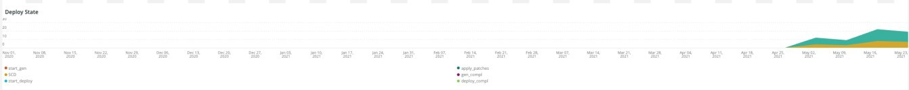

# 的 [!UICONTROL Deploy] 选项卡

此选项卡旨在快速隔离问题和导致部署问题的原因。

## [!UICONTROL Deploy log Deployment Troubleshooter]

的 **[!UICONTROL Deploy log Deployment Troubleshooter]** 框架显示在选定时间范围内发生的部署日志事件计数。 其目的在于提供部署活动的概览，并根据计数确定部署的复杂性。 记录的消息越多，部署通常就越复杂。

## [!UICONTROL Deploy State]

的 **[!UICONTROL Deploy State]** 框架显示在选定的时间范围内发生的部署事件。 此帧的解析器正在查找以下特定信号：

* “%NOTICE:开始生成命令%”)作为“start_gen”
* “%git apply /app/vendor/magento/ece-tools/patches%”)作为“apply_patches”
* “%Set标记：.static_content_deploy%”)作为“SCD”
* “%NOTICE:生成命令command completed%”)作为“gen_compl”
* “%NOTICE:开始部署。%&#39;)作为&#39;start_deploy&#39;
* “%NOTICE:部署已完成%”)作为“deploy_compl”
* “%NOTICE:开始部署后。%&#39;)作为&#39;start_pdeploy&#39;
* “%NOTICE:部署后完成%)作为“部署”
* “%deploy-complete%”)作为“cl_deploy_compl”

## [!UICONTROL Deploy Log Detail]

的 **[!UICONTROL Deploy Log Detail]** 框架显示在选定时间范围内发生的部署日志消息摘要详细信息。 正在解析部署日志中的以下字符串：

* “%NOTICE:开始部署。%&#39;)作为&#39;start_dply&#39;
* “%INFO:开始方案：scenario/deploy.xml%”)作为“start_scenario”
* “%NOTICE:开始预部署%”)作为“strt_predply”
* “%信息：恢复修补程序日志文件%”)为“rstr_ptch_log”
* “%INFO:正在更新缓存配置。%&#39;)作为&#39;updt_cach_config&#39;
* “%INFO:将Redis从连接%”设置为“redis_sec_conn_set”
* “%INFO:在生成挂接期间执行静态内容部署，清理旧内容%&#39;)as&#39;scd_build_hk&#39;
* “%INFO:清除pub/static%”)作为“clr_pub_static”
* “%NFO:清除Redis缓存：%&#39;)作为“clr_redis_cach”
* “%INFO:清除var/cache目录%&#39;)作为“clr_var_cach”
* “%通知：启用维护模式%”)作为“enable_maint_mode”
* “%INFO:禁用cron%”)作为“disable_cron”
* “%INFO:正在尝试终止运行的cron作业，用户处理%”)为“kill_cron_try”
* “%INFO:未找到运行Magentocron和使用者进程。%&#39;)作为&#39;no_cron_fnd&#39;,
* %注意：验证配置%”)作为“validate_config”
* “%在初始安装期间创建管理员用户需要以下管理员数据%”)作为“no_admin”
* “%推荐的PHP版本满足约束%”)作为“php_ver_constraint”
* “%警告：使用给定建议修复配置：%&#39;)作为“fix_config_sugg”
* “%警告： [2003年] 尚未配置用于错误报告的目录嵌套级别值。%&#39;)as&#39;nest_err_reporting&#39;
* “%NOTICE:验证结束%”)作为“end_validation”
* “%NOTICE:正在开始更新。%&#39;)作为&#39;start_update&#39;
* “%INFO:正在更新env.php。%&#39;)作为&#39;update_php_env&#39;
* “%INFO:正在更新env.php DB连接配置。%&#39;)作为&#39;update_php_env_db&#39;
* “%INFO:将env.php AMQP configuration%&#39;)更新为&#39;update_php_env_amqp&#39;
* “%INFO:将搜索引擎设置为：elasticsearch7%”)作为“set_elastic7”
* “%elasticsearch 6.5.4已传递EOL%”)作为“elastic_ver_EOL”
* “%INFO:将搜索引擎设置为：elasticsearch6%”)作为“set_elastic6”
* “%INFO:将安全和不安全的URL%”更新为“update_url”
* “%INFO:正在运行安装程序升级。%&#39;)作为&#39;setup_upgrade_run&#39;
* “%INFO:部署后挂接已启用。 启用Cron、缓存清理和预警操作将延迟%”)作为“post_hook_enabled”
* “%NOTICE:维护模式被禁用。%&#39;)作为&#39;maint_mode_disabled&#39;
* “%INFO:方案（完成%）作为“scenario_finished”
* “%警告：命令维护：启用已完成，但出现错误。 创建维护标志文件%&#39;)为&#39;enable_maintenance_fail&#39;
* “%MySQL Server已消失%”)作为“MySQL_has_gone_away”

## [!UICONTROL Post Deploy Log Detail]

的 **[!UICONTROL Post Deploy Log Detail]** 框架显示在选定时间范围内发生的部署后日志详细信息。 此框架重点介绍包含以下字符串的特定日志消息：

* “%已禁用的维护模式%”)作为“disabled_maint_mode”
* “%INFO:开始方案：scenario/post-deploy.xml%”)作为“start_pstdply_scenario”
* “%通知：验证配置%”)作为“val_config”
* “%通知：验证%”)作为“end_val_config”
* “%INFO:启用cron%”)作为“cron_enabled”
* “%信息：创建重要文件的备份。%&#39;)作为&#39;file_backup&#39;
* “%INFO:已成功创建备份%”)作为“file_backup_success”
* “%INFO:起始页面预热%”)作为“pg_warmup_start”
* “%INFO:已热化页面：%&#39;)作为“homned_up_pg”
* “%错误：预热失败：%&#39;)为“warm_up_pg_err”
* “%信息：方案（完成%）作为“scenario_finished”

## [!UICONTROL Cloud Log Detail]

的 **[!UICONTROL Cloud Log Detail]** 框架显示在选定时间范围内发生的云日志详细信息。 将解析以下字符串，并使用下面的“AS”标签返回：

* “%DEBUG:/bin/bash -c &quot;set-o pipefail&quot;;php 。/bin/magento setup:upgrade%&#39;)作为“start_update”
* “%架构创建/更新：%”)作为“schema_updates”
* “%没有要导入的内容。%&#39;)作为“mod_import_finish”
* “%NOTICE:更新结束。%&#39;)作为“update_finished”
* “%DEBUG:运行步骤：deploy-static-content%”)作为“scd_run”
* “%通知：正在跳过静态内容部署。 已启用SCD on demand。%&#39;)作为“scd_ondemand”
* “%INFO:Clearing%&#39;)as&#39;clr_dirs&#39;
* “%DEBUG:步骤“deploy-static-content”fined%”)作为“scd_finished”
* “%NOTICE:正在跳过静态内容压缩。 已启用SCD on demand。%&#39;)作为&#39;scd_compression_run&#39;,
* “%INFO:清除var/cache目录%&#39;)作为“clr_var_cach”
* “%DEBUG:步骤“compress-static-content”fined%”)作为“scd_compression_finished”
* “%DEBUG:运行步骤：deploy_complete%”)作为“deploy_finished”
* “%INFO:部署后挂接已启用。 启用CRON、缓存清理和预热操作被推迟到部署后阶段。%”)作为“Post_deploy_hook_enabled”
* “%NOTICE:维护模式被禁用。%&#39;)作为&#39;maint_mode_disabled&#39;
* “%INFO:方案（完成%）作为“scenario_finished”
* “%post-deploy.xml%”)作为“post_deploy_start”
* “%NOTICE:验证配置%”)作为“validate_config”
* “%警告： [2003年] 尚未配置用于错误报告的目录嵌套级别值。%&#39;)as&#39;nest_err_reporting&#39;
* “%NOTICE:验证结束%”)作为“end_validation”
* “%INFO:启用cron%”)作为“enable_cron”
* “%INFO:创建重要文件%的备份)作为“create_backup”
* “%DEBUG:步骤“备份”已完成%”)作为“backup_finished”
* “%INFO:起始页预热%”)作为“warmup_start”
* “%错误：预热失败：%&#39;)为“warm_up_fail”
* “%DEBUG:步骤“预热”已完成%”)作为“预热_已完成”
* “%调试：步骤“time-to-first-byte”已完成%”)作为“ttfb_finished”
* “%INFO:方案（完成%）作为“post_deploy_finished”
* “%DEBUG:运行步骤：pre-build%”)作为“run_pre-build”
* “%DEBUG:标记.static_content_deploy已被删除%&#39;)为“scd_flag_del”
* “%DEBUG:步骤“预建”已完成%”)作为“pre-build_completed”
* “%NOTICE:应用补丁程序%”)作为“apply_patches”
* “%已应用%”)作为“patches_applied”
* “%DEBUG:步骤“apply-patches” finished%”)作为“apply_patches_complete”
* “%使用快速策略%”部署)作为“quick_strategy_deploy”
* “%通知：运行DI编译%”)作为“di_compliation_start”
* “%NOTICE:运行DI编译%”)作为“di_compliation_finished”
* “%NOTICE:正在生成新的静态内容%”)作为“gen_frsh_static_content”
* &#39;%magento设置:static-content:deploy%&#39;)作为“scd_executing”
* “%NOTICE:生成新静态内容%&#39;的结束)，作为“gen_frsh_static_cont_finished”
* “%INFO:开始方案：scenario/build/transfer.xml%&#39;)作为&#39;start_transferxml&#39;
* “%INFO:尝试终止运行cron作业%”)作为“kill_crons”
* “%INFO:清除redis缓存：%&#39;)作为“clear_redis_cache”
* “%INFO:检查db是否存在并检查stables%&#39;)作为“db_check”
* “%警告： [2010年] Elasticsearch服务安装在基础架构层，但不用作搜索引擎。%&#39;)as&#39;es_not_used&#39;s
* “%NOTICE:正在开始更新。%&#39;)作为&#39;starting_update&#39;
* “%INFO:将搜索引擎设置为：mysql%&#39;)作为“mysql_search”
* “%SQLSTATE[HY000] [2006年] MySQL Server已丢失%”)，为“mysql_gone”

## [!UICONTROL Count of modules imported during deploy]

的 **[!UICONTROL Count of modules imported during deploy]** 框架显示在选定时间范围内部署期间导入的模块数。

## [!UICONTROL Deployed module list]

的 **[!UICONTROL Deployed module list]** 框架显示选定时间范围内已部署的模块。

