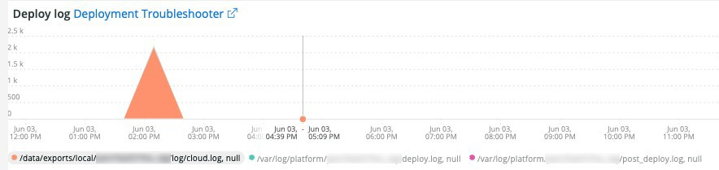

# [!UICONTROL Deploy]选项卡

此选项卡用于尝试快速隔离部署问题的问题和原因。

## [!UICONTROL Deploy log Deployment Troubleshooter]

**[!UICONTROL Deploy log Deployment Troubleshooter]**&#x200B;帧显示在所选时间范围内发生的部署日志事件计数。 其目的是提供部署活动的概览，并按计数确定部署的复杂性。 记录的消息越多，部署通常就越复杂。

## [!UICONTROL Deploy State]

**[!UICONTROL Deploy State]**&#x200B;帧显示在所选时间范围内发生的部署事件。 此帧的解析器正在查找以下特定信号：

* “`%NOTICE: Starting generate command%`”)，作为“`start_gen`”
* “`%git apply /app/vendor/magento/ece-tools/patches%`”)，作为“`apply_patches`”
* “`%Set flag: .static_content_deploy%`”)，作为“`SCD`”
* “`%NOTICE: Generate command completed%`”)，作为“`gen_compl`”
* “`%NOTICE: Starting deploy.%`”)，作为“`start_deploy`”
* “`%NOTICE: Deployment completed%`”)，作为“`deploy_compl`”
* “`%NOTICE: Starting post-deploy.%`”)，作为“`start_pdeploy`”
* “`%NOTICE: Post-deploy is complete%`”)，作为“`pdeploy`”
* “`%deploy-complete%`”)，作为“`cl_deploy_compl`”

## [!UICONTROL Deploy Log Detail]

**[!UICONTROL Deploy Log Detail]**&#x200B;框架显示所选时间范围内发生的部署日志消息摘要详细信息。 正在解析框架以查找部署日志中的以下字符串：

* “`%NOTICE: Starting deploy.%`”)，作为“`start_dply`”
* “`%INFO: Starting scenario(s): scenario/deploy.xml%`”)，作为“`start_scenario`”
* “`%NOTICE: Starting pre-deploy%`”)，作为“`strt_predply`”
* “`%INFO: Restoring patch log file%`”)，作为“`rstr_ptch_log`”
* “`%INFO: Updating cache configuration.%`”)，作为“`updt_cach_config`”
* “`%INFO: Set Redis slave connection%`”)，作为“`redis_sec_conn_set`”
* “`%INFO: Static content deployment was performed during build hook, cleaning old content%`”)，作为“`scd_build_hk`”
* “`%INFO: Clearing pub/static%`”)，作为“`clr_pub_static`”
* “`%NFO: Clearing redis cache:%`”)，作为“`clr_redis_cach`”
* “`%INFO: Clearing var/cache directory%`”)，作为“`clr_var_cach`”
* “`%NOTICE: Enabling Maintenance mode%`”)，作为“`enable_maint_mode`”
* “`%INFO: Disable cron%`”)，作为“`disable_cron`”
* “`%INFO: Trying to kill running cron jobs and consumers processes%`”)，作为“`kill_cron_try`”
* “`%INFO: Running Adobe Commerce cron and consumers processes were not found.%`”)，作为“`no_cron_fnd`”
* “`%NOTICE: Validating configuration%`”)，作为“`validate_config`”
* “`%The following admin data is required to create an admin user during initial installation%`”)，作为“`no_admin`”
* “`%recommended PHP version satisfying the constraint%`”)，作为“`php_ver_constraint`”
* “`%WARNING: Fix configuration with given suggestions:%`”)，作为“`fix_config_sugg`”
* “`%WARNING: [2003] The directory nesting level value for error reporting has not been configured.%`”)，作为“`nest_err_reporting`”
* “`%NOTICE: End of validation%`”)，作为“`end_validation`”
* “`%NOTICE: Starting update.%`”)，作为“`start_update`”
* “`%INFO: Updating env.php.%`”)，作为“`update_php_env`”
* “`%INFO: Updating env.php DB connection configuration.%`”)，作为“`update_php_env_db`”
* “`%INFO: Updating env.php AMQP configuration%`”)，作为“`update_php_env_amqp`”
* “`%INFO: Set search engine to: elasticsearch7%`”)，作为“`set_elastic7`”
* “`%elasticsearch 6.5.4 has passed EOL%`”)，作为“`elastic_ver_EOL`”
* “`%INFO: Set search engine to: elasticsearch6%`”)，作为“`set_elastic6`”
* “`%INFO: Updating secure and unsecure URLs%`”)，作为“`update_urls`”
* “`%INFO: Running setup upgrade.%`”)，作为“`setup_upgrade_run`”
* “`%INFO: Post-deploy hook enabled. Cron enabling, cache cleaning, and pre-warming operations are postponed%`”)，作为“`post_hook_enabled`”
* “`%NOTICE: Maintenance mode is disabled.%`”)，作为“`maint_mode_disabled`”
* “`%INFO: Scenario(s) finished%`”)，作为“`scenario_finished`”
* “`%WARNING: Command maintenance:enable finished with an error. Creating a maintenance flag file%`”)，作为“`enable_maintenance_fail`”
* “`%MySQL server has gone away%`”)，作为“`MySQL_has_gone_away`”

## [!UICONTROL Post Deploy Log Detail]

**[!UICONTROL Post Deploy Log Detail]**&#x200B;框架显示所选时间范围内发生的部署后日志详细信息。 此框架侧重于包含以下字符串的特定日志消息：

* “`%Disabled maintenance mode%`”)，作为“`disabled_maint_mode`”
* “`%INFO: Starting scenario(s): scenario/post-deploy.xml%`”)，作为“`start_pstdply_scenario`”
* “`%NOTICE: Validating configuration%`”)，作为“`val_config`”
* “`%NOTICE: End of validation%`”)，作为“`end_val_config`”
* “`%INFO: Enable cron%`”)，作为“`cron_enabled`”
* “`%INFO: Create backup of important files.%`”)，作为“`file_backup`”
* “`%INFO: Successfully created backup%`”)，作为“`file_backup_success`”
* “`%INFO: Starting page warming up%`”)，作为“`pg_warmup_start`”
* “`%INFO: Warmed up page:%`”)，作为“`warmed_up_pg`”
* “`%ERROR: Warming up failed:%`”)，作为“`warm_up_pg_err`”
* “`%INFO: Scenario(s) finished%`”)，作为“`scenario_finished`”

## [!UICONTROL Cloud Log Detail]

**[!UICONTROL Cloud Log Detail]**&#x200B;帧显示在所选时间范围内发生的云日志详细信息。 以下字符串经过解析后返回，并带有下面的“AS”标签：

* “`%DEBUG: /bin/bash -c "set -o pipefail; php ./bin/magento setup:upgrade%`”)，作为“`start_update`”
* “`%Schema creation/updates:%`”)，作为“`schema_updates`”
* “`%Nothing to import.%`”)，作为“`mod_import_finish`”
* “`%NOTICE: End of update.%`”)，作为“`update_finished`”
* “`%DEBUG: Running step: deploy-static-content%`”)，作为“`scd_run`”
* “`%NOTICE: Skipping static content deploy. SCD on demand is enabled.%`”)，作为“`scd_ondemand`”
* “`%INFO: Clearing%`”)，作为“`clr_dirs`”
* “`%DEBUG: Step "deploy-static-content" finished%`”)，作为“`scd_finished`”
* “`%NOTICE: Skipping static content compression. SCD on demand is enabled.%`”)，作为“`scd_compression_run`”
* “`%INFO: Clearing var/cache directory%`”)，作为“`clr_var_cach`”
* “`%DEBUG: Step "compress-static-content" finished%`”)，作为“`scd_compression_finished`”
* “`%DEBUG: Running step: deploy-complete%`”)，作为“`deploy_finished`”
* “`%INFO: Post-deploy hook enabled. Cron enabling, cache cleaning, and pre-warming operations are postponed to post-deploy stage.%`”)，作为“`Post_deploy_hook_enabled`”
* “`%NOTICE: Maintenance mode is disabled.%`”)，作为“`maint_mode_disabled`”
* “`%INFO: Scenario(s) finished%`”)，作为“`scenario_finished`”
* “`%post-deploy.xml%`”)，作为“`post_deploy_start`”
* “`%NOTICE: Validating configuration%`”)，作为“`validate_config`”
* “`%WARNING: [2003] The directory nesting level value for error reporting has not been configured.%`”)，作为“`nest_err_reporting`”
* “`%NOTICE: End of validation%`”)，作为“`end_validation`”
* “`%INFO: Enable cron%`”)，作为“`enable_cron`”
* “`%INFO: Create backup of important files%`”)，作为“`create_backup`”
* “`%DEBUG: Step "backup" finished%`”)，作为“`backup_finished`”
* “`%INFO: Starting page warming up%`”)，作为“`warmup_start`”
* “`%ERROR: Warming up failed:%`”)，作为“`warm_up_fail`”
* “`%DEBUG: Step "warm-up" finished%`”)，作为“`warmup_finished`”
* “`%DEBUG: Step "time-to-first-byte" finished%`”)，作为“`ttfb_finished`”
* “`%INFO: Scenario(s) finished%`”)，作为“`post_deploy_finished`”
* “`%DEBUG: Running step: pre-build%`”)，作为“`run_pre-build`”
* “`%DEBUG: Flag .static_content_deploy has already been deleted%`”)，作为“`scd_flag_del`”
* “`%DEBUG: Step "pre-build" finished%`”)，作为“`pre-build_completed`”
* “`%NOTICE: Applying patches%`”)，作为“`apply_patches`”
* “`%has been applied%`”)，作为“`patches_applied`”
* “`%DEBUG: Step "apply-patches" finished%`”)，作为“`apply_patches_complete`”
* “`%Deploy using quick strategy%`”)，作为“`quick_strategy_deploy`”
* “`%NOTICE: Running DI compilation%`”)，作为“`di_compliation_start`”
* “`%NOTICE: End of running DI compilation%`”)，作为“`di_compliation_finished`”
* “`%NOTICE: Generating fresh static content%`”)，作为“`gen_frsh_static_content`”
* “`%magento setup:static-content:deploy%`”)，作为“`scd_executing`”
* “`%NOTICE: End of generating fresh static content%`”)，作为“`gen_frsh_static_cont_finished`”
* “`%INFO: Starting scenario(s): scenario/build/transfer.xml%`”)，作为“`start_transferxml`”
* “`%INFO: Trying to kill running cron jobs%`”)，作为“`kill_crons`”
* “`%INFO: Clearing redis cache:%`”)，作为“`clear_redis_cache`”
* “`%INFO: Checking if db exists and has tables%`”)，作为“`db_check`”
* “`%WARNING: [2010] Elasticsearch service is installed at infrastructure layer, but is not used as a search engine.%`”作为“`es_not_used`”
* “`%NOTICE: Starting update.%`”)，作为“`starting_update`”
* “`%INFO: Set search engine to: mysql%`”)，作为“`mysql_search`”
* “`%SQLSTATE[HY000] [2006] MySQL server has gone away%`”)，作为“`mysql_gone`”

## [!UICONTROL Count of modules imported during deploy]

部署期间导入了

**[!UICONTROL Count of modules imported during deploy]**&#x200B;框架显示在所选时间范围内部署期间导入的模块数。

## [!UICONTROL Deployed module list]

**[!UICONTROL Deployed module list]**&#x200B;帧显示所选时间范围内的已部署模块。
