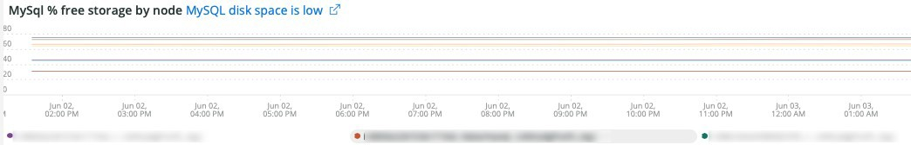
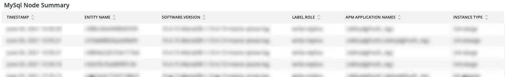

# 的 [!UICONTROL MySQL] 选项卡

## [!UICONTROL MySQL% free storage by node]

许多问题是由分配给MySQL的存储中的MySQL存储耗尽(`datadir` MySQL配置设置，默认值为 `/data/mysql`)或 `tmpdir` 空间不足。 默认 `tmpdir` （MySQL设置）为 `/tmp`. 此框架在 `/, /tmp` （如果定义为单独的装载）和 `/data/mysql` %的可用存储。 从MySQL 5.7版（MariaDB 10.2版）开始，未压缩的tmp表将写入 `/data/mysql` 文件(ibtmp1)中的目录。 默认情况下，此文件会自动无限制地展开。 由于它是表空间，因此不会减小大小，在MySQL重新启动时，它将重置为12MB。

## [!UICONTROL MySQL Connections by Node]

的 **[!UICONTROL MySQL Connections by Node]** 帧指示数据库节点停机或大量连接的时间段。

## [!UICONTROL MySQL Node Summary]

的 **[!UICONTROL MySQL Node Summary]** 表显示数据库节点详细信息，如软件版本和实例类型（大小）。

## [!UICONTROL Galera Number of Nodes in cluster]

的 **[!UICONTROL Galera Number of Nodes in cluster]** 框架显示MySQL日志中的信息。 当节点加入并离开群集时，将只显示选定时间范围的消息。 如果节点在该时间范围之前离开群集，则该时间范围内将不会有任何消息。 如果您怀疑数据库可能没有节点运行，请将时间范围扩展到更长的时段，以查看您是否可以看到其他信息。 如果时间段内的信息指示少于 [!DNL Galera] 群集中，展开时间范围以查看您是否可以确定节点何时离开群集。

## [!UICONTROL MySQL shutdowns and starts]

的 **[!UICONTROL MySQL shutdowns and starts]** 帧检测何时关闭节点。 [!DNL Galera] 节点将被逐出，并自行从 [!DNL Galera] 节点。 这通常会导致重新启动MySQL服务。

## [!UICONTROL Galera log]

的 **[!UICONTROL Galera log]** 帧显示MySQL日志中与 [!DNL Galera] 节点、其状态以及状态的更改 [!DNL Galera] 群集。

* “%1047 WSREP尚未准备用于应用程序的节点use%”)作为“node_not_prep_for_use”
* “%\[ERROR\] WSREP:无法从中读取：wsrep_sst_xtrabackup-v2%&#39;)作为“xtrabackup_read_fail”
* “%\[ERROR\] WSREP:进程已完成，但出现错误：wsrep_sst_xtrabackup_v2 %&#39;)作为“xtrabackup_compl_w_err”
* “%\[ERROR\] WSREP:rbr write fail%”)作为“rbr_write_fail”
* “%selfleave%”)作为“susp_node”
* “%members = 3/3（已加入/总计）%”)作为“3of3”
* “%members = 2/3（已加入/总计）%”)作为“2of3”
* “%members = 2/2%”)作为“2of2”
* “%members = 1/2%”)作为“1of2”
* “%members = 1/3%”)作为“1of3”
* “%members = 1/1%”)作为“1of1”
* “%\[注意\] /usr/sbin/mysqld(mysqld 10)。%&#39;)as&#39;sql_restart&#39;
* “%Quorum:没有完全状态为“%”的节点)为“no_node_count”
* “%WSREP:成员0%”)作为“mem_0”
* “%WSREP:成员1.0%”)作为“mem_1”
* “%WSREP:成员2%&#39;)作为&#39;mem2&#39;
* “%WSREP:已与组同步，已准备好连接%”)为“就绪”
* “%/usr/sbin/mysqld，版本：%”)作为“mysql_restart_mysql.slow”
* “%\[注意\] WSREP:新的群集视图：全局状态：%&#39;)作为&#39;galera_cluster_view_chng&#39;

## [!UICONTROL Galera Log by Host]

的 **[!UICONTROL Galera Log by Host]** 框架与 **[!UICONTROL Galera log]** 框架，但是它是按节点划分的，以帮助进行故障排除。

## [!UICONTROL Database performance]

的 **[!UICONTROL Database performance]** 帧显示特定请求期间的数据库性能。 您可以通过单击图表下方的彩色图标中的各个量度，来查看这些量度。 许多量度在 [使用新旧版监控MySQL数据库性能](https://newrelic.com/blog/how-to-relic/how-to-monitor-mysql) 在此框架中找到。

* average(query.querysPerSecond)
* average(query.slowQueryesPerSecond)
* average(db.createdTmpDiskTablesPerSecond)
* average(db.createdTmpFilesPerSecond)
* average(db.tablesLocksWaitedPerSecond)
* average(db.innodb.rowLockTimeAvg)
* average(db.innodb.rowLockWaitsPerSecond)

## [!UICONTROL Transaction Database Call Count]

的 **[!UICONTROL Transaction Database Call Count]** frame显示每个事务facet发出的数据库调用数。 这似乎是以行为中心，而不是语句。

## [!UICONTROL Cron_schedule table updates]

的 **[!UICONTROL Cron_schedule table updates]** frame显示所选时间段内对cron_schedule表进行数据库更新的最大持续时间。

## [!UICONTROL Slow Query Traces]

的 **[!UICONTROL Slow Query Traces]** frame显示存在慢速查询跟踪的表和请求类型。 会为超过5秒的查询事务创建缓慢的查询跟踪。 此框架的重要性在于更新查询。 如果表格的更新者 `UPDATE`, `DELETE`和 `INSERT` 语句，它们可能会锁定表一段时间。

均等 `SELECT` 如果与FOR UPDATE一起使用，语句可能会锁定行。

## [!UICONTROL Datastore Operations tables]

## [!UICONTROL Cron table change]

的 **[!UICONTROL Cron table change]** frame正在查找“无法获取cron作业的锁：”错误消息，以及涉及特定PHP内存错误和锁的错误 `cron_schedule` 表。 如果 `cron_schedule` 表被锁定(例如， `DELETE` 查询)，则会阻止其他cron运行。

## [!UICONTROL Deadlocks]

的 **[!UICONTROL Deadlocks]** frame正在查看从MySQL日志中解析的以下字符串。

* “%PHP错误：允许的内存大小为%&#39;)，为php_mem_error
* &#39;%get lock;尝试重新启动事务，查询为：DELETE自\&#39;cron_schedule%&#39;)作为cron_sched_lock_del
* cron作业的“%锁定”：indexer_reindex_all_invalid%&#39;)作为“lock_indexer_reindex_all_invalid%”
* cron作业的“%锁定”：cron_schedule%”)作为“lock_cron_schedule”
* “%锁定cron作业：%”)为“total_cron_lock”
* “%常规错误：1205锁等待超时超过%”)作为“sql_1205_lock”
* “%ERROR 1213(40001):在尝试获取lock%时发现死锁)为“sql_1213_lock”
* “%SQLSTATE[40001]:序列化失败：1213 Deadlock found%&#39;)作为“sql_1213_lock2”
* cron作业的“%锁定”：indexer_update_all_views%&#39;)作为“lock_indexer_update_all_views”
* cron作业的“%锁定”：sales_grid_order_invoice_async_insert%&#39;)作为“lock_sales_grid_order_invoice_async_insert”，
* cron作业的“%锁定”：staging_remove_updates%”)作为“lock_staging_remove_updates”
* cron作业的“%锁定”：sales_grid_order_shipment_async_insert%&#39;)作为“lock_sales_grid_order_sync_insert”
* cron作业的“%锁定”：amazon_payments_process_queued_refs%&#39;)作为“lock_amazon_payments_process_queued_refuss”
* cron作业的“%锁定”：sales_send_order_shipment_emails%&#39;)作为“lock_sales_send_order_shimpt_emails”
* cron作业的“%锁定”：staging_synchronize_entities_period%&#39;)作为“lock_staging_synchronize_entities_period”
* cron作业的“%锁定”：indexer_clean_all_changelogs%&#39;)作为“lock_indexer_clean_all_changelogs”
* cron作业的“%锁定”：magento_targetrule_index_reindex%&#39;)作为“lock_magento_targetrule_index_reindex”
* cron作业的“%锁定”：newsletter_send_all%”)作为“lock_newsletter_send_all”
* cron作业的“%锁定”：newsletter_send_all%”)作为“lock_newsletter_send_all”
* cron作业的“%锁定”：sales_send_order_emails%&#39;)作为“lock_sales_send_order_emails”
* cron作业的“%锁定”：sales_send_order_creditmemo_emails%&#39;)作为“lock_sales_send_order_creditmemo_emails”
* cron作业的“%锁定”：sales_grid_order_creditmemo_async_insert%&#39;)作为`lock_sales_grid_order_creditmemo_async_insert&#39;
* cron作业的“%锁定”：bulk_cleanup%”)作为“lock_bulk_cleanup”
* cron作业的“%锁定”：flush_preview_quotas%&#39;)作为“lock_flush_preview_quotas”
* cron作业的“%锁定”：sales_send_order_invoice_emails%&#39;)作为“lock_sales_send_order_invoice_emails”
* cron作业的“%锁定”：sales_send_order_invoice_emails%&#39;)作为“lock_sales_send_order_invoice_emails”
* cron作业的“%锁定”：captcha_delete_expired_images%&#39;)作为“lock_captcha_delete_expired_images”
* cron作业的“%锁定”：magento_newrelicreporting_cron%”)作为“lock_magento_newrelicreporting_cron”
* cron作业的“%锁定”：actipted_authentication_failures_cleanup%”)作为“lock_actified_authentication_failures_cleanup”
* cron作业的“%锁定”：send_notification%”)作为“lock_send_notification”
* cron作业的“%锁定”：magento_giftcardaccount_generage_codes_pool%&#39;)作为“lock_magento_giftcardaccount_generage_codes_pool”
* cron作业的“%锁定”：catalog_product_frontend_actions_flush%”)作为“lock_catalog_product_frontend_actions_flush”
* cron作业的“%锁定”：mysqlmq_clean_messages%&#39;)作为“mysqlmq_clean_messages”
* cron作业的“%锁定”：catalog_product_attribute_value_synchronize%&#39;)作为“lock_catalog_product_attribute_value_synchronize”
* cron作业的“%锁定”：ddg_automation_importer%&#39;)作为“lock_ddg_automation_importer”
* cron作业的“%锁定”：ddg_automation_reviews_and_wishlist%”)作为“lock_ddg_automation_reviews_and_wishlist”
* cron作业的“%锁定”：captcha_delete_old_attempts%”)作为“lock_captcha_delete_old_attempts”
* cron作业的“%锁定”：catalog_product_optide_price_values_cleanup%&#39;)作为“lock_catalog_product_outprice_values_cleanup”
* cron作业的“%锁定”：consumers_runner%”)作为“lock_consumers_runner”
* cron作业的“%锁定”：ddg_automation_customer_subscriber_guest_sync%”)作为“lock_ddg_automation_customer_guest_sync”
* cron作业的“%锁定”：get_amazon_capture_updates%”)作为“lock_get_amazon_capture_updates”
* cron作业的“%锁定”：get_amazon_authorization_updates%”)作为“lock_send_get_amazon_authorization_updates”
* cron作业的“%锁定”：temando_process_platform_events%”)作为“lock_temando_process_platform_events”
* cron作业的“%锁定”：ddg_automation_status%&#39;)作为“lock_ddg_automation_status”
* cron作业的“%锁定”：ddg_automation_status%&#39;)作为“lock_ddg_automation_status”
* cron作业的“%锁定”：sales_clean_orders%”)作为“lock_sales_clean_orders”
* cron作业的“%锁定”：catalog_index_refresh_price%&#39;)作为“lock_catalog_index_refresh_price”
* cron作业的“%锁定”：magento_reward_balance_warning_notification%&#39;)作为“lock_magento_reward_balance_warning_notification”
* cron作业的“%锁定”：analytics_update%”)作为“lock_analytics_update”
* cron作业的“%锁定”：messageue_clean_octiped_locks%&#39;)作为“lock_messageue_clean_octiped_locks”
* cron作业的“%锁定”：messageue_clean_octiped_locks%&#39;)作为“lock_messageue_clean_octiped_locks”
* cron作业的“%锁定”：staging_apply_version%”)作为“lock_staging_apply_version”
* cron作业的“%锁定”：magento_reward_expire_points%”)作为“lock_magento_reward_expire_points”
* cron作业的“%锁定”：yotpo_yotpo_orders_sync%&#39;)作为“lock_yotpo_yotpo_orders_sync”
* cron作业的“%锁定”：catalog_event_status_checker%&#39;)作为“lock_catalog_event_status_checker”
* cron作业的“%锁定”：ddg_automation_campaign%”)作为“lock_ddg_automation_campaign”
* cron作业的“%锁定”：visitor_clean%”)作为“lock_visitor_clean”
* cron作业的“%锁定”：scconnector_verify_website%”)作为“lock_scconnector_verify_website”
* cron作业的“%锁定”：ddg_automation_email_templates%&#39;)作为“lock_ddg_automation_email_templates”
* cron作业的“%锁定”：aggregate_sales_report_order_data%&#39;)作为“lock_aggregate_sales_report_order_data”
* cron作业的“%锁定”：ddg_automation_catalog_sync%&#39;)作为“lock_ddg_automation”

## [!UICONTROL DB Statistics]

的 **[!UICONTROL DB Statistics]** 框架每秒显示删除、写入、读取、更新和慢速查询。

## [!UICONTROL Request frequency]

## [!UICONTROL Database Errors]

的 **[!UICONTROL Database Errors]** 框架显示各种数据库 [警告和错误](https://mariadb.com/kb/en/mariadb-error-codes/).

* “%为临时表分配的内存大小超过innodb_buffer_pool_size%”的20%，为“temp_tbl_buff_pool”
* “%\[ERROR\] WSREP:rbr write fail%”)作为“rbr_write_fail”
* “%mysqld”：磁盘已满%”)作为“disk_full”
* “%错误号28%”)作为“err_28”
* “%rollback%”)作为“rollback”
* “%表%的外键约束失败”)作为“foreign_key_constraint”
* “%Error_code:1114%”)作为“sql_1114_full”%关键：SQLSTATE[HY000] [2006年] MySQL Server已丢失%”)，为“sql_gone”
* “%SQLSTATE[HY000] [1040] 连接太多%”)作为“sql_1040”
* “%关键：SQLSTATE[HY000] [2002年]%&#39;)作为&#39;sql_2002&#39;
* “%SQLSTATE[08S01]:%&#39;)作为&#39;sql_1047&#39;
* &#39;%[警告] 已中止连接%”)作为“aborted_conn”
* “%SQLSTATE[23000]:完整性约束冲突：%&#39;)作为“sql_23000”
* “%1205锁等待超时%”)作为“sql_1205”
* “%SQLSTATE[HY000] [1049] 未知数据库%”)作为“sql_1049”
* “%SQLSTATE[42S02]:找不到基表或视图：%&#39;)作为“sql_42S02”
* “%常规错误：1114%”)作为“sql_1114”
* “%SQLSTATE[40001]%&#39;)作为&#39;sql_1213&#39;
* “%SQLSTATE[42S22]:未找到列：1054未知列%”)作为“sq1_1054”
* “%SQLSTATE[42000]:语法错误或访问冲突：%&#39;)as&#39;sql_42000&#39;
* “%SQLSTATE[21000]:基数冲突：%&#39;)作为“sql_1241”
* “%SQLSTATE[22003]:%&#39;)作为&#39;sql_22003&#39;
* “%SQLSTATE[HY000] [9000] IP地址%的客户端)
* “%SQLSTATE[HY000]:一般错误：2014%”)作为“sql_2014”
* “%1927连接已终止%”)作为“sql_1927”
* “%1062 \[ERROR\] InnoDB:%”)作为“sql_1062_e”
* &quot;%&quot;[注意] WSREP:正在刷新内存映射到磁盘……%&#39;)作为“mem_map_flush”
* “%Internal MariaDB错误代码：1146%”)作为“sql_1146”
* “%Internal MariaDB错误代码：1062%”)作为“sql_1062”·“%1062 [警告] InnoDB:%&#39;)作为“sql_1062_w”
* “%Internal MariaDB错误代码：1064%”)作为“sql_1064”
* &#39;%InnoDB:文件%中的断言失败”)作为“assertion_err”
* “%mysqld_safe当前正在运行的进程数：0%”)作为“mysql_oom”
* “%\[ERROR\] mysqld got signal%”)作为“mysql_sigterm”
* “%1452无法添加%”)作为“sql_1452”
* “%ERROR 1698%”)作为“sql_1698”
* “%SQLSTATE[HY000]:一般错误：3%”)作为“cnt_wrt_tmp”
* “%常规错误：1 %&#39;)作为“sql_syntax”
* “%42S22%”)作为“sql_42S22”
* &#39;%InnoDB:错误（重复键）%&#39;)作为“innodb_dup_key”（从日志时间序列）

## [!UICONTROL DB Error Table]

的 **[!UICONTROL DB Error Table]** 框架显示与 **[!UICONTROL Database Errors]** 框架，但您可以按节点和表格格式查看。 请参阅 [MariaDB错误代码](https://mariadb.com/kb/en/mariadb-error-codes/) 以了解更多信息。

## [!UICONTROL Database Traces]

的 **[!UICONTROL Database Traces]** 框架按类型显示选定时间线中的数据库跟踪。

## [!UICONTROL Database processes]

的 **[!UICONTROL Database processes]** frame显示数据库进程、环境和节点标识符。

## [!UICONTROL MySQL Non-Sleeping Threads by Node]

的 **[!UICONTROL MySQL Non-Sleeping Threads by Node]** 框架显示与数据库的连接线程。 此帧显示活动线程。

## [!UICONTROL MySQL Running and Sleeping Threads by environment]

的 **[!UICONTROL MySQL Running and Sleeping Threads by environment]** 框架显示与数据库的活动连接和休眠连接。 如果与缓慢查询进入休眠状态的数据库存在连接，则将存在休眠连接。 休眠连接可以是被锁定行或表阻止的数据库查询。 这些休眠连接也保持PHP工作器连接。

## [!UICONTROL MySQL mem used by node]

的 **[!UICONTROL MySQL mem used by node]** frame显示MySQL对内存的节点使用情况。 在较大的站点上，此帧可能是连续的条形，其内存值为GB。

## [!UICONTROL Database mysql-slow.log]

的 **[!UICONTROL Database mysql-slow.log]** frame显示了 `mysql-slow.log` 文件。

