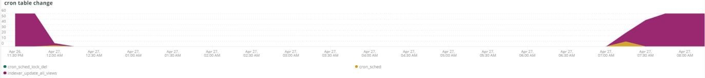

# 此 [!UICONTROL MySQL] 选项卡

## [!UICONTROL MySQL% free storage by node]

许多问题是由于MySQL在分配给MySQL的存储中耗尽存储所导致的(`datadir` MySQL配置设置，默认值为 `/data/mysql`)或 `tmpdir` 空间不足。 默认 `tmpdir` （MySQL设置）为 `/tmp`. 此 **[!UICONTROL MySQL% free storage by node]** 框架查看 `/, /tmp` （如果定义为单独的装载）和 `/data/mysql` 可用存储的百分比。 从MySQL版本5.7（MariaDB版本10.2）开始，未压缩 `tmp` 表格将写入 `tmp` 表空间 `/data/mysql` 目录(ibtmp1)。 默认情况下，此文件将自动展开，无限制。 由于它是一个表空间，因此其大小不会减少，并且在MySQL重新启动时会重置为12 MB。

## [!UICONTROL MySQL Connections by Node]

此 **[!UICONTROL MySQL Connections by Node]** frame表示数据库节点中断或大量连接的时段。

## [!UICONTROL MySQL Node Summary]

此 **[!UICONTROL MySQL Node Summary]** 该表显示数据库节点详细信息，如软件版本和实例类型（大小）。

## [!UICONTROL Galera Number of Nodes in cluster]

此 **[!UICONTROL Galera Number of Nodes in cluster]** 框架显示来自MySQL日志的信息。 当节点加入并离开群集时，将仅显示选定时间范围内的消息。 如果节点在时间范围之前离开群集，则该时间范围内将不存在任何消息。 如果您怀疑数据库可能缺少节点，请将时间范围扩展到更大的时间段，以查看是否可以看到其他信息。 如果时间段内有信息指示小于中的所有节点，则 [!DNL Galera] 群集时，请展开时间范围以查看是否可以确定节点何时离开群集。

## [!UICONTROL MySQL shutdowns and starts]

此 **[!UICONTROL MySQL shutdowns and starts]** 帧检测节点何时关闭。 此 [!DNL Galera] 节点将被逐出，并从 [!DNL Galera] 节点。 这通常会导致MySQL服务重新启动。

## [!UICONTROL Galera log]

此 **[!UICONTROL Galera log]** 框架显示来自MySQL日志的特定信号的计数，涉及 [!DNL Galera] 节点、其状态以及的状态更改 [!DNL Galera] 群集。

* “%1047 WSREP尚未为应用程序使用%准备节点)，如“node_not_prep_for_use”
* “%\[ERROR\] WSREP：无法从wsrep_sst_xtrabackup-v2%”中读取为“xtrabackup_read_fail”
* “%\[ERROR\] WSREP：进程已完成，但出现错误：wsrep_sst_xtrabackup-v2 %&#39;)为“xtrabackup_compl_w_err”
* “%\[ERROR\] WSREP： rbr write fail%”)作为“rbr_write_fail”
* &#39;%self-leave%&#39;)作为&#39;susp_node&#39;
* “%members = 3/3 （已加入/总计）%”)作为“3of3”
* “%members = 2/3 （已加入/总计）%”)作为“2of3”
* “%members = 2/2%”)作为“2of2”
* “%members = 1/2%”)作为“1of2”
* &#39;%members = 1/3%&#39;)作为&#39;1of3&#39;
* “%members = 1/1%”)作为“1of1”
* “%\[注意\] /usr/sbin/mysqld (mysqld 10.%&#39;)，作为&#39;sql_restart&#39;
* “%Quorum：没有具有完整状态：%”的节点)为“no_node_count”
* “%WSREP：成员0%”)作为“mem_0”
* “%WSREP：成员1.0%”)作为“mem_1”
* “%WSREP：成员2%”)作为“mem2”
* “%WSREP：与组同步，准备连接%”)为“就绪”
* “%/usr/sbin/mysqld，版本：%”)作为“mysql_restart_mysql.slow”
* “%\[Note\] WSREP：新群集视图：全局状态：%&#39;)作为“galera_cluster_view_chng”

## [!UICONTROL Galera Log by Host]

此 **[!UICONTROL Galera Log by Host]** 帧与 **[!UICONTROL Galera log]** 帧，只是它按节点划分，以帮助进行故障排除。

## [!UICONTROL Database performance]

此 **[!UICONTROL Database performance]** 框架显示特定请求期间的数据库性能。 您可以通过单击图表下方的彩色图标中的各个量度来查看它们。 中调用的许多量度 [使用New Relic监控MySQL数据库性能](https://newrelic.com/blog/how-to-relic/how-to-monitor-mysql) 在此帧中找到。

* average(query.queriesPerSecond)
* average(query.slowQueriesPerSecond)
* average(db.createdTmpDiskTablesPerSecond)
* average(db.createdTmpFilesPerSecond)
* average(db.tablesLocksWaitedPerSecond)
* average(db.innodb.rowLockTimeAvg)
* average(db.innodb.rowLockWaitsPerSecond)

## [!UICONTROL Transaction Database Call Count]

此 **[!UICONTROL Transaction Database Call Count]** 框架显示每个事务Facet进行的数据库调用的次数。 这似乎是着重于行，而不是语句。

## [!UICONTROL Cron_schedule table updates]

此 **[!UICONTROL Cron_schedule table updates]** frame显示所选时段内cron_schedule表数据库更新的最大持续时间。

## [!UICONTROL Slow Query Traces]

此 **[!UICONTROL Slow Query Traces]** 框架显示存在慢查询跟踪的表和请求类型。 为需要超过五秒钟的查询事务创建慢速查询跟踪。 更新查询对于此框架非常重要。 如果正在更新表 `UPDATE`， `DELETE`、和 `INSERT` 语句，它们可能会在一段时间内锁定表。

平衡 `SELECT` 如果与FOR UPDATE一起使用，语句可能会锁定行。

## [!UICONTROL Datastore Operations tables]

## [!UICONTROL Cron table change]

此 **[!UICONTROL Cron table change]** 帧查找“无法获取cron作业的锁定：”错误消息，以及特定的PHP内存错误和涉及 `cron_schedule` 表格。 如果 `cron_schedule` 表被锁定(例如，被 `DELETE` 查询正在针对它运行)，它将阻止其他cron运行。

## [!UICONTROL Deadlocks]

此 **[!UICONTROL Deadlocks]** frame查看从MySQL日志解析的以下字符串：

* “%PHP严重错误：允许的内存大小为%”)，如php_mem_error
* &#39;%get lock；尝试重新启动事务，查询为：DELETE从\&#39;cron_schedule%&#39;)为cron_sched_lock_del
* &#39;%锁定cron作业： indexer_reindex_all_invalid%&#39;)，作为&#39;lock_indexer_reindex_all_invalid%&#39;
* “% lock for cron job： cron_schedule%”)作为“lock_cron_schedule”
* “% lock for cron job：%”)，作为“total_cron_lock”
* &#39;%General error： 1205 Lock wait timeout exceeded%&#39;)作为&#39;sql_1205_lock&#39;
* “%ERROR 1213 (40001)：尝试获取lock%”时发现死锁)，为“sql_1213_lock”
* &#39;%SQLSTATE[40001]：序列化失败： 1213 Deadlock found%&#39;)为“sql_1213_lock2”
* &#39;%锁定cron作业： indexer_update_all_views%&#39;)作为&#39;lock_indexer_update_all_views&#39;
* “% lock for cron job： sales_grid_order_invoice_async_insert%”)作为“lock_sales_grid_order_invoice_async_insert”，
* 用于cron作业的“%锁定：staging_remove_updates%”)，作为“lock_staging_remove_updates”
* “%锁定cron作业：sales_grid_order_shipment_async_insert%”)，作为“lock_sales_grid_order_shipment_async_insert”
* &#39;% lock for cron job： amazon_payments_process_queued_refunds%&#39;)作为&#39;lock_amazon_payments_process_queued_refunds&#39;
* &#39;%锁定cron作业：sales_send_order_shipment_emails%&#39;)，作为&#39;lock_sales_send_order_shipment_emails&#39;
* 用于cron作业的“%锁定：staging_synchronize_entities_period%”)作为“lock_staging_synchronize_entities_period”
* &#39;%锁定cron作业： indexer_clean_all_changelogs%&#39;)为&#39;lock_indexer_clean_all_changelogs&#39;
* “% lock for cron job： magento_targetrule_index_reindex%”)作为“lock_magento_targetrule_index_reindex”
* &#39;%锁定cron作业： newsletter_send_all%&#39;)作为&#39;lock_newsletter_send_all&#39;
* &#39;%锁定cron作业： newsletter_send_all%&#39;)作为&#39;lock_newsletter_send_all&#39;
* “%锁定cron作业：sales_send_order_emails%”)，作为“lock_sales_send_order_emails”
* &#39;%锁定cron作业：sales_send_order_creditmemo_emails%&#39;)，作为&#39;lock_sales_send_order_creditmemo_emails&#39;
* “% lock for cron job： sales_grid_order_creditmemo_async_insert%”)作为“lock_sales_grid_order_creditmemo_async_insert”
* “% lock for cron job： bulk_cleanup%”)作为“lock_bulk_cleanup”
* “% lock for cron job： flush_preview_quotas%”)作为“lock_flush_preview_quotas”
* “% lock for cron job： sales_send_order_invoice_emails%”)，作为“lock_sales_send_order_invoice_emails”
* “% lock for cron job： sales_send_order_invoice_emails%”)，作为“lock_sales_send_order_invoice_emails”
* &#39;%锁定cron作业： captcha_delete_expired_images%&#39;)，作为&#39;lock_captcha_delete_expired_images&#39;
* “% lock for cron job： magento_newrelicreporting_cron%”)作为“lock_magento_newrelicreporting_cron”
* 用于cron作业的“%锁定： outdoated_authentication_failures_cleanup%”)作为“lock_outdoated_authentication_failures_cleanup”
* “%锁定cron作业： send_notification%”)，作为“lock_send_notification”
* &#39;%锁定cron作业：magento_giftcardaccount_generation_codes_pool%&#39;)为&#39;lock_magento_giftcardaccount_generation_codes_pool&#39;
* &#39;%锁定cron作业：catalog_product_frontend_actions_flush%&#39;)，作为&#39;lock_catalog_product_frontend_actions_flush&#39;
* 用于cron作业的“%锁定： mysqlmq_clean_messages%”)，作为“mysqlmq_clean_messages”
* 用于cron作业的“%锁定：catalog_product_attribute_value_synchronize%”)，作为“lock_catalog_product_attribute_value_synchronize”
* 用于cron作业的“% lock： ddg_automation_importer%”)作为“lock_ddg_automation_importer”
* &#39;% lock for cron job： ddg_automation_reviews_and_wishlist%&#39;)作为&#39;lock_ddg_automation_reviews_and_wishlist&#39;
* “% lock for cron job： captcha_delete_old_attempts%”)作为“lock_captcha_delete_old_attempts”
* &#39;%锁定cron作业：catalog_product_outdoated_price_values_cleanup%&#39;)作为&#39;lock_catalog_product_outdoated_price_values_cleanup&#39;
* 用于cron作业的“% lock： consumers_runner%”)作为“lock_consumers_runner”
* 用于cron作业的“% lock： ddg_automation_customer_subscriber_guest_sync%”)作为“lock_ddg_automation_customer_subscriber_guest_sync”
* &#39;%锁定cron作业：get_amazon_capture_updates%&#39;)作为&#39;lock_get_amazon_capture_updates&#39;
* &#39;%锁定cron作业：get_amazon_authorization_updates%&#39;)作为&#39;lock_send_get_amazon_authorization_updates&#39;
* &#39;%锁定cron作业：temando_process_platform_events%&#39;)，作为&#39;lock_temando_process_platform_events&#39;
* 用于cron作业的“% lock： ddg_automation_status%”)作为“lock_ddg_automation_status”
* 用于cron作业的“% lock： ddg_automation_status%”)作为“lock_ddg_automation_status”
* “% lock for cron job： sales_clean_orders%”)作为“lock_sales_clean_orders”
* “% lock for cron job： catalog_index_refresh_price%”)作为“lock_catalog_index_refresh_price”
* &#39;%锁定cron作业： magento_reward_balance_warning_notification%&#39;)为&#39;lock_magento_reward_balance_warning_notification&#39;
* &#39;%锁定cron作业： analytics_update%&#39;)，作为&#39;lock_analytics_update&#39;
* &#39;%锁定cron作业： messagequue_clean_outdated_locks%&#39;)为&#39;lock_messagequue_clean_outdated_locks&#39;
* &#39;%锁定cron作业： messagequue_clean_outdated_locks%&#39;)为&#39;lock_messagequue_clean_outdated_locks&#39;
* 用于cron作业的“%锁定：staging_apply_version%”)，作为“lock_staging_apply_version”
* &#39;% lock for cron job： magento_reward_expire_points%&#39;)作为&#39;lock_magento_reward_expire_points&#39;
* 用于cron作业的“%锁定：yotpo_yotpo_orders_sync%”)作为“lock_yotpo_yotpo_orders_sync”
* “%锁定cron作业：catalog_event_status_checker%”)，作为“lock_catalog_event_status_checker”
* 用于cron作业的“% lock： ddg_automation_campaign%”)，作为“lock_ddg_automation_campaign”
* &#39;%锁定cron作业： visitor_clean%&#39;)为&#39;lock_visitor_clean&#39;
* 用于cron作业的“%锁定： scconnector_verify_website%”)，作为“lock_scconnector_verify_website”
* 用于cron作业的“% lock： ddg_automation_email_templates%”)作为“lock_ddg_automation_email_templates”
* &#39;%锁定cron作业：aggregate_sales_report_order_data%&#39;)，作为&#39;lock_aggregate_sales_report_order_data&#39;
* 用于cron作业的“% lock： ddg_automation_catalog_sync%”)作为“lock_ddg_automation”

## [!UICONTROL DB Statistics]

此 **[!UICONTROL DB Statistics]** 帧显示每秒的删除、写入、读取行、更新和慢查询。

## [!UICONTROL Request frequency]

## [!UICONTROL Database Errors]

此 **[!UICONTROL Database Errors]** 框架显示各种数据库 [警告和错误](https://mariadb.com/kb/en/mariadb-error-codes/)：

* “%为临时表分配的内存大小超过innodb_buffer_pool_size%”的20%，即“temp_tbl_buff_pool”
* “%\[ERROR\] WSREP： rbr write fail%”)作为“rbr_write_fail”
* “%mysqld：磁盘已满%”)作为“disk_full”
* “%Error number 28%”)，作为“err_28”
* “%rollback%”)作为“rollback”
* “%Foreign key constraint对表%”失败)，为“foreign_key_constraint”
* “%Error_code： 1114%”)作为“sql_1114_full”%CRITICAL： SQLSTATE[HY000] [2006] MySQL服务器已消失%&#39;)为“sql_gone”
* &#39;%SQLSTATE[HY000] [1040] 连接数%&#39;)过多，如“sql_1040”
* &#39;%CRITICAL： SQLSTATE[HY000] [2002]%”)，作为“sql_2002”
* &#39;%SQLSTATE[08S01]：%&#39;)，作为“sql_1047”
* &#39;%[警告] 已中止连接%”)，作为“aborted_conn”
* &#39;%SQLSTATE[23000]：完整性约束违规：%&#39;)为“sql_23000”
* “%1205 Lock wait timeout%”)作为“sql_1205”
* &#39;%SQLSTATE[HY000] [1049] 未知的数据库%”)，作为“sql_1049”
* &#39;%SQLSTATE[42S02]：未找到基表或视图：%&#39;)作为“sql_42S02”
* &#39;%General error： 1114%&#39;)作为&#39;sql_1114&#39;
* &#39;%SQLSTATE[40001]%&#39;)作为&#39;sql_1213&#39;
* &#39;%SQLSTATE[42S22]：未找到列： 1054 Unknown column%&#39;)作为“sq1_1054”
* &#39;%SQLSTATE[42000]：语法错误或访问冲突：%&#39;)，作为&#39;sql_42000&#39;
* &#39;%SQLSTATE[21000]：基数违规：%&#39;)为“sql_1241”
* &#39;%SQLSTATE[22003]：%&#39;)，作为&#39;sql_22003&#39;
* &#39;%SQLSTATE[HY000] [9000] IP地址为%的客户端)作为“sql_9000”
* &#39;%SQLSTATE[HY000]：常规错误： 2014%&#39;)为“sql_2014”
* “%1927连接已终止%”)为“sql_1927”
* “%1062 \[ERROR\] InnoDB：%&#39;)作为“sql_1062_e”
* “%[注意] WSREP：正在刷新内存映射到磁盘……%&#39;)，作为“mem_map_flush”
* &#39;%Internal MariaDB错误代码： 1146%&#39;)为&#39;sql_1146&#39;
* &#39;%Internal MariaDB错误代码： 1062%&#39;)，作为&#39;sql_1062&#39; * &#39;%1062 [警告] InnoDB：%&#39;)作为“sql_1062_w”
* &#39;%Internal MariaDB错误代码： 1064%&#39;)为&#39;sql_1064&#39;
* “%InnoDB：文件%”中的断言失败)为“assertion_err”
* &#39;%mysqld_safe现在运行的进程数： 0%&#39;)为&#39;mysql_oom&#39;
* “%\[ERROR\] mysqld得到signal%&#39;)作为“mysql_sigterm”
* “%1452无法添加%”)作为“sql_1452”
* “%ERROR 1698%”)作为“sql_1698”
* &#39;%SQLSTATE[HY000]：常规错误： 3%&#39;)作为“cnt_wrt_tmp”
* &#39;%General error： 1 %&#39;)作为&#39;sql_syntax&#39;
* “%42S22%”)作为“sql_42S22”
* “%InnoDB： Error （重复键）%”)作为“Innodb_dup_key” FROM Log TIMESERIES

## [!UICONTROL DB Error Table]

此 **[!UICONTROL DB Error Table]** 框架显示的信息与 **[!UICONTROL Database Errors]** 框架，但您可以按节点和表格格式查看它。 请参阅 [MariaDB错误代码](https://mariadb.com/kb/en/mariadb-error-codes/) 以了解更多信息。

## [!UICONTROL Database Traces]

此 **[!UICONTROL Database Traces]** 帧按类型显示选定时间轴上的数据库跟踪。

## [!UICONTROL Database processes]

此 **[!UICONTROL Database processes]** frame显示数据库进程、环境和节点标识符。

## [!UICONTROL MySQL Non-Sleeping Threads by Node]

此 **[!UICONTROL MySQL Non-Sleeping Threads by Node]** frame显示到数据库的连接线程。 此框架显示活动线程。

## [!UICONTROL MySQL Running and Sleeping Threads by environment]

此 **[!UICONTROL MySQL Running and Sleeping Threads by environment]** 帧显示与数据库的活动连接和休眠连接。 如果存在到数据库的连接，其中慢速查询进入休眠状态，则存在休眠连接。 休眠连接可以是被锁定的行或表阻止的数据库查询。 这些休眠连接还保持PHP工作器连接。

## [!UICONTROL MySQL mem used by node]

此 **[!UICONTROL MySQL mem used by node]** 帧显示MySQL的内存节点使用情况。 在较大的网站上，此框架可能为连续条，其中已使用的内存为GB。

## [!UICONTROL Database mysql-slow.log]

此 **[!UICONTROL Database mysql-slow.log]** 框架显示 `mysql-slow.log` 文件跨所选时间范围。
