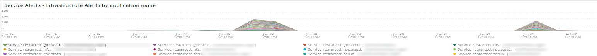
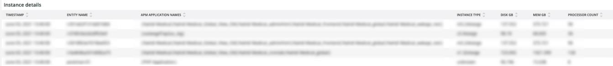

# 此 [!DNL Infra] 选项卡

此 **[!DNL Infra]** 选项卡可隔离基础架构问题的问题和原因。 进一步说明了您可以在选项卡上看到的帧。

## [!UICONTROL Service Alerts – Infrastructure Alerts by Application name]

此 **[!UICONTROL Service Alerts – Infrastructure Alerts by Application name]** 该图显示了由收集的服务预警 [!DNL New Relic] 基础结构代理。 这将显示服务重新启动，其中许多与部署相关。

## [!UICONTROL Inode usage by mount]

此 **[!UICONTROL Inode usage by mount]** 帧显示 [!DNL inode] 在整个所选时间范围内按装载列出的使用情况。 即使节点用完后，可能还有大量可用存储空间 [!DNL inodes]，将显示缺少可用存储。 删除文件（尤其是小文件）将释放空间并生成 [!DNL inodes] 可用。

## [!UICONTROL vCPU tier view over timeline GREATER 2 weeks]

此 **[!UICONTROL vCPU tier view over timeline GREATER 2 weeks]** 框架显示选定时间范围内超过两周的vCPU层视图。 此帧查看分配给的vCPU数量 [!DNL New Relic] 显示的应用程序名称。

## [!UICONTROL vCPU tier view over timeline]

此 **[!UICONTROL vCPU tier view over timeline]** 该帧显示选定时间范围内超过24小时的vCPU层视图。 此帧查看分配给的vCPU数量 [!DNL New Relic] 显示的应用程序名称。 它将同时显示群集的上升和下降。

## [!UICONTROL vCPU tier view over timeline BY NODE]

此 **[!UICONTROL vCPU tier view over timeline BY NODE]** 框架按节点显示选定时间范围内的vCPU层视图。 此帧有助于检测节点丢失或节点放大或缩小时。 vCPU层按节点查看时间线，应查看少于24小时的时间线。

## [!UICONTROL Instance details]

此 **[!UICONTROL Instance details]** 该表显示每个实例的详细信息 [!DNL New Relic] 应用程序。

## [!UICONTROL Logging, if there is a broken line for a node, it indicates non-responsive node during that time period]

此 **[!UICONTROL Logging, if there is a broken line for a node, it indicates non-responsive node during that time period]** 框架显示一段时间内无响应的节点。
