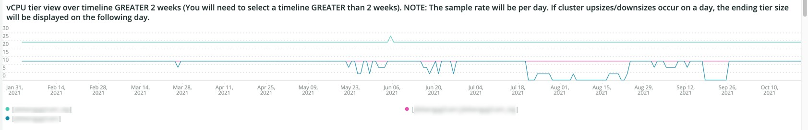

# 的 [!UICONTROL Infra] 选项卡

的 **[!UICONTROL Infra]** tab可隔离问题和导致基础结构问题的原因。 进一步介绍了您在选项卡上可以看到的帧。

## [!UICONTROL Service Alerts – Infrastructure Alerts by Application name]

的 **[!UICONTROL Service Alerts – Infrastructure Alerts by Application name]** 图表显示由 [!DNL New Relic] 基础设施代理。 这将显示服务重新启动，其中许多与部署相关。

## [!UICONTROL Inode usage by mount]

的 **[!UICONTROL Inode usage by mount]** 该框架通过在选定的时间范围内装载来显示索引节点使用情况。 即使存在大量的可用存储，如果某个节点耗尽inode，它也会显示缺少可用存储。 删除文件（尤其是小文件）将释放空间并使inode可用。

## [!UICONTROL vCPU tier view over timeline GREATER 2 weeks]

的 **[!UICONTROL vCPU tier view over timeline GREATER 2 weeks]** 此框架显示超过两周的选定时间范围内的vCPU层视图。 此帧查看分配给的vCPU数 [!DNL New Relic] 显示应用程序名称。

## [!UICONTROL vCPU tier view over timeline]

的 **[!UICONTROL vCPU tier view over timeline]** 此框架显示在超过24小时的选定时间范围内的vCPU层视图。 此帧查看分配给的vCPU数 [!DNL New Relic] 显示应用程序名称。 它将同时显示群集的上升大小和缩减大小。

## [!UICONTROL vCPU tier view over timeline BY NODE]

的 **[!UICONTROL vCPU tier view over timeline BY NODE]** 帧按节点显示选定时间范围内的vCPU层视图。 此帧有助于检测节点丢失或节点大小调整或缩小时。 按节点显示时间轴的vCPU层视图，应查看时间轴少于24小时。

## [!UICONTROL Instance details]

的 **[!UICONTROL Instance details]** 表显示了每个 [!DNL New Relic] 应用程序。

## [!UICONTROL Logging, if there is a broken line for a node, it indicates non-responsive node during that time period]

的 **[!UICONTROL Logging, if there is a broken line for a node, it indicates non-responsive node during that time period]** 框架显示某个时间段内的非响应节点。
