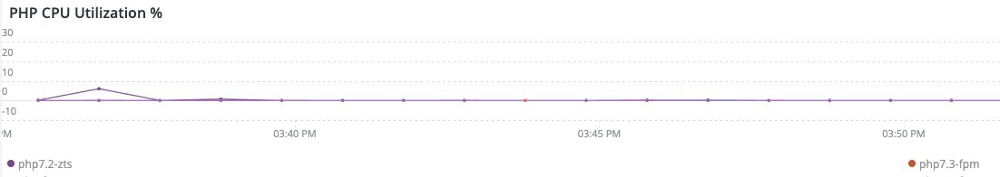

# 的 [!UICONTROL PHP] 选项卡

的 **PHP** 选项卡显示PHP进程问题，以便对PHP问题进行更深入的分析。

## [!UICONTROL PHP active process details]

的 **[!UICONTROL PHP active process details]** 帧显示选定时间范围内的PHP进程，包括php-fpm。

## [!UICONTROL PHP process load (# of PHP processes and % of CPU load)]

的 **[!UICONTROL PHP process load (# of PHP processes and % of CPU load)]** frame显示在选定时间范围内来自PHP-FPM进程的CPU负载。

## [!UICONTROL PHP Memory detail]

的 **[!UICONTROL PHP Memory detail]** frame显示了选定时间范围内PHP进程的内存使用情况。

## [!UICONTROL PHP CPU Utilization]

的 **[!UICONTROL PHP CPU Utilization]** frame显示了在选定时间范围内PHP进程的CPU占用百分比。

## [!UICONTROL PHP Process states]

的 **[!UICONTROL PHP Process states]** 框架显示选定时间范围内的PHP进程状态。 当PHP进程终止并重新启动时，将显示该PHP进程。 请注意终止的不显示重新启动的PHP进程。

* “%NOTICE:正在终止……%&#39;)作为“php_term”
* “%通知：退出，再见！%&#39;)作为“php_exit”
* “%通知：fpm正在运行，pid%&#39;)作为“fpm_start”
* “%NOTICE:准备处理连接%&#39;)作为“php_ready”

## [!UICONTROL PHP Errors]

的 **[!UICONTROL PHP Errors]** 此框架显示选定时间范围内PHP工作程序错误的数量。 解析并显示的错误消息包括：

* “%worker_connections不够%”)作为“worker”
* “%PHP错误：允许的内存大小！%&#39;)作为“mem_size”
* “%退出信号11(SIGSEGV)%”)为“sig_11”
* “%退出信号7(SIGBUS)%”)为“sig_7”
* “%increase pm.start_servers%”)作为“pmstart_serv”
* “%max_children%”)作为“max_children_cnt”
* “%PHP错误：允许的内存大小为%&#39;)，作为“mem_exhst_coun”
* “%无法为池%分配内存”)作为“opc_mem_count”
* “%警告字符串间隔缓冲区溢出%”)作为“opc_str_buf”
* “%非法字符串offsetl%”)作为“opc_sv_comments”
* “%PHP错误：未捕获的RedisException:读取连接%上的错误”)作为“php_exc”

## [!UICONTROL PHP processes count]

的 **[!UICONTROL PHP processes count]** 框架显示选定时间范围内的PHP进程计数。

## [!UICONTROL Database Errors]

的 **[!UICONTROL Database Errors]** 框架显示选定时间范围内的数据库错误。 解析的错误包括：

* “%为临时表分配的内存大小超过innodb_buffer_pool_size%”的20%)作为“temp_tbl_buff_pool”
* “%\[ERROR\] WSREP:rbr write fail%”)作为“rbr_write_fail”
* “%mysqld”：磁盘已满%”)作为“disk_full”
* “%错误号28%”)作为“err_28”
* “%rollback%”)作为“rollback”
* “%表%的外键约束失败”)作为“foreign_key_constraint”
* “%Error_code:1114%”)作为“sql_1114_full”
* “%关键：SQLSTATE[HY000] [2006年] MySQL Server已丢失%”)，为“sql_gone”
* “%SQLSTATE[HY000] [1040] 连接太多%”)作为“sql_1040”
* “%关键：SQLSTATE[HY000] [2002年]%&#39;)作为&#39;sql_2002&#39;
* “%SQLSTATE[08S01]:%&#39;)作为&#39;sql_1047&#39;
* &#39;%[警告] 已中止连接%”)作为“aborted_conn”
* “%SQLSTATE[23000]:完整性约束冲突：%&#39;)作为“sql_23000”
* “%1205锁等待超时%”)作为“sql_1205”
* “%SQLSTATE[HY000] [1049] 未知数据库%”)作为“sql_1049”
* “%SQLSTATE[42S02]:找不到基表或视图：%&#39;)作为“sql_42S02”
* “%常规错误：1114%”)作为“sql_1114”
* “%SQLSTATE[40001]%&#39;)作为&#39;sql_1213&#39;
* “%SQLSTATE[42S22]:未找到列：1054未知列%”)作为“sq1_1054”
* “%SQLSTATE[42000]:语法错误或访问冲突：%&#39;)作为“sql_42000”
* “%SQLSTATE[21000]:基数冲突：%&#39;)作为“sql_1241”
* “%SQLSTATE[22003]:%&#39;)作为&#39;sql_22003&#39;
* “%SQLSTATE[HY000] [9000] IP地址%的客户端)
* “%SQLSTATE[HY000]:一般错误：2014%”)作为“sql_2014”
* “%1927连接已终止%”)作为“sql_1927”
* “%1062 \[ERROR\] InnoDB:%”)作为“sql_1062_e”
* &#39;%[注意] WSREP:正在刷新内存映射到磁盘……%&#39;)作为“mem_map_flush”
* “%Internal MariaDB错误代码：1146%”)作为“sql_1146”
* “%Internal MariaDB错误代码：1062%”)作为“sql_1062”*“%1062” [警告] InnoDB:%&#39;)作为“sql_1062_w”
* “%Internal MariaDB错误代码：1064%”)作为“sql_1064”
* &#39;%InnoDB:文件%中的断言失败”)作为“assertion_err”
* “%mysqld_safe当前正在运行的进程数：0%”)作为“mysql_oom”
* “%\[ERROR\] mysqld got signal%”)作为“mysql_sigterm”
* “%1452无法添加%”)作为“sql_1452”
* “%ERROR 1698%”)作为“sql_1698”
* “%SQLSTATE[HY000]:一般错误：3%”)作为“cnt_wrt_tmp”
* “%常规错误：1 %&#39;)作为“sql_syntax”
* “%42S22%”)作为“sql_42S22”
* &#39;%InnoDB:错误（重复键）%&#39;)为“innodb_dup_key”

## [!UICONTROL Database traces]

的 **[!UICONTROL Database traces]** 框架显示数据库跟踪信息。 此帧将与选定时间轴的APM事务摘要视图对齐。

## [!UICONTROL Database mysql-slow.log]

的 **[!UICONTROL Database mysql-slow.log]** frame显示了 `mysql-slow.log` 文件。
