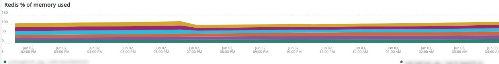

# 的 [!DNL Redis] 选项卡

## [!UICONTROL Redis Node summary]

的 **[!UICONTROL Redis Node summary]** 包含环境中的所有节点。 上例包括用于共享暂存的节点。 生产上有一个主节点和两个副节点，在暂存上有一个主节点和两个副节点。

## [!UICONTROL Redis node detail]

的 **[!UICONTROL Redis node detail]** 帧指示环境， [!DNL Redis] 角色、软件版本和节点大小。

## [!UICONTROL Redis node roles timeline]

的 **[!UICONTROL Redis node roles timeline]** frame指示丢失 [!DNL Redis] 服务。 如果行减少，则表示该行代表的特定角色已丢失一个节点。

## [!UICONTROL Connection to Redis]

的 **[!UICONTROL Connection to Redis]** frame显示net.connectedClients值(来自 [!DNL New Relic Redis] 示例数据。 它显示连接计数 [!DNL New Relic] 应用程序（环境）和节点。

## [!UICONTROL Commands per second by node]

的 **[!UICONTROL Commands per second by node]** 框架显示 [!DNL Redis] 按节点每秒发送的命令。

## [!UICONTROL Redis % of memory used]

的 **[!UICONTROL Redis % of memory used]** frame显示 [!DNL Redis] 服务器。

## [!UICONTROL Redis used memory]

的 **[!UICONTROL Redis used memory]** 帧以GB/MB为单位显示节点内存的使用情况。

## [!UICONTROL Redis changes since last db save]

[!DNL Redis] 是内存驻留的，并将信息保存到存储中。 的 **[!UICONTROL Redis changes since last db save]** frame指示自将上一个数据库保存到存储后对内存发生的更改数。 请参阅 [Redis持久性](https://redis.io/docs/manual/persistence/) 以了解有关 [!DNL Redis's] 持久性。

## [!UICONTROL Redis synchronization from Log]

的 **[!UICONTROL Redis synchronization from Log]** 框架重点关注在 [!DNL Redis] 同步或由于同步问题而发生的错误。 有关 [!DNL Redis]，请参阅 [[!DNL Redis] 文档](https://redis.io/docs/).
