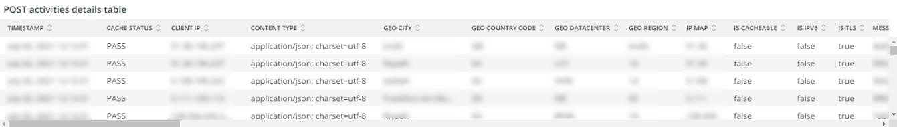

# 的 [!UICONTROL Security] 选项卡

的 **[!UICONTROL Security]** 选项卡解释安全问题并隔离其潜在原因。 此外，还描述了选项卡的框架。

## [!UICONTROL API calls by IP, details by URL]

的 **[!UICONTROL API calls by IP, details by URL]** 框架显示选定时间范围内按IP划分的API调用数量。 此框架显示IP地址和该IP地址访问的API URL。

## [!UICONTROL Forgot Password]

的 **[!UICONTROL Forgot Password]** 访问框架显示选定时间范围内忘记密码尝试的次数。 针对IP地址的高活动可能是对站点的攻击。

## [!UICONTROL Create Account access]

的 **[!UICONTROL Create Account access]** 框架显示选定时间范围内的新帐户活动数。 来自单个IP地址的高活动可能表示攻击。

## [!UICONTROL POST activities]

的 **[!UICONTROL POST activities]** 框架显示 `POST` 网站的活动，分面 `client_ip` 从 [!DNL Fastly] 日志。 它还会显示IP地址访问的URL。

## [!UICONTROL POST activities summary table]

的 **[!UICONTROL POST activities summary table]** 框架显示摘要 `POST` 网站的活动，分面 `client_ip` 从 [!DNL Fastly] 日志。 它还显示IP地址访问的URL的计数。 计数是指选定的时间范围。

## [!UICONTROL POST activities details table]

的 **[!UICONTROL POST activities details table]** 框架显示 `POST` 活动 [!DNL Fastly] 日志。 它还会显示 [!DNL Fastly] 记录这些请求。 它仅限于最近2000个请求。

## [!UICONTROL Guest Carts activities]

的 **[!UICONTROL Guest Carts activities]** 框架显示选定时间范围内的来宾购物车活动数量，按IP地址和访问的URL分面。 客车可用于梳理攻击。 此框架显示访客购物车URL访问的请求总数。

## [!UICONTROL API – forgot password, create account by Countries]

的 **[!UICONTROL API – forgot password, create account by Countries]** 此框架显示在选定时间范围内创建的帐户数以及请求重置忘记密码的次数。 此外，还应显示请求的来源国。 这一框架侧重于请求的原籍国。

## [!UICONTROL API - forgot password, create account by Countries and IP address]

的 **[!UICONTROL API - forgot password, create account by Countries and IP address]** 此框架显示在选定时间范围内创建的帐户数以及请求重置忘记密码的次数。 此外，还应能显示请求的IP地址、已访问的URL和原始国家/地区。 此帧重点关注IP计数。

## [!UICONTROL Guest cart activities by IP]

的 **[!UICONTROL Guest cart activities by IP]** 框架按IP显示选定时间范围内的来宾购物车活动。

## [!UICONTROL Guest cart activities by Countries]

的 **[!UICONTROL Guest cart activities by Countries]** 框架按国家/地区显示选定时间范围内的来宾购物车活动。

