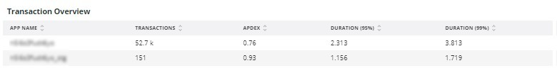
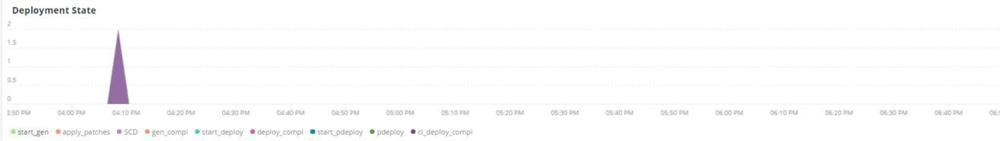
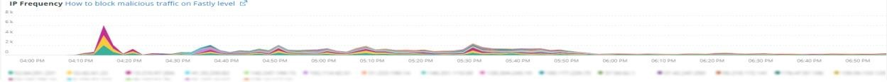

# [!UICONTROL Summary]选项卡

[!UICONTROL Summary]的[!DNL Observation for Adobe Commerce]选项卡用于快速查看站点遇到的一些问题，以帮助您自动解决或识别站点问题的潜在根本原因。 其他选项卡提供有关组件服务、数据库、基础架构和流程状态的更深入的信息。

## [!UICONTROL Transaction Overview]

### [什么是交易？](https://docs.newrelic.com/docs/apm/transactions/intro-transactions/transactions-new-relic-apm/#:%7E:text=transactions%20are%20reported.-，什么%20is%20a%20transaction%3F，工作%20in%20a%20software%20application。&text=For%20APM%2C%20it%20will%20overly，当%20the%20response%20is%20sent)

“在[!DNL New Relic]，事务被定义为软件应用程序中的一个逻辑工作单元。 具体来说，它是指构成该工作单元的函数调用和方法调用。 它通常指的是Web交易，代表一种活动，从应用程序收到Web请求时到响应发送时发生的活动。”

### 交易类型：

使用HTTP请求启动了&#x200B;**Web：** Web事务。 对于大多数组织来说，这些表示以客户为中心的交互，因此是需要监控的最重要的事务。

**非Web：**&#x200B;非Web事务不是通过Web请求启动的。 它们可以包括非Web工作进程、后台进程、脚本、消息队列活动和其他任务。

如果查看上面的&#x200B;**[!UICONTROL Transaction Overview]**&#x200B;帧，会发现几乎53,000个平均为0.76的APDEX事务，其中95%的事务发生在2.313秒以内。 如果在短时间范围内存在APDEX点击，则较短时间范围可以显示与当前平均值的偏差。

## [!UICONTROL 404 page errors frame]

**[!UICONTROL 404 page errors]**&#x200B;帧列出了选定时间范围内的[URI](https://en.wikipedia.org/wiki/Uniform_Resource_Identifier)和404页错误的计数。

## [!UICONTROL % of Storage Free frame]

存储可用帧的

**[!UICONTROL % of Storage Free]**&#x200B;框架显示群集的所有节点中存储挂载的平均可用百分比。 例如，如果您有一个三节点群集，则框架将显示\&lt;装载点\>、\&lt;环境名称\>。 如果三个节点之间存在差异，则此帧具有欺骗性。 例如，如果`/data/mysql`可用装入点在三个节点群集中的值不同，则会出现差异。 在[!UICONTROL MySQL]选项卡下有一个框架，该框架按节点名称面向装载点，以便更准确地查看每个节点上的`/data/mysql`可用存储空间的实际大小。

## [!UICONTROL % of system memory that is free frame]

可用帧的系统内存的

**%的可用系统内存**&#x200B;帧按节点显示每个节点上可用的系统内存量。

## [!UICONTROL Swap memory free in bytes]

**[!UICONTROL Swap memory free in bytes]**&#x200B;帧按节点显示节点上可用的SWAP内存量。

## [!UICONTROL CPU % by host]

按主机CPU百分比

所有环境和节点的聚合会显示在&#x200B;**[!UICONTROL CPU % by host]**&#x200B;框架中。 您应该取消选择非生产环境。 另请注意生产环境的所有节点都不存在的任何实例。 有关高CPU利用率的更多提示，请参阅[在Adobe Commerce上使用New Relic进行性能故障诊断](https://experienceleague.adobe.com/docs/commerce-knowledge-base/kb/troubleshooting/miscellaneous/troubleshoot-performance-using-new-relic-on-magento-commerce.html)。

## [!UICONTROL Alerts during timeframe]

时间范围内

**[!UICONTROL Alerts during timeframe]**&#x200B;显示所有警报，包括Adobe Commerce支持添加的[!UICONTROL Managed Alerts]。

## [!UICONTROL CPU Usage]

如果&#x200B;**[!UICONTROL CPU Usage]**&#x200B;帧为空，则表示未启用[!DNL New Relic]的基础结构应用程序。 如果您的网站位于起始位置，则不会看到此信息。 如果您的网站是Pro，请打开[支持票证](https://experienceleague.adobe.com/docs/commerce-knowledge-base/kb/help-center-guide/magento-help-center-user-guide.html)为您的网站启用[!DNL New Relic Infrastructure]。

## [!UICONTROL Average Response Time]

**[!UICONTROL Average Response Time]**&#x200B;图形显示事务（Web和其他事务）的平均响应时间。

## [!UICONTROL Long duration cron_schedule updates]

在cron作业开始和完成时写入&#x200B;**[!UICONTROL cron_schedule]**&#x200B;表。 长持续时间cron作业可能指示更新此表时的延迟，这可能指示cron栈栈或cron计划方式存在问题。

## [!UICONTROL Response Code]

**[!UICONTROL Response Code]**&#x200B;帧很好地指示了Web流量和请求的响应代码。 它是[!DNL New Relic's]个交易数据，由返回的`httpResponseCode`分面。

## [!UICONTROL Web Traffic volume compared with one week ago Magento Managed Alerts Information]

此框架显示了过去一周和本周的比较Web流量。

## [!UICONTROL Deployment Log Entries]

**[!UICONTROL Deployment Log Entries]**&#x200B;框架显示部署和云日志条目的计数，并按部署日志名称彩块化计数。

## [!UICONTROL Deployment State]

**[!UICONTROL Deployment State]**&#x200B;框架从部署日志中面向特定的部署阶段。 以下是日志和Facet名称中计算的一些阶段示例：

**部署日志阶段：**

* “%Start正在启动生成命令%”)作为“start_gen”
* “%git应用/app/vendor/magento/ece-tools/patches%”)作为“apply_patches”
* &#39;%Set flag： .static_content_deploy%&#39;)设置为&#39;SCD&#39;
* &#39;%NOTICE： Generate command completed%&#39;)作为&#39;gen_compl&#39;
* “%NOTICE： Deployment completed%”)作为“deploy_compl”
* &#39;%NOTICE：正在启动后期部署。%&#39;)作为“start_pdeploy”
* &#39;%NOTICE： Post-deploy已完成%&#39;)作为&#39;pdeploy&#39;
* “%deploy-complete%”)作为“cl_deploy_compl”

## [!UICONTROL IP Frequency]

**[!UICONTROL IP Frequency]**&#x200B;帧计算[!DNL Fastly]日志中每个IP的（&#39;MISS&#39;和&#39;PASS&#39;）状态。 具有这些状态的Web请求将访问原始服务器，并将向服务器添加负载。 它显示频率排名前20的地址。 此帧可用于检测网站上的IP攻击或重负载源。

## [!UICONTROL IP Response – top 20 URLs in duration]

**[!UICONTROL IP Response – top 20 URLs in duration]**&#x200B;框架显示响应持续时间最长的URL。 它可能会指示响应持续时间最长的图像文件或页面、API或页面。

## [!UICONTROL API Calls by IP]

通过ip进行

**[!UICONTROL API Calls by IP]**&#x200B;框架有助于识别针对API和IP地址的大量流量，这些地址会从API URL发出请求。

## [!UICONTROL API Calls by IP, details by URL]

按URL的

**[!UICONTROL API Calls by IP, details by URL]**&#x200B;框架提供针对API的高流量详细信息以及发出请求的URL的详细信息。

## [!UICONTROL IP Frequency Rate per minute]

每分钟

有时很难分辨哪个IP地址在其他帧中的请求最多。 **[!UICONTROL IP Frequency Rate per minute]**&#x200B;帧显示每个IP地址的每分钟速率。

## [!UICONTROL Potential Bots]

**[!UICONTROL Potential Bots]**&#x200B;框架会查看具有request_user_agent名称（如NULL或“%bot%”）的请求。 通常，“%bot%”request_user_agent遵循`robots.txt`文件中的策略设置。

## [!UICONTROL Transaction Errors]

**[!UICONTROL Transaction Errors]**&#x200B;框架显示来自[!DNL New Relic]的事务错误计数。

## [!UICONTROL Nginx access by node]

**[!UICONTROL Nginx access by node]**&#x200B;帧按节点查看`access.log`中的计数。 查看负载是否均匀分布很有帮助。 它通常显示在节点断开时。 此框架还会显示整个站点的载荷。

## [!UICONTROL Galera Log]

[[!DNL Galera]](https://galeracluster.com/library/galera-documentation.pdf)用于数据库群集。 此帧侧重于来自[!UICONTROL Galera]群集的特定信号。 信号集中在进入和退出集群的节点上，这是维护数据库数据完整性的正常行为。 在[!UICONTROL Galera]群集状态更改时，节点将保持同步。

**[!UICONTROL Galera]状态更改的列表：**

* “%1047 WSREP尚未为应用程序使用%准备节点)，如“node_not_prep_for_use”
* “%\[ERROR\] WSREP：无法从wsrep_sst_xtrabackup-v2%”中读取为“xtrabackup_read_fail”
* “%\[ERROR\] WSREP：进程已完成，但出现错误：wsrep_sst_xtrabackup-v2 %&#39;)为“xtrabackup_compl_w_err”
* “%\[ERROR\] WSREP： rbr write fail%”)作为“rbr_write_fail”
* &#39;%self-leave%&#39;)作为&#39;susp_node&#39;
* “%members = 3/3 （已加入/总计）%”)作为“3of3”
* “%members = 2/3 （已加入/总计）%”)作为“2of3”
* “%members = 2/2%”)，作为“2of2”*“%members = 1/2%”)，作为“1of2”*“%members = 1/3%”)，作为“1of3”
* “%members = 1/1%”)作为“1of1”
* “%\[注意\] /usr/sbin/mysqld (mysqld 10.%&#39;)作为&#39;sql_restart&#39;
* “%Quorum：没有具有完整状态：%”的节点)为“no_node_count”
* “%WSREP：成员0%”)作为“mem_0”
* “%WSREP：成员1.0%”)作为“mem_1”
* “%WSREP：成员2%”)作为“mem2”
* “%WSREP：与组同步，准备连接%”)为“就绪”
* “%/usr/sbin/mysqld，版本：%”)作为“mysql_restart_mysql.slow”
* “%\[Note\] WSREP：新群集视图：全局状态：%&#39;)作为“galera_cluster_view_chng”

如果状态频繁更改，这些信号可能指示存储、内存或查询问题。

## [!UICONTROL Database errors]

**检测到的数据库错误或消息列表：**

* &#39;%为临时表分配的内存大小超过innodb_buffer_pool_size%&#39;的20%)，如&#39;temp_tbl_buff_pool&#39;
* “%\[ERROR\] WSREP： rbr write fail%”)作为“rbr_write_fail”
* “%mysqld：磁盘已满%”)作为“disk_full”
* “%Error number 28%”)，作为“err_28”
* “%rollback%”)作为“rollback”
* “%Foreign key constraint对表%”失败)，为“foreign_key_constraint”
* &#39;%Error_code： 1114%&#39;)作为&#39;sql_1114_full&#39;
* &#39;%CRITICAL： SQLSTATE\[HY000\] \[2006\] MySQL服务器已消失%&#39;)为&#39;sql_gone&#39;
* “%SQLSTATE\[HY000\] \[1040\]连接数%&#39;)为“sql_1040”
* &#39;%CRITICAL： SQLSTATE\[HY000\] \[2002\]%&#39;)作为&#39;sql_2002&#39;
* “%SQLSTATE\[08S01\]：%”)作为“sql_1047”
* “%\[Warning\]已中止连接%”)为“aborted_conn”
* “%SQLSTATE\[23000\]：完整性约束冲突：%&#39;)为“sql_23000”
* “%1205 Lock wait timeout%”)作为“sql_1205”
* “%SQLSTATE\[HY000\] \[1049\]未知数据库%&#39;)作为“sql_1049”
* “%SQLSTATE\[42S02\]：未找到基表或视图：%&#39;)作为“sql_42S02”
* &#39;%General error： 1114%&#39;)作为&#39;sql_1114&#39;
* “%SQLSTATE\[40001\]%”)作为“sql_1213”
* “%SQLSTATE\[42S22\]：找不到列： 1054 Unknown column%&#39;)为“sq1_1054”
* “%SQLSTATE\[42000\]：语法错误或访问冲突：%&#39;)为“sql_42000”
* “%SQLSTATE\[21000\]：基数违规：%&#39;)为“sql_1241”
* &#39;%SQLSTATE\[22003\]：%&#39;)作为&#39;sql_22003&#39;
* “%SQLSTATE\[HY000\] \[9000\]客户端，IP地址为%&#39;)作为“sql_9000”
* “%SQLSTATE\[HY000\]：常规错误： 2014%”)为“sql_2014”
* “%1927连接已终止%”)为“sql_1927”
* &#39;%1062 \[\ERROR\] InnoDB：%&#39;)作为&#39;sql_1062_e&#39;
* “%\[Note\] WSREP：正在刷新内存映射到磁盘……%”)，作为“mem_map_flush”
* &#39;%Internal MariaDB错误代码： 1146%&#39;)为&#39;sql_1146&#39;
* &#39;%Internal MariaDB错误代码： 1062%&#39;)，作为&#39;sql_1062&#39; * &#39;%1062 \[Warning\] InnoDB：%&#39;)，作为&#39;sql_1062_w&#39;
* &#39;%Internal MariaDB错误代码： 1064%&#39;)为&#39;sql_1064&#39;
* “%InnoDB：文件%”中的断言失败)为“assertion_err”
* &#39;%mysqld_safe现在运行的进程数： 0%&#39;)为&#39;mysql_oom&#39;
* “%\[ERROR\] mysqld得到signal%&#39;)作为“mysql_sigterm”
* “%1452无法添加%”)作为“sql_1452”
* “%ERROR 1698%”)作为“sql_1698”
* “%SQLSTATE\[HY000\]：常规错误： 3%”)作为“cnt_wrt_tmp”
* &#39;%General error： 1 %&#39;)作为&#39;sql_syntax&#39;
* “%42S22%”)作为“sql_42S22”
* “%InnoDB：错误（重复键）%”，因为“innodb_dup_key”

## [!UICONTROL Database traces]

**[!UICONTROL Database traces]**&#x200B;框架查看来自[的](https://docs.newrelic.com/docs/apm/transactions/transaction-traces/transaction-traces-database-queries-page/)sql跟踪[!DNL New Relic]实体的数据并返回跟踪的路径。

## [!UICONTROL Database mysql-slow.log]

**[!UICONTROL Database mysql-slow.log]**&#x200B;框架按查询请求类型对[mysql-slow.log](https://dev.mysql.com/doc/refman/5.7/en/slow-query-log.html)中的条目计数。 它以可视方式隔离了mysql-slow.log（慢查询日志）中可能需要的时间范围。 对没有索引的表的查询或更新大型表的查询可能会阻止其他查询。

## [!UICONTROL Redis synchronization from Log]

同步

[[!DNL Redis]](https://redis.io/docs/about/)是用作数据库、缓存和消息代理的开源（BSD已授权）内存中数据结构存储。 如果配置，它可以执行数据库和会话缓存。 **[!UICONTROL Redis synchronization from Log]**&#x200B;帧侧重于[[!DNL Redis] 同步](https://redis.io/docs/latest/operate/oss_and_stack/management/replication/)。 [!DNL Redis]数据集越大，同步越可能出现问题（需要保持同步的数据越多）。

**[!DNL Redis]个错误和消息：**

* “%SLAVE同步：设备%”上没有剩余空间)，如“space”
* “%Server已启动，Redis版本%”)作为“serv_start”
* &#39;%服务器现在已准备好接受连接%&#39;)为“就绪”
* 与主的“%Connection”丢失。%&#39;)作为“mstr_lost”
* “%+sdown sentinel%”)作为“+sentinal”
* “%-sdown sentinel%”)作为“ — sentinal”
* “%-sdown slave%”)，作为“ — slave”，作为“%+sdown slave%”)
* “%-failover-abort-not-selected master%”)作为“ — failover”
* “%+failover-abort-not-selected master%”)作为“+failover”
* “%Partial无法进行重新同步（没有缓存的主控）%”，因为“part_sync_err”
* “%MASTER已中止复制，错误为： ERR Can%”)为“mstr_sync_err”
* &#39;%Master不支持PSYNC或处于错误状态%&#39;)为&#39;mstr_psync_err&#39;
* “%SLAVE同步：已完成，成功%”)，作为“ slv_sync_suc”
* “%MASTER已中止复制，错误为： ERR Can%”)为“mstr_sync_err，coun”
* “%OOM命令在使用内存%”时不允许使用)作为“ max_mem_err”
* “%CredisException（代码： 0）：连接%”上出现读取错误)为“credis_read_error”
* “%Uncaught RedisException：%”)作为“redis_excp_err”
* “%psync已调度为尽快关闭，以克服输出缓冲区%”)，如“output_buf_err”

## [!UICONTROL PHP process states]

PHP进程的行为方式取决于[配置](https://www.php.net/manual/en/install.fpm.configuration.php)。 配置非常复杂，包含许多变量和选项。 **[!UICONTROL PHP process states]**&#x200B;框架可帮助您了解PHP进程何时终止和重新启动。

### [!UICONTROL PHP errors]

**[!UICONTROL PHP errors]**&#x200B;框架显示选定时间范围内工作进程的PHP错误数。 有关详细信息，请参阅[Adobe Commerce PHP设置](../../installation/prerequisites/php-settings.md)。

**PHP错误和消息：**

* “%worker_connections不足%”)
* &#39;%PHP严重错误：允许的内存大小！%&#39;)作为“mem_size”
* &#39;%exited on signal 11 (SIGSEGV)%&#39;)为&#39;sig_11&#39;
* &#39;%exited on signal 7 (SIGBUS)%&#39;)为&#39;sig_7&#39;
* &#39;%increase pm.start_servers%&#39;)作为&#39;pmstart_serv&#39;
* “%max_children%”)作为“max_children_cnt”
* “%PHP致命错误：允许的内存大小为%”)作为“mem_exhst_coun”
* “%Unable to allocate memory for pool%”)，作为“opc_mem_count”
* “%Warning Interned string buffer overflow%”)作为“opc_str_buf”
* “%Illegal string offsetl%”)作为“opc_sv_comments”
* “%PHP严重错误：未捕获的RedisException：连接%”上出现读取错误)，作为“php_exc”

## [!UICONTROL PHP processes]

[PHP-FPM](https://php-fpm.org/)是[!UICONTROL FastCGI Process Manager]使用的[!DNL Nginx]。 要了解系统要求，请参阅映射到Adobe Commerce版本的[PHP版本要求](../../installation/system-requirements.md)。 **[!UICONTROL PHP processes]**&#x200B;帧显示在所选时间线中的特定时间运行的PHP进程数。

## [!UICONTROL Secondary processes]

辅助进程可能会影响站点响应。 **[!UICONTROL Secondary processes]**&#x200B;框架指示可能向站点添加负载的一个或多个进程。 数据库主要运行着大部分的辅助进程。

## [!UICONTROL Traffic vs Week Ago]

的比较

**[!UICONTROL Traffic vs Week Ago]**&#x200B;帧查看来自[!DNL Fastly]日志的网站流量（请求），其缓存状态为(“MISS”、“PASS”)。 这些请求会将负载添加到原始服务器。 此框架显示了同一时间范围内本周和上周的比较Web请求量。

## [!UICONTROL Fastly Cache]

**[!UICONTROL Fastly Cache]**&#x200B;框架显示[!DNL Fastly]日志中请求的缓存状态的聚合视图。 如果选择ERROR ，则会显示请求中的错误百分比。 当源服务器对页面请求的响应不够快时，该值通常会增加。

## [!UICONTROL Page Rendering]

**[!UICONTROL Page Rendering]**&#x200B;框架显示页面查看源[!DNL New Relic]与同一时间段前一周相比的当前周平均页面渲染持续时间。

## [!UICONTROL Page loading detail]

**[!UICONTROL Page loading detail]**&#x200B;框架描述了页面加载事件。 它详述了这些方面的含义。 以下是为此帧运行的查询：

`SELECT percentile(timeToResponseStart, 50) AS 'first byte', percentile(firstPaint, 50) as 'First paint', percentile(firstContentfulPaint, 50) as 'First contentful paint', percentile(timeToDomContentLoadedEventEnd, 50) AS 'DOM content loaded', percentile(duration, 50) AS 'Window load + AJAX' FROM BrowserInteraction TIMESERIES`

## [!UICONTROL Transactions – Avg, Max, Min]

事务持续时间以秒为单位。 根据事务的不同，如果事务长时间运行，它可能会影响其他事务。 名称下列出的交易和持续时间为特定时段。 如果存在简洁的问题时间范围，请将[!DNL Observation for Adobe Commerce]日期/时间选择器的大小调整为该较窄的时间范围。

## [!UICONTROL Admin Activities]

**[!UICONTROL Admin Activities]**&#x200B;框架标识与管理员用户的交易。

## [!UICONTROL Order transactions (default?)]

**[!UICONTROL Order transactions (default?)]**&#x200B;框架从事务中查找事务`request.headers.host`，其中名称= `WebTransaction/Action/checkout/onepage/success`。 如果订单成功URL不同，则此帧将没有数据。

## [!UICONTROL Elasticsearch Index information]

**[Elasticsearch状态：](https://www.elastic.co/guide/en/elasticsearch/reference/current/cluster-health.html)**

* 绿色：分配所有分片。
* 黄色：分配了所有主分片，但取消分配了一个或多个复制副本分片。 如果群集中的某个节点出现故障，则某些数据可能不可用，直到修复该节点。
* 红色：一个或多个主分区未分配，因此某些数据不可用。 在群集启动过程中，如果分配了主分片，可能会短暂发生这种情况。

## [!UICONTROL Elasticsearch Errors]

**[!DNL Elasticsearch]个错误：**

* “%all shards failed%”作为“all_shards_failed”
* “%NoNodesAvailableException%”作为“no_alive_nodes”
* “%PHP”严重错误：未捕获错误： Elasticsearch%”的参数错误，为“wrong_param”
* &#39;%您可以通过将Magento Cloud基础架构上的Elasticsearch服务升级到“ver_err”版本%来解决此问题
* “%cluster运行状况状态已从\[YELLOW\]更改为\[RED\]（原因：%）为“yel_red”
* “%No space”作为“no_space”，在设备%上已没有剩余空间
* “%”无法作为“failed_query”执行&lbrack;SearchRequest&lbrace;searchType=%&#39;

## [!UICONTROL Cron view]

**[!UICONTROL Cron view]**&#x200B;框架将查看cron日志，以平衡开始的cron数量与结束的cron数量。

## [!UICONTROL Cron error]

来自cron.log的&#x200B;**个Cron错误：**

* “%_stg%”作为“stg_crons”
* “%Could not acquire lock for cron job%”作为“cron_lock”
* &#39;%一般错误： 2006 MySQL伺服器已经离开%&#39;为&#39;mysql_has_gone_away&#39;
* “%error%”作为“error”
* “%General error： 1205 Lock wait timeout exceeded%”（常规错误： 1205锁定等待超时超过%），因为sql_1205_cron

## [!UICONTROL cron_schedule table updates]

**[!UICONTROL cron_schedule table updates]**&#x200B;帧查看数据存储操作更新涉及cron_schedule表的最长持续时间（以秒为单位）。 它基于SQL请求类型而设计。

## [!UICONTROL Datastore Operations Tables]

此&#x200B;**[!UICONTROL Datastore Operations Tables]**&#x200B;框架按持续时间时间、表名称和SQL请求类型显示前25个操作。 将鼠标悬停在尖峰上可查看有关正在访问什么表以及按什么请求类型访问的详细信息。

## [!UICONTROL Cache Flush]

检测到&#x200B;**缓存刷新：**

* “%config%”作为“config_cache_flushed”
* “%layout%”作为“layout_cache_flush”
* &#39;%block_html%&#39;作为&#39;block_html_cache_flush&#39;
* “%collections%”作为“collections_cache_flush”
* “%reflection%”作为“reflection_cache_flush”
* “%db_ddl%”作为“db_ddl_cache_flush”
* “%compiled_config%”作为“compiled_config_cache_flush”
* “%eav%”作为“eav_cache_flush”
* “%customer_notification%”作为“cust_notif_cache_flush”
* “%config_integration%”作为“config_intege_cache_flush”
* “%config_integration_api%”作为“config_integration_api_cache_flush”
* “%full_page%”作为“full_page_cache_flush”
* “%config_webservice%”作为“config_webserv_cache_flush”
* “%translate%”作为“translate_cache_flush”
