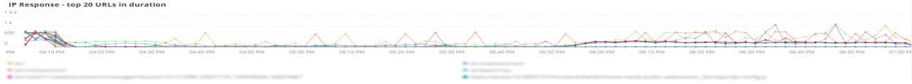

# 的 [!UICONTROL Summary] 选项卡

的 [!UICONTROL Summary] 选项卡 [!DNL Observation for Adobe Commerce] 旨在快速查看站点遇到的一些问题，以帮助您自动解决或确定站点问题的潜在根本原因。 其他选项卡提供了有关组件服务、数据库、基础结构和进程状态的更深入的级别信息。

## [!UICONTROL Transaction Overview]

### [什么是交易？](https://docs.newrelic.com/docs/apm/transactions/intro-transactions/transactions-new-relic-apm/#:%7E:text=transactions%20are%20reported.-,What%20is%20a%20transaction%3F，work%20in%20a%20software%20application。&amp;text=For%20APM%2C%20it%20will%20ferny，when%20the%20response%20is%20sent)

&quot;At [!DNL New Relic]，事务被定义为软件应用程序中的一个逻辑工作单元。 具体而言，它指构成该工作单元的函数调用和方法调用。 它通常指Web交易，它表示从应用程序收到Web请求到发送响应时所发生的活动。”

### 交易类型：

**Web:** Web事务通过HTTP请求启动。 对于大多数组织而言，这些量度代表以客户为中心的交互，因此是要监控的最重要交易。

**非Web:** 非Web事务不会通过Web请求启动。 它们可以包括非Web工作进程、后台进程、脚本、消息队列活动和其他任务。

如果您查看 **[!UICONTROL Transaction Overview]** 在上面的框架中，有近53,000笔交易的APDEX平均分数为。76，其中95%的交易是在2.313秒内发生的。 如果在短时间内发生APDEX点击，则较紧的时间范围可能显示与当前平均值的偏差。

## [!UICONTROL 404 page errors frame]

的 **[!UICONTROL 404 page errors]** 框架列出了 [URI](https://en.wikipedia.org/wiki/Uniform_Resource_Identifier) 和选定时间范围内404个页面错误的计数。

## [!UICONTROL % of Storage Free frame]

的 **[!UICONTROL % of Storage Free]** frame显示集群所有节点中存储装载空闲的平均百分比。 例如，如果您有三个节点群集，则该帧将显示\&lt;mount point=&quot;&quot;>, \&lt;environment name=&quot;&quot;>. 如果三个节点之间存在差异，则此帧可能具有欺骗性。 例如， `/data/mysql` 在三个节点群集中，“装载点空闲”值不同。 下面有一个框架 [!UICONTROL MySQL] 选项卡，按节点名称划分装载点，以便更准确地查看 `/data/mysql` 每个节点上的存储实际上是免费的。

## [!UICONTROL % of system memory that is free frame]

的 **系统内存中空闲的百分比** 帧按节点显示每个节点上空闲的系统内存量。

## [!UICONTROL Swap memory free in bytes]

的 **[!UICONTROL Swap memory free in bytes]** 帧按节点显示节点上空闲的SWAP内存量。

## [!UICONTROL CPU % by host]

所有环境和节点的聚合显示在 **[!UICONTROL CPU % by host]** 框架。 您应取消选择非生产环境。 另请注意，生产环境的所有节点都不存在的任何实例。 有关CPU利用率高的更多提示，请参阅 [使用Adobe Commerce上的New Relic解决性能问题](https://experienceleague.adobe.com/docs/commerce-knowledge-base/kb/troubleshooting/miscellaneous/troubleshoot-performance-using-new-relic-on-magento-commerce.html).

## [!UICONTROL Alerts during timeframe]

的 **[!UICONTROL Alerts during timeframe]** 显示所有警报，包括 [!UICONTROL Managed Alerts] 由Adobe Commerce支持添加。

## [!UICONTROL CPU Usage]

如果 **[!UICONTROL CPU Usage]** 框架为空，表示应用 [!DNL New Relic] 未启用。 如果您的网站位于Starter上，则您看不到此信息。 如果您的网站位于Pro上，请打开 [支持票证](https://experienceleague.corp.adobe.com/docs/commerce-knowledge-base/kb/help-center-guide/magento-help-center-user-guide.html?lang=en) 必须 [!DNL New Relic Infrastructure] 为您的网站启用。

## [!UICONTROL Average Response Time]

的 **[!UICONTROL Average Response Time]** 图表显示交易（web等）的平均响应时间。

## [!UICONTROL Long duration cron_schedule updates]

的 **[!UICONTROL cron_schedule]** 表格在cron作业开始和结束时写成。 持续时间较长的cron作业可能表示更新此表时的延迟，这可能表示cron堆栈或cron如何计划的问题。

## [!UICONTROL Response Code]

的 **[!UICONTROL Response Code]** frame是web流量和请求响应代码的良好指示。 是 [!DNL New Relic's] 事务数据，且该数据由 `httpResponseCode` 返回。

## [!UICONTROL Web Traffic volume compared with one week ago Magento Managed Alerts Information]

此框架显示过去一周和当前周的Web流量比较。

## [!UICONTROL Deployment Log Entries]

的 **[!UICONTROL Deployment Log Entries]** frame显示部署和云日志条目的计数，并根据部署日志名称分别显示这些计数。

## [!UICONTROL Deployment State]

的 **[!UICONTROL Deployment State]** 从部署日志中划分特定部署阶段。 以下是日志和Facet名称中计入的阶段示例：

**部署日志阶段：**

* “%正在启动生成命令%”)作为“start_gen”
* “%git apply /app/vendor/magento/ece-tools/patches%”)作为“apply_patches”
* “%Set标记：.static_content_deploy%”)作为“SCD”
* “%NOTICE:生成命令command completed%”)作为“gen_compl”
* “%NOTICE:部署已完成%”)作为“deploy_compl”
* “%NOTICE:开始部署后。%&#39;)作为&#39;start_pdeploy&#39;
* “%NOTICE:部署后完成%)作为“部署”
* “%deploy-complete%”)作为“cl_deploy_compl”

## [!UICONTROL IP Frequency]

的 **[!UICONTROL IP Frequency]** frame会计算来自 [!DNL Fastly] 日志。 具有这些状态的Web请求将到达源服务器，并将向服务器添加负载。 它以频度显示排名前20的地址。 此框架可用于检测网站上的IP攻击或重负载源。

## [!UICONTROL IP Response – top 20 URLs in duration]

的 **[!UICONTROL IP Response – top 20 URLs in duration]** frame显示响应持续时间最长的URL。 它可能指示响应持续时间最长的大图像文件或页面、API或页面。

## [!UICONTROL API Calls by IP]

的 **[!UICONTROL API Calls by IP]** frame可帮助识别针对API和从API URL发出请求的IP地址的大量流量。

## [!UICONTROL API Calls by IP, details by URL]

的 **[!UICONTROL API Calls by IP, details by URL]** frame提供了针对API的大量流量的详细信息以及发出请求的URL的详细信息。

## [!UICONTROL IP Frequency Rate per minute]

有时，很难知道哪个IP地址在其他帧上的请求最多。 的 **[!UICONTROL IP Frequency Rate per minute]** frame显示每分钟每个IP地址的速率。

## [!UICONTROL Potential Bots]

的 **[!UICONTROL Potential Bots]** frame会查看请求，请求名称为request_user_agent（如NULL或“%bot%”）。 通常，“%bot%”request_user_agent遵循 `robots.txt` 文件。

## [!UICONTROL Transaction Errors]

的 **[!UICONTROL Transaction Errors]** frame显示 [!DNL New Relic].

## [!UICONTROL Nginx access by node]

的 **[!UICONTROL Nginx access by node]** 框架从 `access.log` 。 查看负载是否均匀分布是很有帮助的。 它通常显示节点何时停止。 该框架还显示整个网站的负载情况。

## [!UICONTROL Galera Log]

[[!DNL Galera]](https://galeracluster.com/library/galera-documentation.pdf) 用于数据库群集。 此帧聚焦于 [!UICONTROL Galera] 群集。 这些信号集中在进入和退出群集的节点上，这是维护数据库数据完整性的正常行为。 节点将保持同步，因为 [!UICONTROL Galera] 群集状态更改。

**列表 [!UICONTROL Galera] 状态更改：**

* “%1047 WSREP尚未准备用于应用程序的节点use%”)作为“node_not_prep_for_use”
* “%\[ERROR\] WSREP:无法从中读取：wsrep_sst_xtrabackup-v2%&#39;)作为“xtrabackup_read_fail”
* “%\[ERROR\] WSREP:进程已完成，但出现错误：wsrep_sst_xtrabackup_v2 %&#39;)作为“xtrabackup_compl_w_err”
* “%\[ERROR\] WSREP:rbr write fail%”)作为“rbr_write_fail”
* “%selfleave%”)作为“susp_node”
* “%members = 3/3（已加入/总计）%”)作为“3of3”
* “%members = 2/3（已加入/总计）%”)作为“2of3”
* “%members = 2/2%”)作为“2of2”*“%members = 1/2%”)作为“1of2”*“%members = 1/3%”)作为“1of3”
* “%members = 1/1%”)作为“1of1”
* “%\[注意\] /usr/sbin/mysqld(mysqld 10)。%&#39;)作为“sql_restart”
* “%Quorum:没有完全状态为“%”的节点)为“no_node_count”
* “%WSREP:成员0%”)作为“mem_0”
* “%WSREP:成员1.0%”)作为“mem_1”
* “%WSREP:成员2%”)作为“mem2”
* “%WSREP:已与组同步，已准备好连接%”)为“就绪”
* “%/usr/sbin/mysqld，版本：%”)作为“mysql_restart_mysql.slow”
* “%\[注意\] WSREP:新的群集视图：全局状态：%&#39;)作为&#39;galera_cluster_view_chng&#39;

如果状态频繁更改，这些信号可能表示存储、内存或查询问题。

## [!UICONTROL Database errors]

**检测到的数据库错误或消息列表：**

* “%为临时表分配的内存大小超过innodb_buffer_pool_size%”的20%)作为“temp_tbl_buff_pool”
* “%\[ERROR\] WSREP:rbr write fail%”)作为“rbr_write_fail”
* “%mysqld”：磁盘已满%”)作为“disk_full”
* “%错误号28%”)作为“err_28”
* “%rollback%”)作为“rollback”
* “%表%的外键约束失败”)作为“foreign_key_constraint”
* “%Error_code:1114%”)作为“sql_1114_full”
* “%关键：SQLSTATE\[HY000\] \[2006\] MySQL Server已丢失%&#39;)作为“sql_gone”
* “%SQLSTATE\[HY000\] \[1040\]连接太多%”)作为“sql_1040”
* “%关键：SQLSTATE\[HY000\] \[2002\]%`)作为&#39;sql_2002&#39;
* “%SQLSTATE\[08S01\]:%”)作为“sql_1047”
* “%\[警告\]已中止连接%”)作为“aborted_conn”
* “%SQLSTATE\[23000\]:完整性约束冲突：%&#39;)作为“sql_23000”
* “%1205锁等待超时%”)作为“sql_1205”
* “%SQLSTATE\[HY000\] \[1049\]未知数据库%”)作为“sql_1049”
* “%SQLSTATE\[42S02\]:找不到基表或视图：%&#39;)作为“sql_42S02”
* “%常规错误：1114%”)作为“sql_1114”
* “%SQLSTATE\[40001\]%”)作为“sql_1213”
* &#39;%SQLSTATE\[42S22\]:未找到列：1054未知列%”)作为“sq1_1054”
* “%SQLSTATE\[42000\]:语法错误或访问冲突：%&#39;)作为“sql_42000”
* “%SQLSTATE\[21000\]:基数冲突：%&#39;)作为“sql_1241”
* “%SQLSTATE\[22003\]:%”)作为“sql_22003”
* “%SQLSTATE\[HY000\] \[9000\] IP地址%的客户端”)为“sql_9000”
* “%SQLSTATE\[HY000\]:一般错误：2014%”)作为“sql_2014”
* “%1927连接已终止%”)作为“sql_1927”
* “%1062 \[\ERROR\] InnoDB:%”)作为“sql_1062_e”
* “%\[注意\] WSREP:正在刷新内存映射到磁盘……%&#39;)作为“mem_map_flush”
* “%Internal MariaDB错误代码：1146%”)作为“sql_1146”
* “%Internal MariaDB错误代码：1062%”)作为“sql_1062”*“%1062 \[Warning\] InnoDB:%”)作为“sql_1062_w”
* “%Internal MariaDB错误代码：1064%”)作为“sql_1064”
* &#39;%InnoDB:文件%中的断言失败”)作为“assertion_err”
* “%mysqld_safe当前正在运行的进程数：0%”)作为“mysql_oom”
* “%\[ERROR\] mysqld got signal%”)作为“mysql_sigterm”
* “%1452无法添加%”)作为“sql_1452”
* “%ERROR 1698%”)作为“sql_1698”
* “%SQLSTATE\[HY000\]:一般错误：3%”)作为“cnt_wrt_tmp”
* “%常规错误：1 %&#39;)作为“sql_syntax”
* “%42S22%”)作为“sql_42S22”
* &#39;%InnoDB:错误（重复键）%&#39;)为“innodb_dup_key”

## [!UICONTROL Database traces]

的 **[!UICONTROL Database traces]** 框架从 [sql跟踪](https://docs.newrelic.com/docs/apm/transactions/transaction-traces/transaction-traces-database-queries-page/) 实体 [!DNL New Relic] 和返回跟踪的路径。

## [!UICONTROL Database mysql-slow.log]

的 **[!UICONTROL Database mysql-slow.log]** frame执行 [mysql-slow.log](https://dev.mysql.com/doc/refman/5.7/en/slow-query-log.html) 按查询请求类型。 它会以可视方式隔离mysql-slow.log（慢速查询日志）中可能感兴趣的时间范围。 对没有更新大型表的索引或查询的表的查询可能会阻止其他查询。

## [!UICONTROL Redis synchronization from Log]

[[!DNL Redis]](https://redis.io/docs/about/) 是内存中用作数据库、缓存和消息代理的开源（BSD已授权）数据结构存储。 如果配置了，它可以执行数据库和会话缓存。 的 **[!UICONTROL Redis synchronization from Log]** 帧聚焦 [[!DNL Redis] 同步](https://redis.io/docs/manual/replication/). 越大 [!DNL Redis] 数据集，则同步出现问题的可能性越大（要保持同步的数据越多）。

**[!DNL Redis]错误和消息：**

* “%SLAVE同步：设备%上没有空格)作为“空格”
* “%服务器已启动，Redis版本%”)作为“serv_start”
* “%服务器现已准备好接受连接%”)为“就绪”
* “%连接已主控丢失。%&#39;)作为“mstr_lost”
* “%+sdown sentinel%”)作为“+sentinal”
* “%sdown sentinel%”)作为“ — sentinal”
* “%-sdown slave%”)作为“ — slave”，“%+sdown slave%”)作为“+slave”
* “%-failover-abort-not-selected mymaster%”)作为“ — failover”
* “%+failover-abort-not-selected mymaster%”)作为“+failover”
* “%部分重新同步不可能(无缓存的主控)%”)作为“part_sync_err”
* “%主控中止的复制，并出现错误：ERR Can%”)作为“mstr_sync_err”
* “%主控不支持PSYNC或处于错误状态%”)作为“mstr_psync_err”
* “%Slave同步：success%”)作为“slv_sync_suc”
* “%主控中止的复制，并出现错误：ERR Can%”)作为“mstr_sync_err，coun”
* “%OOM命令在使用内存%”时不允许)作为“max_mem_err”
* “%CredisException(code:0):读取连接%上的错误”)作为“credis_read_error”
* “%未捕获的RedisException:%”)作为“redis_excp_err”
* “%psync计划尽快关闭，以克服输出缓冲区%”)作为“output_buf_err”

## [!UICONTROL PHP process states]

PHP进程的行为方式取决于 [配置](https://www.php.net/manual/en/install.fpm.configuration.php). 配置非常复杂，有许多变量和选项。 的 **[!UICONTROL PHP process states]** frame可帮助您了解PHP进程何时终止和重新启动。

### [!UICONTROL PHP errors]

的 **[!UICONTROL PHP errors]** 框架显示选定时间范围内工作程序出现的PHP错误数。 有关更多信息，请参阅 [Adobe Commerce PHP设置](../../installation/prerequisites/php-settings.md).

**PHP错误和消息：**

* “%worker_connections不够%”)作为“worker”
* “%PHP错误：允许的内存大小！%&#39;)作为“mem_size”
* “%退出信号11(SIGSEGV)%”)为“sig_11”
* “%退出信号7(SIGBUS)%”)为“sig_7”
* “%increase pm.start_servers%”)作为“pmstart_serv”
* “%max_children%”)作为“max_children_cnt”
* “%PHP错误：允许的内存大小为%&#39;)，作为“mem_exhst_coun”
* “%无法为池%分配内存”)作为“opc_mem_count”
* “%警告字符串间隔缓冲区溢出%”)作为“opc_str_buf”
* “%非法字符串offsetl%”)作为“opc_sv_comments”
* “%PHP错误：未捕获的RedisException:读取连接%上的错误”)作为“php_exc”

## [!UICONTROL PHP processes]

[PHP-FPM](https://php-fpm.org/) 是 [!UICONTROL FastCGI Process Manager] 使用者 [!DNL Nginx]. 要了解系统要求，请参阅 [映射到Adobe Commerce版本的PHP版本要求](../../installation/system-requirements.md). 的 **[!UICONTROL PHP processes]** 帧显示选定时间轴中特定时间运行的PHP进程数。

## [!UICONTROL Secondary processes]

辅助流程可能会影响站点响应。 的 **[!UICONTROL Secondary processes]** 框架指示可能向站点添加负载的进程或进程。 数据库运行的次进程最多。

## [!UICONTROL Traffic vs Week Ago]

的 **[!UICONTROL Traffic vs Week Ago]** frame查看 [!DNL Fastly] 具有(“MISS”、“PASS”)缓存状态的日志。 这些请求会向源服务器添加负载。 此框架显示同一时间段内当前周和上周的比较Web请求量。

## [!UICONTROL Fastly Cache]

的 **[!UICONTROL Fastly Cache]** 帧显示来自 [!DNL Fastly] 日志。 如果选择“错误”，则将显示请求中的错误百分比。 当源服务器对页面请求的响应速度不够快时，响应速度通常会增加。

## [!UICONTROL Page Rendering]

的 **[!UICONTROL Page Rendering]** frame显示从的页面查看源开始的当前周的平均页面渲染持续时间 [!DNL New Relic] 与同一时间段的前一周相比。

## [!UICONTROL Page loading detail]

的 **[!UICONTROL Page loading detail]** 框架描述页面加载事件。 详细说明了这些方面的含义。 以下是针对此框架运行的查询：

`SELECT percentile(timeToResponseStart, 50) AS 'first byte', percentile(firstPaint, 50) as 'First paint', percentile(firstContentfulPaint, 50) as 'First contentful paint', percentile(timeToDomContentLoadedEventEnd, 50) AS 'DOM content loaded', percentile(duration, 50) AS 'Window load + AJAX' FROM BrowserInteraction TIMESERIES`

## [!UICONTROL Transactions – Avg, Max, Min]

交易持续时间以秒为单位。 根据事务，如果它运行时间较长，则可能会影响其他事务。 在名称下列出的事务和持续时间针对特定时间段。 如果问题时间范围很简明，请调整 [!DNL Observation for Adobe Commerce] 日期/时间选择器。

## [!UICONTROL Admin Activities]

的 **[!UICONTROL Admin Activities]** 框架标识与管理员用户的交易。

## [!UICONTROL Order transactions (default?)]

的 **[!UICONTROL Order transactions (default?)]** 框架查找事务 `request.headers.host` 从事务处理，其中名称= `WebTransaction/Action/checkout/onepage/success`. 如果订单成功URL不同，则此框架将没有数据。

## [!UICONTROL Elasticsearch Index information]

**[Elasticsearch状态：](https://www.elastic.co/guide/en/elasticsearch/reference/current/cluster-health.html)**

* 绿色：所有碎片都被分配。
* 黄色：已分配所有主分片，但一个或多个副本分片未分配。 如果群集中的某个节点出现故障，则某些数据可能在该节点被修复之前不可用。
* 红色：一个或多个主分片未分配，因此某些数据不可用。 在群集启动期间，当分配了主分片时，可能会发生这种情况。

## [!UICONTROL Elasticsearch Errors]

**[!DNL Elasticsearch]错误：**

* “%all shards failed%”作为“all_shards_failed”
* “%NoNodesAvailableException%”作为“no_alive_nodes”
* “%PHP错误：未捕获的错误：将“Elasticsearch%”作为“wrong_param”的参数错误
* “%您可以通过将Magento云基础架构上的Elasticsearch服务升级为版本%”作为“ver_err”来修复此问题
* “%cluster health status（%群集运行状况状态）已从\[黄色\]更改为\[RED\]（原因：%&#39;为&#39;yel_red&#39;）
* “%在设备%上没有空格”为“no_space”
* “%”无法执行[SearchRequest{searchType=%&#39;作为&#39;failed_query&#39;

## [!UICONTROL Cron view]

的 **[!UICONTROL Cron view]** frame检查cron日志，以在开始的cron数与结束的cron数之间取得平衡。

## [!UICONTROL Cron error]

**cron.log中的Cron错误：**

* “%_stg%”作为“stg_crons”
* “%无法为cron作业%获取锁”作为“cron_lock”
* “%常规错误：2006 MySQL Server已以“mysql_has_gone_away”的形式消失%
* “%error%”作为“error”
* “%常规错误：1205锁等待超时超过%&#39;，如sql_1205_cron

## [!UICONTROL cron_schedule table updates]

的 **[!UICONTROL cron_schedule table updates]** frame检查数据存储操作更新涉及cron_schedule表的最大持续时间（以秒为单位）。 它对SQL请求类型是多面的。

## [!UICONTROL Datastore Operations Tables]

此 **[!UICONTROL Datastore Operations Tables]** frame按持续时间、表名和SQL请求类型显示前25个操作。 将鼠标悬停在尖峰上，可查看正在访问的表以及按请求类型访问的表的详细信息。

## [!UICONTROL Cache Flush]

**检测到缓存刷新：**

* “%config%”作为“config_cache_flushed”
* “%layout%”作为“layout_cache_flush”
* “%block_html%”作为“block_html_cache_flush”
* “%collections%”作为“collections_cache_flush”
* “%reflection%”作为“reflection_cache_flush”
* “%db_ddl%”作为“db_ddl_cache_flush”
* “%compiled_config%”作为“compiled_config_cache_flush”
* “%eav%”作为“eav_cache_flush”
* “%customer_notification%”作为“cust_notif_cache_flush”
* “%config_integration%”作为“config_integ_cache_flush”
* “%config_integration_api%”作为“config_integ_api_cache_flush”
* “%full_page%”作为“full_page_cache_flush”
* “%config_webservice%”作为“config_webserv_cache_flush”
* “%translate%”为“translate_cache_flush”
