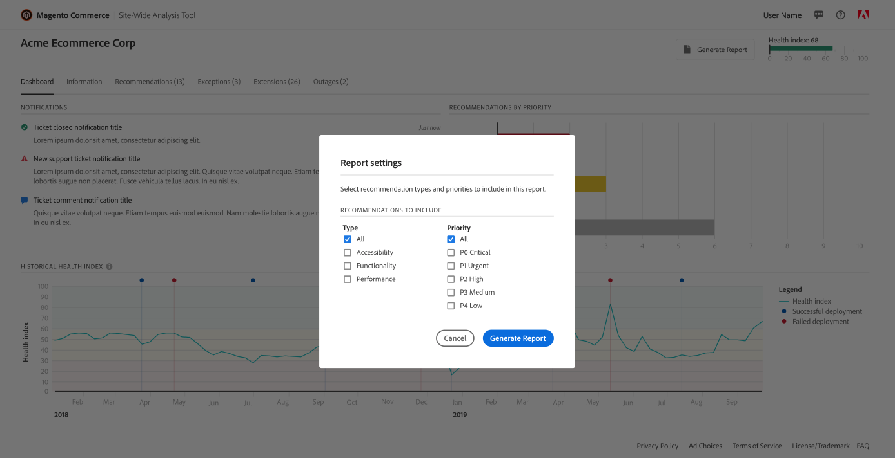

# 如何访问[!DNL Site-Wide Analysis Tool]

您可以通过两种方式访问[!DNL Site-Wide Analysis Tool Dashboard]。

您可以从[[!DNL Site-Wide Analysis Tool] 网站](https://supportinsights.adobe.com/commerce)直接&#x200B;**访问[!DNL dashboard](仅适用于Adobe Commerce on cloud infrastructure)**&#x200B;并使用您的Adobe ID登录，也可以从您商店的[!DNL Admin Panel]通过[!DNL dashboard]访问。

[!DNL Site-Wide Analysis Tool]服务可在[生产模式](https://docs.magento.com/user-guide/magento/installation-modes.html)下供有权访问用户[角色资源](https://docs.magento.com/user-guide/system/permissions-user-roles.html)的[!DNL Admin]用户使用。

>[!NOTE]
>
>自2024年4月23日起，[!DNL Site-Wide Analysis Tool]已停用，不再供Adobe Commerce本地客户使用。

*[!DNL Site-Wide Analysis Tool]仪表板*

## 选项1：直接从[!DNL Site-Wide Analysis Tool]域登录到您的[!DNL Site-Wide Analysis Tool Dashboard](仅适用于云基础架构上的Adobe Commerce)

需要&#x200B;**[!DNL Adobe ID]才能访问[!DNL Commerce]帐户**。
如果您已经拥有[!DNL Commerce]帐户，但没有帐户[!DNL Adobe ID]，则可以在登录过程中创建帐户。

1. 转到[https://supportinsights.adobe.com/commerce](https://supportinsights.adobe.com/commerce)。

1. 单击&#x200B;**[!UICONTROL Sign in with Adobe ID]**&#x200B;按钮并按照提示操作。

   
   *[!DNL Adobe ID]登录屏幕*

1. 接受条款和条件。

1. **<u>注意</u>：**&#x200B;您的帐户应有权访问&#x200B;**[!DNL Support Permissions]**&#x200B;以访问[!DNL Site-Wide Analysis Tool Dashboard]。
请参阅用户指南中的[共享 [!DNL Commerce] 帐户](https://experienceleague.adobe.com/docs/commerce-admin/start/commerce-account/commerce-account-share.html)中的更多详细信息。

## 选项2：从应用商店的[!DNL Admin Panel]登录到您的[!DNL Site-Wide Analysis Tool Dashboard]

### 步骤1：验证权限

验证[!DNL Admin]用户帐户是否有权通过其[分配的用户角色](https://docs.magento.com/user-guide/system/permissions-user-roles.html)访问[!DNL Site-Wide Analysis Tool]。

>[!IMPORTANT]
>
>[!DNL Site-Wide Analysis Tool]角色资源（权限）是&#x200B;**非**&#x200B;自动分配的。 必须为[!UICONTROL Admin]中的用户角色和单独分配给每个用户帐户的角色激活它。

对于需要[!DNL Site-Wide Analysis Tool]访问权限的自定义角色，请执行以下操作：

1. 选择&#x200B;**[!UICONTROL Reports]** > *[!UICONTROL System Insights]* > **[!UICONTROL Site-Wide Analysis Tool]**&#x200B;角色资源。

   
   已为角色&#x200B;*选择*[!DNL Site-Wide Analysis Tool]&#x200B;权限

1. 单击&#x200B;**[!UICONTROL Save Role]**。

1. 通知任何分配了该角色的用户注销[!DNL Admin]，然后重新登录。

>[!NOTE]
>
>如果您已验证用户帐户具有访问[!DNL Site-Wide Analysis Tool]的权限，并且用户在尝试从[!DNL Admin]访问该工具时收到403错误，则云基础架构上的Adobe Commerce实例可能已启用HTTP访问控制。 如果您启用了HTTP身份验证，则不支持[!DNL Site-Wide Analysis Tool]仪表板。 有关解决此问题的更多信息，请参阅我们的[支持文章](https://support.magento.com/hc/en-us/articles/360057400172-403-errors-when-accessing-Site-Wide-Analysis-Tool-on-Magento?_ga=2.168901729.117144580.1649172612-1623400270.1640858671)。

### 步骤2：访问[!DNL Site-Wide Analysis Tool]

1. 在&#x200B;*[!UICONTROL Admin]*&#x200B;侧边栏上，转到&#x200B;**[!UICONTROL Reports]** > *[!UICONTROL System Insights]* > **[!UICONTROL Site-Wide Analysis Tool]**。

   
   在Adobe Commerce *的[!DNL Admin Panel]中的*[!DNL Site-Wide Analysis Tool]&#x200B;位置

1. 阅读[!DNL Site-Wide Analysis Tool]的&#x200B;*使用条款*&#x200B;并单击&#x200B;**[!UICONTROL Accept]**&#x200B;以继续。

   每个用户都必须接受会话的使用条款。 对于每个已登录的会话，将重复执行此步骤。

1. 在功能板顶部，单击要查看的选项卡。

   
   *[!DNL Site-Wide Analysis Tool]信息*

## 从[!DNL Site-Wide Analysis Tool Dashboard]生成报告

1. 单击仪表板右上角的&#x200B;**[!UICONTROL Generate Report]**。

1. 选中要包含在报告中的每个&#x200B;**[!UICONTROL Type]**&#x200B;和&#x200B;**[!UICONTROL Priority]**&#x200B;设置的复选框。

1. 单击&#x200B;**[!UICONTROL Generate Report]**。

   
   *报告设置*

| 选项卡 | 描述 |
| --- | --- |
| 仪表板 | 按优先级显示带有当前通知和建议的系统运行状况。 |
| 信息 | 提供客户联系信息和当前票证摘要，以及有关每个已安装Adobe Commerce产品的详细信息。 |
| Recommendations | 列出基于最佳实践的建议，以解决在您的网站上检测到的问题。 |
| 例外 | 列出由无错误处理程序的异常条件引起的应用程序引发的错误。 |
| 扩展 | 列出所有第三方扩展和第三方库。 |

>[!NOTE]
>
>应用推荐后，可能需要几天时间才能在[!DNL Site-Wide Analysis Tool Dashboard]或生成的报告中更新该推荐。
