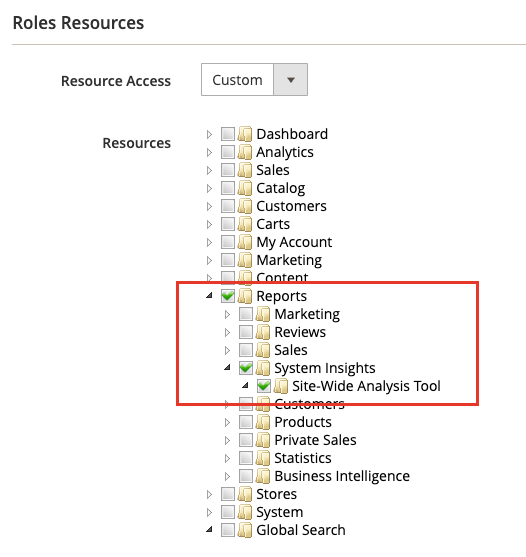

# 如何访问 [!DNL Site-Wide Analysis Tool]

的 [!DNL Site-Wide Analysis Tool] 服务在 [生产模式](https://docs.magento.com/user-guide/magento/installation-modes.html) 表示 [!DNL Admin] 具有用户访问权限的用户 [角色资源](https://docs.magento.com/user-guide/system/permissions-user-roles.html).

>[!NOTE]
>
>如果您已在本地安装Adobe Commerce，则必须安装 [代理](../site-wide-analysis-tool/installation.md) 以使用该工具。

*[!DNL Site-Wide Analysis Tool]功能板*

## 步骤1:验证权限

验证 [!DNL Admin] 用户帐户具有访问权限 [!DNL Site-Wide Analysis Tool] 通过 [分配用户角色](https://docs.magento.com/user-guide/system/permissions-user-roles.html).

>[!IMPORTANT]
>
>的 [!DNL Site-Wide Analysis Tool] 角色资源（权限）为 **not** 自动分配。 必须为 [!UICONTROL Admin].

对于需要的自定义角色 [!DNL Site-Wide Analysis Tool] 访问，请执行以下操作：

1. 选择 **[!UICONTROL Reports]** > *[!UICONTROL System Insights]* > **[!UICONTROL Site-Wide Analysis Tool]** 角色资源。

   
   *[!DNL Site-Wide Analysis Tool]为角色选择的权限*

1. 单击 **[!UICONTROL Save Role]**.

1. 通知被分配了该角色的任何用户以注销 [!DNL Admin]，然后再次登录。

>[!NOTE]
>
>如果您已验证该用户帐户具有访问 [!DNL Site-Wide Analysis Tool] 当用户尝试从 [!DNL Admin]，则云基础架构上的Adobe Commerce实例可能已启用HTTP访问控制。 的 [!DNL Site-Wide Analysis Tool] 如果启用了HTTP身份验证，则不支持功能板。 有关解决此问题的更多信息，请参阅 [支持文章](https://support.magento.com/hc/en-us/articles/360057400172-403-errors-when-accessing-Site-Wide-Analysis-Tool-on-Magento?_ga=2.168901729.117144580.1649172612-1623400270.1640858671).

## 步骤2:访问 [!DNL Site-Wide Analysis Tool]

1. 在 *[!UICONTROL Admin]* 侧栏，转到 **[!UICONTROL Reports]** > *[!UICONTROL System Insights]* > **[!UICONTROL Site-Wide Analysis Tool]**.

1. 阅读 *使用条款* 对于 [!DNL Site-Wide Analysis Tool] 单击 **[!UICONTROL Accept]** 继续。

   每个用户都必须接受会话的使用条款。 对于每个已登录的会话，都会重复此步骤。

   
   *使用条款*

1. 在功能板顶部，单击要查看的选项卡。

   
   *[!DNL Site-Wide Analysis Tool]信息*

## 步骤3:生成报表

1. 在仪表板的右上角，单击 **[!UICONTROL Generate Report]**.

1. 为每个 **[!UICONTROL Type]** 和 **[!UICONTROL Priority]** 设置。

1. 单击 **[!UICONTROL Generate Report]**.

   
   *报表设置*

| 选项卡 | 描述 |
| --- | --- |
| 功能板 | 通过按优先级显示当前通知和建议的系统运行状况。 |
| 信息 | 提供客户联系信息和当前票证的摘要，以及有关每个已安装Adobe Commerce产品的详细信息。 |
| Recommendations | 根据最佳实践列出建议，以解决在您的网站上检测到的问题。 |
| 例外 | 列出应用程序在没有错误处理程序的情况下导致异常情况引发的错误。 |
| 扩展 | 列出所有第三方扩展和第三方库。 |

>[!NOTE]
>
>应用推荐后，可能需要几天时间才能在 [!DNL Site-Wide Analysis Tool] 功能板或生成的报表。
