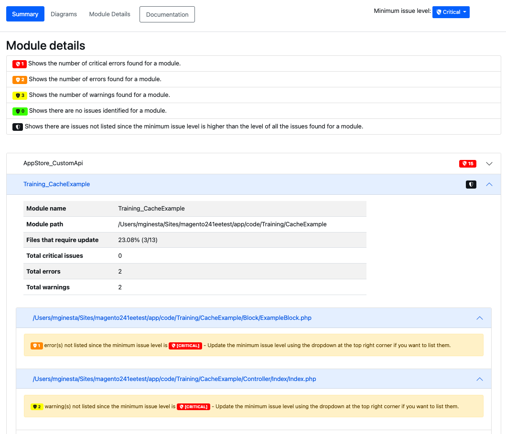

# 运行 [!DNL Upgrade Compatibility Tool]

{{commerce-only}}

的 [!DNL Upgrade Compatibility Tool] 是一个命令行工具，可通过分析Adobe Commerce中安装的所有模块，根据特定版本检查某个特定版本的自定义实例。 它会返回一个关键问题、错误和警告的列表，在升级到最新版本的Adobe Commerce之前，必须解决这些问题。

的 [!DNL Upgrade Compatibility Tool] 确定在尝试升级到较新版本的Adobe Commerce之前，必须在代码中修复的潜在问题。

## 使用 `upgrade:check` 命令

的 `upgrade:check` 命令是执行该工具的主命令：

```bash
bin/uct upgrade:check <dir>
```

>[!TIP]
>
>的 `<dir>` value是Adobe Commerce实例所在的目录。

的 `upgrade:check` 命令运行 [!DNL Upgrade Compatibility Tool] 和会通过分析Adobe Commerce中安装的所有模块，针对特定版本检查某个自定义实例。 它会返回一个关键问题、错误和警告的列表，在升级到最新版本的Adobe Commerce之前，必须解决这些问题。

>[!WARNING]
>
>仅在提供项目根目录（或主目录）时执行。

此命令检查特定Adobe Commerce实例的核心代码更改，以及其中安装的所有自定义代码更改。

您可以运行 `core:code:changes` 命令仅分析该特定Adobe Commerce实例的核心代码更改。 请参阅 [核心代码更改](../upgrade-compatibility-tool/run.md#use-the-core:code:changes-command) 中。

您可以使用 `graphql:compare` 命令来比较两个GraphQL模式，以检查它们之间是否有任何更改。 请参阅 [GraphQL模式兼容性验证](../upgrade-compatibility-tool/run.md#graphql-schema-compatibility-verification) 中。

### Recommendations使用 `upgrade:check` 命令

- 的 [!DNL Upgrade Compatibility Tool] 需要至少2GB的RAM才能运行。 建议使用此设置以避免由于内存不足而出现的问题。 的 [!DNL Upgrade Compatibility Tool] 如果运行 `upgrade:check` 命令 `memory_limit` 设置。
- 指定 `-m` 用于针对特定模块运行工具的选项：

   ```bash
   bin/uct upgrade:check <dir> -m[=MODULE-PATH]
   ```

其中参数如下所示：

- `<dir>`:Adobe Commerce安装目录。
- `[=MODULE-PATH]`:特定模块路径目录。

### 使用 `--help` 选项

要查看 [!DNL Upgrade Compatibility Tool] 命令常规选项和帮助，运行：

```bash
bin/uct --help
```

但是，可以运行 `--help` 作为运行特定命令时的选项，例如 `bin/uct upgrade:check`. 这会返回特定 `--help` 该命令的选项：

```bash
bin/uct upgrade:check --help
```

可用 `--help` 选项 `upgrade:check` 命令：

- `-m, --module-path[=MODULE-PATH]`:要分析的模块的路径
- `-a, --current-version[=CURRENT-VERSION]`:当前Adobe Commerce版本，如果忽略，将使用Adobe Commerce安装的版本。
- `-c, --coming-version[=COMING-VERSION]`:Target Adobe Commerce版本，如果忽略，则将使用最新发布的Adobe Commerce版本。 提供所有可用Adobe Commerce版本的列表。
- `--json-output-path[=JSON-OUTPUT-PATH]`:将以json格式导出输出的文件的路径。
- `--html-output-path[=HTML-OUTPUT-PATH]`:将以HTML格式导出输出的文件的路径。
- `--min-issue-level`:报表中显示的最小问题级别。 默认级别为 [警告].
- `-i, --ignore-current-version-compatibility-issues`:当您不希望在 [!DNL Upgrade Compatibility Tool] 报表。
- `--context=CONTEXT`:执行上下文。 此选项用于集成目的，不会影响执行结果。
- `-h, --help`:显示该特定命令的帮助。 如果未提供命令， `list` 命令是缺省结果。
- `-q, --quiet`:执行命令时不输出任何消息。
- `-v, --version`:显示应用程序版本。
- `--ansi, --no-ansi`:启用ANSI输出。
- `-n, --no-interaction`:执行命令时，不要提出任何交互式问题。
- `-v, --vv, --vvv, --verbose`:增加输出通信的密集度。 1表示正常输出，2表示详细输出，3表示DEBUG输出。

### 输出

由于所执行之分析， [!DNL Upgrade Compatibility Tool] 导出一个报表，其中包含每个文件的问题列表，以指定其严重性、错误代码和错误描述。

请参阅以下示例：

```terminal
File: /app/code/Custom/CatalogExtension/Controller/Index/Index.php
------------------------------------------------------------------
 * [WARNING][1131] Line 23: Extending from class 'Magento\Framework\App\Action\Action' that is @deprecated on version '2.4.2'
 * [ERROR][1429] Line 103: Call method 'Magento\Framework\Api\SearchCriteriaBuilder::addFilters' that is non API on version '2.4.2'
 * [CRITICAL][1110] Line 60: Instantiating class/interface 'Magento\Catalog\Model\ProductRepository' that does not exist on version '2.4.2'
```

检查 [错误消息引用](error-messages.md) 主题以了解更多信息。

该报表还包含一个详细的摘要，其中显示：

- *当前版本*:当前安装的版本。
- *Target版本*:要升级到的版本。
- *执行时间*:分析构建报表所花费的时间(mm:ss)。
- *需要更新的模块*:包含兼容性问题和需要更新的模块的百分比。
- *需要更新的文件*:包含兼容性问题和需要更新的文件的百分比。
- *严重错误总数*:发现的严重错误数。
- *错误总数*:找到的错误数。
- *警告总数*:找到的警告数。

请参阅以下示例：

```terminal
 ----------------------------- ------------------
  Current version               2.4.2
  Target version                2.4.3
  Execution time                1m:10s
  Modules that require update   78.33% (47/60)
  Files that require update     21.62% (115/532)
  Total critical issues         35
  Total errors                  201
  Total warnings                103
 ----------------------------- ------------------
```

>[!NOTE]
>
>默认情况下， [!DNL Upgrade Compatibility Tool] 将报表导出为两种不同的格式： `json` 和 `html`.

#### JSON

JSON文件包含的信息与输出中显示的信息完全相同：

- 已识别问题的列表。
- 分析摘要。

对于每个遇到的问题，报表会提供详细信息，如问题的严重性和描述。

>[!NOTE]
>
>输出文件夹的默认路径为 `var/output/[TIME]-results.json`.

要将此报表导出到其他输出文件夹，请运行：

```bash
bin/uct upgrade:check <dir> --json-output-path[=JSON-OUTPUT-PATH]
```

其中参数如下所示：

- `<dir>`:Adobe Commerce安装目录。
- `[=JSON-OUTPUT-PATH]`:导出的路径目录 `.json` 输出文件。

>[!NOTE]
>
>输出文件夹的默认路径为 `var/output/[TIME]-results.json`.

#### HTML

HTML文件还包含分析摘要和已识别问题的列表。


在 [!DNL Upgrade Compatibility Tool] 分析：


HTML报表还包含四个不同的图表：

- **按问题严重性划分的模块**:显示按模块划分的严重性分布。
- **按问题严重性列出的文件**:按文件显示严重性分布。
- **按问题总数排序的模块**:显示10个受损最多的模块，其中考虑了警告、错误和严重错误。
- **具有相对大小和问题的模块**:模块包含的文件越多，其圆圈就越大。 模块遇到的问题越多，其圆就越红。

通过这些图表，您可以（一目了然地）识别最易损坏的部件以及执行升级需要更多工作的部件。


您将能够根据最小问题级别(默认情况下， [警告])。

右上角有一个下拉菜单，允许您根据自己的必需品选择其他选项。 将相应地过滤已识别问题的列表。



请注意，问题级别较低的问题已清除，但您收到通知，以便始终了解每个模块已识别的问题。

此外，图表也会相应地更新，但 `Modules with relative sizes and issues`，通过 `min-issue-level` 最初设置。

如果要查看不同的结果，则需要重新运行为 `--min-issue-level` 选项。


要将此报表导出到其他输出文件夹，请运行：

```bash
bin/uct upgrade:check <dir> --html-output-path[=HTML-OUTPUT-PATH]
```

其中参数如下所示：

- `<dir>`:{{site.data.var.ee}}安装目录。
- `[=HTML-OUTPUT-PATH]`:导出的路径目录 `.html` 输出文件。

>[!NOTE]
>
>输出文件夹的默认路径为 `var/output/[TIME]-results.html`.

### 使用 `--ignore-current-version-compatibility-issues` 选项

的 [!DNL Upgrade Compatibility Tool] 允许您运行 `upgrade:check` 命令 `--ignore-current-version-compatibility-issues` 选项，以便仅显示新的或未知的严重问题、错误和警告。 当您不希望在 [!DNL Upgrade Compatibility Tool] 报表。

```bash
bin/uct upgrade:check --ignore-current-version-compatibility-issues <dir>
```

>[!NOTE]
>
>这仅适用于PHP API验证。

### 香草安装

A _香草_ 安装是对特定发行版本的指定版本标记或分支的全新安装。

的 `bin/uct core:code:changes` 命令会检查系统中是否存在vanilla实例。 如果这是首次使用香草版安装，则交互式命令行问题将提示您从Adobe Commerce存储库(`https://repo.magento.com/`)。

您可以运行 [!DNL Upgrade Compatibility Tool] 命令 `--vanilla-dir` 选项以指定Adobe Commerce vanilla安装目录。

请参阅 [部署原版实例](https://devdocs.magento.com/contributor-guide/contributing.html#vanilla-pr) 主题以了解更多信息。

## 使用 `list` 命令

返回 [!DNL Upgrade Compatibility Tool] 可用命令，运行：

```bash
bin/uct list
```

的 `list` 命令返回以下内容：

- `-h, --help`:显示该特定命令的帮助。 如果未提供命令， `list` 命令是缺省结果。
- `-q, --quiet`:执行命令时不输出任何消息。
- `-v, --version`:显示应用程序版本。
- `--ansi, --no-ansi`:启用ANSI输出。
- `-n, --no-interaction`:执行命令时，不要提出任何交互式问题。
- `-v, --vv, --vvv, --verbose`:增加输出通信的密集度。 1表示正常输出，2表示详细输出，3表示DEBUG输出。

## 使用 `core:code:changes` 命令

您可以将当前Adobe Commerce安装与干净的香草版安装进行比较，以查看核心代码是否进行了任何修改以实施新功能或自定义。 此验证有助于根据这些更改评估升级所需的工作量。

```bash
bin/uct core:code:changes <dir> <vanilla dir>
```

其中参数如下所示：

- `<dir>`:Adobe Commerce安装目录。
- `<vanilla dir>`:Adobe Commerce香草安装目录。

运行此命令时存在一些限制：

- 仅在提供项目根目录（或主目录）时执行。
- 仅显示核心修改的列表。

### 使用 `core:code:changes` 命令 `--help` 选项

可用 `--help` 选项 `core:code:changes` 命令：

- `-h, --help`:显示该特定命令的帮助。 如果未提供命令， `list` 命令是缺省结果。
- `-q, --quiet`:执行命令时不输出任何消息。
- `-v, --version`:显示应用程序版本。
- `--ansi, --no-ansi`:启用ANSI输出。
- `-n, --no-interaction`:执行命令时，不要提出任何交互式问题。
- `-v, --vv, --vvv, --verbose`:增加输出通信的密集度。 1表示正常输出，2表示详细输出，3表示DEBUG输出。

## 版本

您可以将当前Adobe Commerce安装与Adobe Commerce版本进行比较 `>=2.3`.

运行命令时，必须将版本作为参数提供：

```bash
bin/uct upgrade:check <dir> -c 2.4.3
```

>[!NOTE]
>
>此参数提供所有可用Adobe Commerce版本的列表。

其中：

- `-c, --coming-version[=COMING-VERSION]`:Adobe Commerce目标版本。

运行前一个命令时存在一些限制：

- 此参数是指标识特定版本Adobe Commerce的任何标记。
- 需要明确提供此内容；仅提供其值不起作用。
- 提供不带任何引号（无单引号或双引号）的标记版本： ~~“2.4.1-develop”~~.
- 您不应提供比当前安装的版本旧，也不应提供比2.3版本旧，2.3版本是当前支持的最旧版本。

### 使用 `refactor` 命令

的 [!DNL Upgrade Compatibility Tool] 能够自动修复减少的一组问题：

- 允许在不传递参数的情况下使用但现在已弃用此用法的函数。
- 使用 `$this` 在Magento模板中。
- 使用PHP关键词 `final` 在专用方法中。

运行：

```bash
bin/uct refactor <dir>
```

其中参数如下所示：

- `<dir>`:Adobe Commerce安装目录。

## GraphQL模式兼容性验证

的 [!DNL Upgrade Compatibility Tool] 还提供了相关选项，用于检查两个GraphQL端点并比较其架构，以查找它们之间的中断和危险更改：

```bash
bin/uct graphql:compare <schema1> <schema2>
```

其中参数如下所示：

- `<schema1>`:现有安装的端点URL。
- `<schema2>`:香草安装的端点URL。

你肯定在 `instance before` 和 `instance after` 升级。

### GraphQL比较命令 `--help` 选项

可用 `--help` 选项 `graphql:compare` 命令：

- `-h, --help`:显示该特定命令的帮助。 如果未提供命令， `list` 命令是缺省结果。
- `-q, --quiet`:执行命令时不输出任何消息。
- `-v, --version`:显示应用程序版本。
- `--ansi, --no-ansi`:启用ANSI输出。
- `-n, --no-interaction`:执行命令时，不要提出任何交互式问题。
- `-v, --vv, --vvv, --verbose`:增加输出通信的密集度。 1表示正常输出，2表示详细输出，3表示DEBUG输出。

### 示例，其中列出了GraphQL的严重问题、错误和警告

```terminal
 *   [WARNING] FIELD_CHANGED_KIND: ConfigurableProduct.gender changed type from Int to String.
 *   [WARNING] OPTIONAL_INPUT_FIELD_ADDED: An optional field sku on input type ProductAttributeSortInput was added.
```

您可以运行 [!DNL Upgrade Compatibility Tool] 通过PhpStorm插件运行配置。 请参阅 [[!DNL Upgrade Compatibility Tool] 运行配置](https://devdocs.magento.com/guides/v2.3/ext-best-practices/phpstorm/uct-run-configuration.html) 主题以了解更多信息。

请参阅 [视频教程](https://experienceleague.adobe.com/docs/commerce-learn/tutorials/upgrade/uct-phpstorm.html?lang=en) (06:30)了解如何使用 [!DNL Upgrade Compatibility Tool] MagentoPHPStorm插件。


## 建议的操作

### 优化结果

的 [!DNL Upgrade Compatibility Tool] 提供包含结果的报表，其中默认包含项目中发现的所有问题。 您可以优化结果以重点关注完成升级所必须修复的问题：

- 使用选项 `--ignore-current-version-compatibility-issues`，会针对您当前的Adobe Commerce版本禁止所有已知严重问题、错误和警告。 它仅针对您尝试升级到的版本提供错误。
- 添加 `--min-issue-level` 选项，此设置允许设置最小问题级别，以帮助只排定升级中最重要问题的优先级。
- 如果只想分析某个供应商、模块甚至目录，则还可以指定路径作为选项。 运行 `bin` 的命令 `-m`. 这允许 [!DNL Upgrade Compatibility Tool] 独立分析特定模块，并有助于解决在执行时可能出现的内存问题 [!DNL Upgrade Compatibility Tool].

### 遵循Adobe Commerce最佳实践

- 请避免使用两个同名模块。
- 关注Adobe Commerce [编码标准](https://devdocs.magento.com/guides/v2.4/coding-standards/bk-coding-standards.html).

## 疑难解答

### 分段错误

当两个模块具有相同的名称时， [!DNL Upgrade Compatibility Tool] 显示分段错误。

为避免出现此错误，建议运行 `bin` 的命令 `-m`:

```bash
bin/uct upgrade:check /<dir>/<instance-name> --coming-version=2.4.1 -m /vendor/<vendor-name>/<module-name>
```

>[!NOTE]
>
>的 `<dir>` value是Adobe Commerce实例所在的目录。

的 `-m` 选项允许 [!DNL Upgrade Compatibility Tool] 可单独分析每个特定模块，以避免在Adobe Commerce实例中遇到两个同名模块。

此命令选项还允许 [!DNL Upgrade Compatibility Tool] 要分析包含多个模块的文件夹，请执行以下操作：

```bash
bin/uct upgrade:check /<dir>/<instance-name> --coming-version=2.4.1 -m /vendor/<vendor-name>/
```

此建议还有助于解决在执行 [!DNL Upgrade Compatibility Tool].

### 空输出

>[!NOTE]
>
>的 `M2_VERSION` 是您要与Adobe Commerce实例进行比较的Adobe Commerce版本。

如果运行此命令后：

```bash
bin/uct upgrade:check INSTALLATION_DIR -c M2_VERSION
```

唯一的输出是 `Upgrade compatibility tool`:

```terminal
bin/uct upgrade:check /var/www/project/magento/ -c 2.4.1
Upgrade compatibility tool
```

可能的原因是PHP内存限制。
通过设置 `memory_limit` to `-1`:

```bash
php -d memory_limit=-1 /bin/uct upgrade:check INSTALLATION_DIR -c M2_VERSION
```
